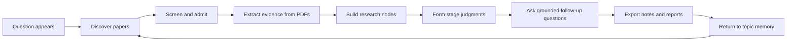

[English](README.md) | [简体中文](docs/README.zh-CN.md) | [日本語](docs/README.ja-JP.md) | [한국어](docs/README.ko-KR.md) | [Deutsch](docs/README.de-DE.md) | [Français](docs/README.fr-FR.md) | [Español](docs/README.es-ES.md) | [Русский](docs/README.ru-RU.md)

<p align="center">
  
</p>

<h1 align="center">TraceMind</h1>

<p align="center">
  <strong>An AI personal research workbench for people who want to understand a direction, not just ask for an answer.</strong>
</p>

<p align="center">
  <a href="LICENSE"></a>
  
  
  
</p>

TraceMind is built for a simple but stubborn reality: one research update almost never lets you see a whole research direction.

Today, AI research is loud. Papers pile up, hot terms spread fast, and many tools reward quick summaries or trend-following. That is useful for keeping up, but it is not enough for understanding what actually solves a problem. TraceMind asks a different question: can AI follow literature over time, accumulate evidence, and become a loyal, rigorous assistant that helps you see how a field is really moving?

Instead of treating every question as a fresh chat, TraceMind turns a topic into a long-lived research space. It helps you discover papers, screen what matters, extract figures and formulas from PDFs, build research nodes, make evidence-backed judgments, and keep follow-up conversations grounded in the material you have already accumulated.

## Project overview

TraceMind is an AI personal research workbench. It is designed for students, independent researchers, engineers, technical leads, analysts, and curious builders who need to turn a growing pile of papers into a coherent view of a field.

At a glance:

| If you are dealing with | TraceMind helps with |
| --- | --- |
| Too many papers and no clear main line | topic maps, node graphs, key paper sets, and stage-by-stage progress |
| AI answers that sound smooth but forget the source | evidence-backed outputs tied to papers, PDFs, figures, formulas, and citations |
| Great research questions scattered across chats and notes | a topic workbench with memory, follow-up, and exportable research artifacts |
| Trend chasing with weak accumulation | long-lived topics that grow from real material instead of one-off summaries |

## Why TraceMind exists

Research rarely fails because information is unavailable. It fails because understanding does not compound fast enough.

A typical workflow looks like this:
- you read a paper that seems important
- three days later you find a contradictory result
- two weeks later you remember the conclusion but not the figure that justified it
- one month later the entire conversation has dissolved into tabs, bookmarks, and half-finished notes

General chat tools are excellent at replying. They are much weaker at preserving why a judgment was made, what evidence supports it, what still feels uncertain, and how a direction changes over time.

TraceMind is built around four commitments:
- `evidence before vibe`: every strong judgment should be traceable back to material
- `memory before chat`: the workbench should remember topics, nodes, and prior reasoning
- `structure before dumping`: papers should become research nodes, not just a longer reading list
- `human judgment at the center`: AI assists; it does not replace the researcher

## Highlights

- `Topic pages show real progress`: stages, node graph, key papers, and current research progress come from actual accumulated material rather than a fake planning phase.
- `Research nodes become fast understanding surfaces`: a node page is not just a paper page. It is a structured research brief with core question, key papers, evidence chain, methods, findings, limitations, disputes, and a readable judgment.
- `Evidence stays visible`: TraceMind keeps papers, PDFs, figures, formulas, citations, and extracted fragments close to the final answer.
- `Answers stay grounded`: follow-up questions are asked inside the topic context instead of starting from zero in a generic chat box.
- `Self-hosted by design`: you can control model providers, credentials, and research data in your own environment.
- `Built for long arcs`: the product is designed for weeks and months of accumulation, not just a single polished output.

## Quick start

Prerequisites:
- Node.js `18+`
- npm `9+`
- Python `3.10+` for PDF extraction scripts
- one model provider key for local use

Run the backend:

```bash
cd skills-backend
npm install
cp .env.example .env
npm run db:generate
npm run dev
```

Run the frontend:

```bash
cd frontend
npm install
npm run dev
```

Default local addresses:
- frontend: `http://localhost:5173`
- backend health: `http://localhost:3303/health`

Docker option:

```bash
docker compose up --build
```

## First 15 minutes

1. Start the backend and frontend.
2. Open the app and configure at least one model provider in settings.
3. Create a topic you actually care about, not a throwaway demo keyword.
4. Run paper discovery and review the candidate set instead of accepting everything.
5. Admit the papers that truly belong to the topic and reject the ones that only look related.
6. Open a node research view and read the structured brief before reading dozens of raw abstracts.
7. Ask a follow-up question that tests the node, such as `What is the weakest evidence in this branch?`
8. Export the result or keep growing the topic with new papers and new judgments.

## How the research loop works



What each step means:
- `Discover papers`: search across academic sources and build a candidate pool.
- `Screen and admit`: decide which papers belong in the working topic and which do not.
- `Extract evidence`: pull text, figures, formulas, tables, and citations into reusable evidence objects.
- `Build nodes`: organize the topic by problem, method, mechanism, limitation, disagreement, or turning point.
- `Form judgments`: write what the evidence currently supports, what is still weak, and what needs to be challenged next.
- `Keep following up`: let AI answer from the topic context you have already built.
- `Export artifacts`: turn the work into readable node briefs, research notes, or report material.

## What makes TraceMind different

TraceMind is not trying to replace every tool around research. It sits in the gap between them.

| Tool | Great at | Where TraceMind fits |
| --- | --- | --- |
| Zotero | collecting, annotating, and citing papers | turns literature into nodes, evidence chains, and evolving judgments |
| NotebookLM | asking questions over a given set of sources | keeps those questions inside a long-lived topic with progress, memory, and node structure |
| Elicit | search, screening, and literature review workflows | focuses more on personal ongoing research accumulation than a single review pass |
| Perplexity | fast answers with web sources | turns one-off answers into topic memory and follow-up research structure |
| Obsidian or Notion | notes and personal organization | adds literature tracking, grounded AI, and evidence-aware research views |
| ChatGPT or Claude | reasoning, drafting, and conversation | gives the model a research room instead of an empty chat window |

## What the product is trying to optimize for

TraceMind does not chase `more output` as its north star. It optimizes for a harder outcome:

> When a researcher makes an important judgment, they should be able to return to the papers, the evidence, and the reasoning path that produced it.

That leads to specific product choices:
- new topics stay lightweight and grow from real material
- stage views reflect actual research progress instead of speculative planning
- node pages privilege clarity and structure over volume
- uncertainty is part of the product, not an embarrassment to hide

## Open-source foundations and references

TraceMind stands on mature open tooling instead of pretending to reinvent every layer.

Technical foundations:
- `React` and `Vite` for the frontend workbench
- `Express` and `Prisma` for the research API and data layer
- `SQLite`, with `PostgreSQL` and `Redis` available for fuller deployments
- `PyMuPDF` and local scripts for PDF extraction
- `OpenAI`, `Anthropic`, and `Google` compatible model access through the backend runtime
- `arXiv`, `OpenAlex`, `Crossref`, `Semantic Scholar`, and `Zotero` adjacent workflows for literature discovery and management

Documentation and product-writing taste was shaped by public open-source projects such as `Supabase`, `Dify`, `LangChain`, `Immich`, `Next.js`, `Visual Studio Code`, `Excalidraw`, and `Open WebUI`. The goal is not to copy their positioning, but to learn from their clarity: explain what the project is, why it matters, how to run it, where it stops, and what a user should do next.

## Who TraceMind is for

TraceMind is a strong fit if you are:
- following a research direction over weeks or months
- trying to compare papers instead of just collecting them
- writing literature reviews, technical memos, or research briefs
- self-hosting your tools and keeping control over model keys and research data
- using AI as an assistant, but still wanting to own the final judgment

TraceMind is not the right tool if you only need:
- a quick factual lookup
- a polished answer with no interest in the evidence path
- a generic enterprise knowledge base instead of a research workbench
- a system that replaces expert judgment rather than supporting it

## Contributing, security, and license

- Contribution guide: [CONTRIBUTING.md](CONTRIBUTING.md)
- Security policy: [SECURITY.md](SECURITY.md)
- License: [MIT](LICENSE)

## Closing

It is hard to see a research direction from a single update, and it is even harder when the surrounding ecosystem rewards speed, trend-following, and surface novelty. TraceMind is our attempt to slow the loop down just enough for real understanding to accumulate.

The ambition is simple: let AI track literature, remember evidence, support follow-up questions, and act as your most loyal and rigorous assistant, not by speaking louder than the research, but by helping you see the shape of it more clearly.
