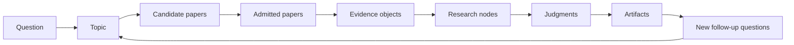
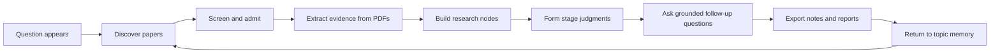

[English](README.md) | [简体中文](docs/README.zh-CN.md) | [日本語](docs/README.ja-JP.md) | [한국어](docs/README.ko-KR.md) | [Deutsch](docs/README.de-DE.md) | [Français](docs/README.fr-FR.md) | [Español](docs/README.es-ES.md) | [Русский](docs/README.ru-RU.md)

<p align="center">
  
</p>

<h1 align="center">TraceMind</h1>

<p align="center">
  <strong>An AI personal research workbench for people who want to understand a field, not just harvest quick answers from it.</strong>
</p>

<p align="center">
  <a href="LICENSE"></a>
  
  
  
  
</p>

## If you read only one paragraph

One research update almost never lets you see an entire research direction. In modern AI research, the pace is fast, the noise is high, and the social reward often goes to following trends quickly. That helps people keep up, but it does not necessarily help them understand what is actually changing, what evidence is strong, which papers form the real main line, or where a field is still confused. TraceMind is built around a different ambition: let AI follow literature over time, accumulate evidence, organize a direction into research nodes, and act as a loyal, rigorous assistant that helps a person truly see the shape of a field.

## What TraceMind is

TraceMind is an AI personal research workbench.

It is not just a chat UI, not just a paper list, and not just another summary generator. It is a workspace for turning a growing set of papers, figures, formulas, citations, notes, and follow-up questions into a more stable research understanding.

It is designed for:
- students working through a thesis or literature review
- independent researchers building a long-running view of a topic
- engineers and technical leads tracking a fast-moving technical direction
- analysts who need evidence-backed notes rather than opinionated summaries
- open-source builders trying to understand whether a method is real progress or just fashionable packaging

## The problem it is trying to solve

Most research workflows do not collapse because information is unavailable. They collapse because understanding does not compound fast enough.

A very familiar pattern looks like this:
- you read a paper that feels important
- a few days later you find a contradictory result
- two weeks later you remember the claim but not the figure that justified it
- one month later the whole direction is split across chats, tabs, bookmarks, and unfinished notes

Generic AI tools are excellent at replying in the moment. They are much weaker at preserving:
- why a judgment was made
- what evidence supports it
- which papers are actually central and which are merely adjacent
- what is still unresolved
- how the field moved from one stage to another

TraceMind is built so that research does not have to restart from zero every time you return to a topic.

## What the product is optimizing for

TraceMind is not trying to maximize output volume. Its north star is harder than that:

> When a researcher makes an important judgment, they should be able to return to the papers, evidence, and reasoning path that produced it.

That changes product behavior in concrete ways:
- new topics stay light and only grow when real material arrives
- stage views reflect actual research accumulation instead of speculative planning
- node pages are designed as fast understanding surfaces, not generic article pages
- uncertainty is visible rather than hidden
- follow-up questions stay grounded in topic memory and evidence

## What TraceMind feels like in practice

You can think of the product as moving through five user-facing surfaces:

| Surface | What it should answer quickly |
| --- | --- |
| Home | What topics am I actively following right now? |
| Topic page | How far has this direction progressed, what stages exist, what nodes matter, and which papers anchor the story? |
| Node research view | What is the real question here, which papers matter most, what evidence supports the current judgment, and what is still contested? |
| Workbench conversation | What happens if I push back on the current understanding or ask a narrower follow-up question? |
| Export artifacts | How do I turn this into notes, briefs, review material, or a report draft? |

## Why topic pages matter

A topic is not meant to be a decorative container. It is the long-lived object that holds a research direction together.

A good topic page should let a user see, almost immediately:
- what the topic is actually about
- whether the topic is still mostly exploratory or already structurally rich
- which stages came from real research progress
- which nodes carry the main explanatory load
- which papers are key rather than merely present
- what progress has happened recently

TraceMind intentionally does not start a topic by creating a fake `research planning` stage. A topic begins as a light shell, then grows from real paper discovery, evidence extraction, node formation, and later-stage judgments.

## Why node research views matter

A node page is not supposed to feel like a single-paper page.

When a user opens a node, the experience should feel closer to:

> "My research assistant already read a meaningful slice of this area and prepared a structured brief for me."

A strong node research view should organize at least these questions:
- what is the core problem inside this node
- which papers define it
- how the evidence chain supports the current conclusion
- what methods, findings, and limitations matter most
- where disagreement, controversy, or ambiguity remains
- what judgment currently seems justified

This is one of TraceMind’s most important product bets: helping users recover the main line without re-reading dozens of papers from scratch.

## What you can do with TraceMind today

- discover papers across academic sources and build a candidate pool
- screen papers into what belongs, what is adjacent, and what should be rejected for the current topic
- extract text, figures, formulas, tables, and citation structure from PDFs
- organize a direction into research nodes instead of leaving it as a flat reading list
- generate structured node briefs that surface evidence, limitations, and disagreements
- ask follow-up questions that inherit topic and node context
- export research artifacts for later writing, review, or reporting

## A simple mental model

These product objects help make the rest of the README easier to understand:

| Object | Meaning |
| --- | --- |
| Topic | a long-running research direction you want to keep returning to |
| Paper | a source document plus metadata, PDF structure, citations, and extracted assets |
| Evidence | reusable research material such as text fragments, figures, tables, formulas, and source references |
| Node | a structured research unit, often about a problem, method, mechanism, limitation, controversy, or turning point |
| Judgment | the current best reading of what the evidence supports and what remains weak |
| Memory | the accumulated context that keeps later follow-up grounded |
| Artifact | something you can export, such as node notes, a brief, or report material |

## How the concepts connect

The easiest way to understand TraceMind is to see it as a chain of transformations:



That chain matters because TraceMind is not trying to jump directly from `question` to `answer`.

It is trying to preserve the intermediate structure:
- why those papers became relevant
- which evidence fragments were actually used
- how those fragments were organized into nodes
- what judgment was possible at that stage
- what new questions were created after the judgment

## Core concepts, in depth

The table above is the short version. This is the deeper version.

| Concept | What it is | What it is not | Why it matters |
| --- | --- | --- | --- |
| `Topic` | a long-running research direction | a disposable search keyword | it gives the rest of the system a stable place to accumulate memory |
| `Stage` | a real phase in the development of a topic | a speculative plan written before evidence exists | it tells the user how the direction has actually evolved |
| `Paper` | a source object with metadata, content, and citations | just a title in a reading list | it is the entry point to evidence, not the end of the workflow |
| `Evidence` | the reusable research fragments extracted from material | generic "supporting text" with no source anchor | it makes later judgments inspectable |
| `Node` | a structured unit of understanding inside a topic | a folder or a prettier paper card | it helps the user recover the main line of a sub-problem quickly |
| `Judgment` | the current best interpretation of the evidence | a final truth claim | it lets the system stay useful without pretending uncertainty is gone |
| `Memory` | the accumulated topic context across time | random chat history | it keeps follow-up work from collapsing back to zero |
| `Artifact` | something worth carrying out of the system | raw model output pasted into a text box | it is how research accumulation becomes reusable outside the app |

## How stages should emerge

Stages are one of the most easily misunderstood parts of the product.

In TraceMind, a stage should not mean:
- a to-do list the model invented at topic creation time
- a generic research plan that every topic goes through
- a decorative label added for visual completeness

A stage should emerge from actual research movement, such as:
- a wave of paper discovery around a new method family
- a node becoming dense enough to form a clear subfield view
- a methodological turn, for example from pipeline systems to end-to-end systems
- a shift from optimistic claims to stronger evaluation scrutiny
- a time-bounded change in what the field appears to believe

That is why "topic progress" in TraceMind is closer to `field legibility` than `task completion`.

## What a mature topic looks like

A mature topic does not mean "finished". It means the topic has become legible.

You should expect a mature topic to have:
- a visible set of key papers rather than an unfiltered pile
- several nodes that explain different parts of the direction
- stages that reflect actual research evolution
- at least a few judgments that are specific, grounded, and revisable
- obvious places where the field is still unresolved
- follow-up questions that are sharper than the original question

If a topic still feels like a paper inbox, it has not matured yet.

## How to read a node research view

The fastest way to use TraceMind well is to learn how to read a node page in order.

1. Read the node title and core question first. If the question is vague, the node is probably still weak.
2. Check the key papers. They should explain why this node exists at all.
3. Read the evidence chain. This is where the node stops being a summary and becomes research structure.
4. Read methods, findings, and limits together. A method without limits is usually marketing.
5. Read disputes and unresolved issues carefully. This is often where the real value lives.
6. Read the final judgment last. A good judgment should feel earned by the sections above it.

If the final judgment feels stronger than the evidence chain, that is a sign the node still needs work.

## Summary is not judgment

This distinction is central to how TraceMind thinks.

A `summary` usually answers:
- what does this paper say
- what method does it propose
- what result does it report

An `evidence chain` answers:
- which concrete fragments, figures, formulas, and comparisons matter
- how those pieces connect to the sub-problem inside the node
- where support is strong and where it is thin

A `judgment` answers:
- what can reasonably be believed now
- what remains contested
- what the current reading depends on
- what would most likely change the conclusion

In other words:
- summary is about describing material
- evidence chain is about organizing support
- judgment is about making a careful, revisable research claim

## What a strong judgment should contain

A strong research judgment inside TraceMind should usually contain:
- a clear statement of the current conclusion
- the key papers or evidence objects supporting it
- the main limitation or uncertainty that weakens it
- at least one unresolved question or tension
- an implicit or explicit sense of confidence

If a judgment has no tension, no limitation, and no source pressure behind it, it is probably just polished language.

## From empty topic to useful topic

Most users need help understanding what "good progress" actually looks like. A healthy topic often passes through these shapes:

| Phase | What you usually see |
| --- | --- |
| `Empty shell` | a topic exists, but almost no trustworthy structure has formed |
| `Candidate pool` | many papers are present, but the topic is still noisy |
| `Grounded graph` | nodes begin to form and evidence starts clustering around them |
| `Readable main line` | a user can identify important stages, key papers, and current disagreements |
| `Export-ready workspace` | judgments, notes, and node briefs are good enough to support writing or reporting |

This progression is more realistic than expecting a topic to become insightful immediately after creation.

## Quick start

Prerequisites:
- Node.js `18+`
- npm `9+`
- Python `3.10+`
- at least one model-provider key for local use

Run the backend:

```bash
cd skills-backend
npm install
cp .env.example .env
npm run db:generate
npm run dev
```

Run the frontend:

```bash
cd frontend
npm install
npm run dev
```

Default local addresses:
- frontend: `http://localhost:5173`
- backend health: `http://localhost:3303/health`

Docker option:

```bash
docker compose up --build
```

## Your first hour in TraceMind

1. Start backend and frontend, then open the app.
2. Configure at least one model provider in settings.
3. Create a topic you genuinely care about. Do not waste the first pass on a throwaway demo keyword.
4. Run paper discovery and read the candidate pool with skepticism.
5. Admit only the papers that actually belong to the direction you are trying to understand.
6. Open a node research view before diving into raw paper reading.
7. Use the workbench to ask a pressure-test question, such as `What is the weakest evidence in this branch?`
8. Export a note or summary, then keep growing the topic with new papers and new judgments.

By the end of a good first hour, you should already feel a difference between:
- having many papers
- and having a topic that has started to become legible

## Three common usage patterns

Different users benefit from TraceMind in different rhythms.

| Pattern | What the user is trying to do | What TraceMind should help them do |
| --- | --- | --- |
| `Daily tracking` | keep up with a fast-moving area without drowning in it | turn new papers into a cleaner candidate pool and sharper follow-up questions |
| `Weekly synthesis` | understand where a topic stands right now | refresh nodes, update judgments, and surface what changed |
| `Writing support` | prepare a review, memo, or report | turn node judgments and evidence chains into exportable structure |

## A concrete example

Suppose you are following `end-to-end autonomous driving`.

Without a structured workspace, the direction often becomes a fog of:
- benchmark claims
- architecture diagrams
- simulation-heavy evaluation
- scattered safety arguments
- repeated hype around “foundation models for driving”

In TraceMind, the same direction can start to become a clearer map:
- one node for interpretability and safety boundaries
- one node for perception-to-planning interfaces
- one node for simulation versus real-world evaluation credibility
- one node for data loops and long-tail handling
- one node for where large-model reasoning actually helps and where it is mostly aesthetic packaging

That is the difference the product cares about: not simply seeing more material, but seeing the direction more clearly.

## The research loop



What each step means:
- `Discover papers`: search across academic sources and build a candidate pool.
- `Screen and admit`: decide which papers belong to the working topic and which do not.
- `Extract evidence`: pull text, figures, formulas, tables, and citations into reusable research objects.
- `Build nodes`: organize the topic by problem, method, mechanism, limitation, disagreement, or turning point.
- `Form judgments`: state what the evidence currently supports, what is still weak, and what must be challenged next.
- `Keep following up`: let AI answer from the topic you already built rather than from an empty context.
- `Export artifacts`: turn the work into readable notes, structured briefs, or report material.

## What makes TraceMind different

TraceMind does not try to replace every tool around research. It sits in the gap between them.

| Tool | Great at | Where TraceMind fits |
| --- | --- | --- |
| Zotero | collecting, annotating, and citing papers | turns literature into nodes, evidence chains, and evolving judgments |
| NotebookLM | asking questions over a given set of sources | keeps those questions inside a long-lived topic with progress, memory, and node structure |
| Elicit | search, screening, and literature review workflows | focuses more on personal ongoing research accumulation than a single review pass |
| Perplexity | fast answers with web sources | turns one-off answers into topic memory and follow-up research structure |
| Obsidian or Notion | notes and personal organization | adds literature tracking, grounded AI, and evidence-aware research views |
| ChatGPT or Claude | reasoning, drafting, and conversation | gives the model a research room instead of an empty chat window |

## What TraceMind is not

It is worth being explicit here.

TraceMind is not:
- a promise that AI can replace expert judgment
- a guarantee that extracted evidence is always perfect
- a generic enterprise knowledge base
- a trend-tracking feed optimized for speed over depth
- a system that should hide uncertainty behind polished prose

This project becomes more useful when users are willing to inspect, challenge, and refine its outputs.

## How to tell whether TraceMind is working for you

The product is doing its job well if, after using it, you can answer these questions more clearly than before:
- What is the main line of this topic?
- Which papers actually matter most?
- Which evidence objects are supporting my current view?
- Where is the field still split or uncertain?
- What is my next best follow-up question?

If the app gives you more text but not better answers to those questions, it is not helping enough yet.

## Trust model

TraceMind is designed around a specific trust posture.

The AI should help with:
- discovery
- extraction
- structuring
- drafting
- pressure-testing interpretations

The human should still own:
- topic framing
- paper admission and rejection standards
- final interpretation of evidence
- what gets exported or cited as a serious judgment

Put differently: TraceMind is strongest when it behaves like a research assistant with memory, not a research oracle.

## Architecture at a glance

| Part | Role |
| --- | --- |
| `frontend/` | React + Vite research workbench UI |
| `skills-backend/` | Express + Prisma API, orchestration, topic and research services |
| `model-runtime/` | model connectors and runtime glue |
| `generated-data/` | curated demo and runtime data used by the app |
| `assets/` | public branding assets such as the TraceMind SVG logo |

## Open-source foundations and references

TraceMind stands on mature open tooling instead of pretending to reinvent every layer.

Technical foundations:
- `React` and `Vite` for the frontend workbench
- `Express` and `Prisma` for the research API and data layer
- `SQLite`, with `PostgreSQL` and `Redis` available for fuller deployments
- `PyMuPDF` and local scripts for PDF extraction
- `OpenAI`, `Anthropic`, and `Google` compatible model access through the backend runtime
- `arXiv`, `OpenAlex`, `Crossref`, `Semantic Scholar`, and Zotero-adjacent workflows for literature discovery and management

The documentation tone and public project structure were also shaped by excellent open-source examples such as `Supabase`, `Dify`, `LangChain`, `Immich`, `Next.js`, `Visual Studio Code`, `Excalidraw`, and `Open WebUI`. The goal is not to copy their positioning, but to borrow their clarity: explain what the project is, why it exists, how to run it, where it stops, and what a user should do next.

## Current boundaries

TraceMind is strongest when used as a serious assistant inside a human-led research process.

It still has important boundaries:
- model outputs can still be wrong
- PDF extraction is useful but not infallible
- the product can structure evidence, but it cannot substitute for domain expertise
- self-hosting gives control, but it also means you are responsible for keys, data, and deployment hygiene

Those are not embarrassing footnotes. They are part of the trust model.

## Who should try it

TraceMind is a strong fit if you are:
- following a research direction over weeks or months
- comparing papers instead of only collecting them
- writing literature reviews, technical memos, or research briefs
- self-hosting tools and keeping control over model keys and research data
- using AI as an assistant while still wanting to own the final judgment

TraceMind is probably not the right tool if you only need:
- a quick factual lookup
- a polished answer with no interest in the evidence path
- a generic enterprise knowledge base
- a system that replaces expert judgment rather than supporting it

## FAQ

### Why not just use ChatGPT or Claude with a long prompt?

Because a long prompt is not the same thing as a research workspace. A real workspace keeps topic memory, evidence objects, node structure, stage progress, and reusable artifacts together over time.

### Why not just use Zotero?

Zotero is excellent at collecting and citing literature. TraceMind tries to solve a different layer: how papers become structured research understanding with grounded AI assistance.

### Why does TraceMind care so much about node pages?

Because a user should be able to enter a node and recover the main line quickly. If the node page cannot help a person orient themselves, the product becomes just another archive.

### Why avoid a fake planning stage when a topic is created?

Because a planned stage can look tidy while saying nothing true about the research. TraceMind wants stages to emerge from evidence, discovery, screening, and accumulation.

## Contributing, security, and license

- Contribution guide: [CONTRIBUTING.md](CONTRIBUTING.md)
- Security policy: [SECURITY.md](SECURITY.md)
- License: [MIT](LICENSE)

## Closing

It is hard to see a research direction from a single update, and it is even harder when the surrounding ecosystem rewards speed, trend-following, and surface novelty. TraceMind is our attempt to slow the loop down just enough for real understanding to accumulate.

The ambition is simple: let AI track literature, remember evidence, support follow-up questions, and act as your most loyal and rigorous assistant, not by speaking louder than the research, but by helping you see the shape of it more clearly.
