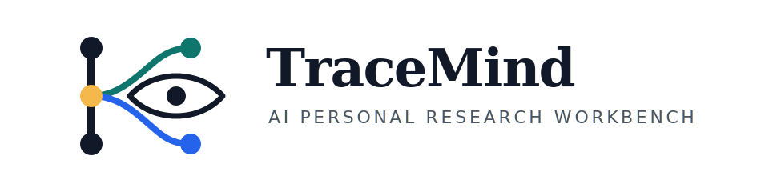
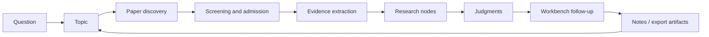

[English](README.md) | [简体中文](docs/README.zh-CN.md) | [日本語](docs/README.ja-JP.md) | [한국어](docs/README.ko-KR.md) | [Deutsch](docs/README.de-DE.md) | [Français](docs/README.fr-FR.md) | [Español](docs/README.es-ES.md) | [Русский](docs/README.ru-RU.md)

<p align="center">
  
</p>

<h1 align="center">TraceMind</h1>

<p align="center">
  <strong>An AI personal research workbench for people who want to see a field clearly, not just collect fast answers from it.</strong>
</p>

<p align="center">
  <a href="LICENSE"></a>
  
  
  
  
</p>

## What TraceMind Is

TraceMind is an AI personal research workbench. It is built for the moment after "I already found many papers" but before "I can clearly explain what this direction is really doing."

Instead of treating research as a pile of chats, bookmarks, and disconnected summaries, TraceMind turns:

- papers into reusable evidence
- evidence into research nodes
- nodes into grounded judgments
- judgments into follow-up questions that still remember the topic

The goal is not to generate more words. The goal is to make a research direction legible.

## Product Introduction

TraceMind is easiest to understand as five user-facing surfaces working together.

| Surface | What it is for | What you should understand quickly |
| --- | --- | --- |
| Topic page | Understand the current state of one direction | What stages exist, which nodes matter, what the key papers are, and how far the field has actually progressed |
| Node page: Research View | Fast entry into a node | What the node studies, what evidence matters, where the field agrees, where it splits, and what judgment currently stands |
| Node page: Article View | Deep synthesis for one node | How the papers inside the node connect, what each paper contributes, and how the evidence supports the long-form reading |
| Workbench | Ask grounded follow-up questions | Challenge the current judgment, compare branches, narrow the question, and keep asking without losing context |
| Model center | Configure your own AI stack | Bring your own provider, model, base URL, API key, and task routing for different parts of the workflow |

If you remember one thing, remember this:

> TraceMind is not a paper inbox with a chat box on top. It is a research structure builder.

## Topic Page: See the Direction Clearly

The topic page is the product's main orientation surface. It should answer a hard question very quickly:

> "What is the real state of this research direction right now?"

In TraceMind, the topic page is not supposed to look like a generic project board, and it is not supposed to begin with a fake `research planning` stage. A topic starts light, then grows only when real material arrives.

### What appears on the topic page

- A research progress overview that summarizes how many real stages, nodes, papers, and evidence objects the topic already has
- A stage timeline that grows from actual paper discovery, screening, node synthesis, and time-window accumulation
- A stage-node graph that shows the main line, side branches, and merge points in one visual surface
- Up to ten visible node cards per stage so dense stages stay readable instead of collapsing into visual noise
- Key papers lifted to the top, so important work is not buried inside a long list
- Fast node entry chips that let a user jump into the most relevant nodes immediately
- Pending or still-unmapped material, so incomplete work remains visible instead of silently disappearing
- A right-side research workbench entry, so follow-up questions can start directly from the topic context

### What a good topic page should tell a user in 30 seconds

- Is this topic still exploratory, or has it become structurally clear?
- Which stage best describes the field right now?
- Which branches matter enough to keep watching?
- Which nodes carry the main explanatory load?
- Which papers define the current state instead of merely appearing nearby?
- What changed recently?

This is why TraceMind does not want a topic to begin with a made-up planning stage. In this system, a stage should be earned by research material, not invented for decoration.

## Node Page: One Node, Two Reading Modes

A node is not a single-paper page. A node is a structured unit of understanding inside a topic. It may represent a method family, a technical dispute, a bottleneck, a mechanism, a limitation, or a turning point.

The node page therefore has two different jobs, and TraceMind makes them explicit through dual view.

| View | Purpose | Best for |
| --- | --- | --- |
| Research View | Fast structured understanding | The first three minutes when you need to understand the node without drowning in prose |
| Article View | Deep synthesized reading | The next twenty minutes when you want the node turned into a coherent narrative without immediately rereading every paper |

### Research View: the fast understanding entrance

Research View is designed to be closer to a research brief than to a blog article. It should feel like:

> "My research assistant already read this node, organized the evidence, and prepared the fastest serious entry point for me."

In practice, Research View emphasizes:

- the core question of the node
- visual argument cards and key claims
- key papers and their roles inside the node
- evidence chains built from figures, tables, formulas, and cited fragments
- main methods, findings, and limitations
- disagreements, unresolved questions, and pressure points
- a current synthesis or research judgment

It is meant to be image-heavy, structure-heavy, and faster to scan than a traditional article page.

### Article View: deep node understanding without opening every paper first

Article View is the long-form reading layer of the node. Its job is not to replace original papers forever. Its job is to reduce how often a user must immediately jump back into ten separate PDFs just to recover the main line.

In practice, Article View provides:

- a continuous node article rather than a flat pile of summaries
- inline references that stay connected to papers and evidence
- grounded use of figures, tables, and formulas when available
- synthesis of how multiple papers contribute to the same node
- a stable reading surface first, followed by deeper article enhancement when richer synthesis is ready

This is one of TraceMind's central bets: a user should be able to deeply understand a node's paper set before deciding which original papers need close rereading.

## Workbench: Ask at Any Time

TraceMind includes a research workbench because understanding a direction is never finished after one page view.

The workbench exists in two forms:

- as a right-side contextual panel on topic and node surfaces
- as a full workbench page for longer follow-up sessions

Its role is not generic conversation. Its role is grounded follow-up. Good workbench questions sound like:

- Which branch in this topic currently has the weakest evidence?
- What would most likely overturn the current node judgment?
- Compare these two nodes as competing explanations.
- Which papers are central, and which ones are just adjacent noise?
- If I only had time to reread three originals, which three should I choose?

The important part is context inheritance. The workbench is supposed to remember the active topic or node instead of forcing the user to rebuild the setup from zero in every prompt.

## Models and APIs: Bring Your Own Stack

TraceMind is designed for users who want control over their model stack.

The product includes a model center and prompt studio where you can configure:

- a default language model slot
- a default multimodal model slot
- custom models for research roles
- task routing for chat, topic synthesis, PDF parsing, figure analysis, formula recognition, table extraction, and evidence explanation
- provider, model name, base URL, API key, and provider-specific options

In practice, this means TraceMind can work with:

- official providers such as OpenAI, Anthropic, and Google
- built-in provider families supported by the Omni layer
- OpenAI-compatible gateways with custom base URLs
- enterprise or self-hosted API endpoints that expose compatible interfaces

The design idea is simple: the product should not hardcode one provider into the user's research workflow.

## Research Loop: How a Topic Grows

TraceMind works best when you see it as a research accumulation loop rather than a one-shot assistant.



The loop matters because TraceMind is not trying to jump directly from `question` to `answer`. It tries to preserve the middle structure:

- why these papers were admitted
- which evidence objects actually mattered
- how those objects formed nodes
- what judgment the node could support
- what new questions appeared after the judgment

## Quick Start

### Requirements

- Node.js `18+`
- npm `9+`
- Python `3.10+`
- at least one usable model API key

### Start the backend

```bash
cd skills-backend
npm install
cp .env.example .env
npm run db:generate
npm run dev
```

### Start the frontend

```bash
cd frontend
npm install
npm run dev
```

### Optional: run with Docker

```bash
docker compose up --build
```

### Default local addresses

- Frontend: `http://localhost:5173`
- Backend health check: `http://localhost:3303/health`

### First-use checklist

1. Open the app and go to the settings or model center first.
2. Configure at least one language model. Add a multimodal model if you want stronger PDF, figure, table, and formula handling.
3. Create a real topic you genuinely want to understand for weeks, not a throwaway demo query.
4. Run paper discovery, then screen the candidate pool instead of admitting everything.
5. Open the topic page and check whether stages, nodes, and key papers have started to become meaningful.
6. Enter a node through Research View first, then move to Article View when you want depth.
7. Use the workbench to challenge the current judgment and identify what still feels weak.

## Highlight Features

These are the capabilities that most clearly define TraceMind.

- Real-progress topic pages: stages come from papers, nodes, and evidence, not from a fake plan generated on day one.
- Stage-node graph: one topic surface can show timeline, branches, merge points, and key nodes together.
- Dual-view nodes: Research View for fast clarity, Article View for deep understanding.
- Evidence-first node synthesis: figures, tables, formulas, and cited fragments are part of the reasoning surface.
- Grounded workbench: users can keep asking questions without losing the active research context.
- User-controlled model routing: different models can be assigned to language, multimodal, or task-specific roles.
- Self-hosted posture: the project is designed for users who want to run and configure their own environment.
- Multilingual surface: the product ships with eight-language documentation and internationalized UI foundations.

## How TraceMind Compares

TraceMind does not try to replace every research tool. It sits between literature collection, structured reading, and grounded AI assistance.

| Tool type | What it does well | Where TraceMind is different |
| --- | --- | --- |
| Generic AI chat | Fast answers and brainstorming | TraceMind keeps topic memory, paper structure, node structure, and evidence grounding over time |
| Reference manager | Collecting papers and citations | TraceMind focuses on node formation, evidence chains, and research judgment |
| Note-taking app or wiki | Flexible manual organization | TraceMind turns literature into structured research objects instead of relying only on manual note labor |
| Single-paper summarizer | Quick paper digestion | TraceMind emphasizes node-level synthesis across multiple papers |

The right way to think about it is not "TraceMind versus everything else." It is "TraceMind as the layer that makes a research direction readable."

## Tutorial: A Good Personal Workflow

One practical way to use TraceMind as an individual researcher is:

1. Start from a direction, not a paper.
   Ask a field-level question such as "What is changing in multimodal agent planning?" instead of importing one isolated paper.
2. Build a candidate pool, then reject aggressively.
   A noisy topic never becomes clear if adjacent papers are admitted just because they sound related.
3. Let nodes emerge from subproblems.
   Good nodes usually form around method families, bottlenecks, evaluation disputes, or technical turns.
4. Read the topic page before reading a node deeply.
   The topic page should tell you which nodes deserve attention first.
5. Open Research View before Article View.
   First recover the structure, then invest in the deeper read.
6. Use Article View to understand the node's combined literature without instantly going back to every original PDF.
7. Use the workbench to attack the weak points.
   Ask what is missing, what is overstated, and what would change the current judgment.
8. Export notes or report material only after the node becomes legible.

If you use the product well, the feeling should slowly change from "I collected many papers" to "I can now explain this branch of the field."

## Design Principles

TraceMind is guided by a few strong product principles.

- No fake planning stage at topic creation.
- Stages must emerge from real research material.
- Nodes are units of understanding, not folders.
- Research View must be the fast entrance.
- Article View must make a node deeply readable.
- Judgments must stay revisable and evidence-linked.
- The workbench must stay grounded in topic memory.

These principles matter because a research product becomes noisy very quickly if it optimizes for impressive output instead of stable understanding.

## Origin

A single research update rarely lets a person see an entire direction. In contemporary AI research, the pace is fast, the social pressure to follow trends is strong, and the reward often goes to the person who reacts first. That helps with awareness, but not always with understanding.

This creates a deeper problem. If everyone is chasing what is newest, then fewer people are steadily tracing what is actually accumulating, what keeps failing, and what evidence really changes the field.

TraceMind starts from a different question:

> Can AI track literature over time, accumulate evidence, and answer from that accumulation instead of from detached fluency?

That is the research instinct behind the project. The aim is to let AI become a loyal, rigorous assistant that helps a person see the lineage, branching, and unresolved tensions of a field more clearly.

## Tech Stack

- Frontend: React + Vite
- Backend: Express + Prisma
- Database: SQLite by default
- Model layer: Omni gateway with configurable providers, slots, and task routing
- Research assets: papers, figures, tables, formulas, nodes, stages, and exported artifacts

## Closing

Research understanding does not compound automatically. Papers accumulate faster than judgment, and summaries accumulate faster than structure.

TraceMind is built for the slower, more valuable layer in between: the layer where a person can return to a topic and still see what the field is doing, why the current judgment exists, and what still needs to be challenged.
