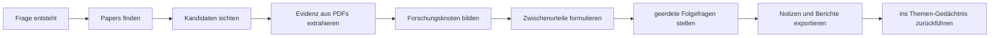

[English](../README.md) | [简体中文](README.zh-CN.md) | [日本語](README.ja-JP.md) | [한국어](README.ko-KR.md) | [Deutsch](README.de-DE.md) | [Français](README.fr-FR.md) | [Español](README.es-ES.md) | [Русский](README.ru-RU.md)

<p align="center">
  
</p>

<h1 align="center">TraceMind</h1>

<p align="center">
  <strong>Eine persönliche KI-Forschungswerkbank für Menschen, die eine Richtung verstehen wollen und nicht nur schnelle Antworten sammeln möchten.</strong>
</p>

<p align="center">
  <a href="../LICENSE"></a>
  
  
  
</p>

## Kurz gesagt

Ein einzelnes Forschungsergebnis reicht fast nie aus, um die Entwicklung eines Feldes wirklich zu erkennen. Gerade in der KI-Forschung sind Tempo, Trends und Sichtbarkeit hoch, aber tiefes Verständnis wächst deutlich langsamer. TraceMind soll helfen, Literatur über längere Zeit zu verfolgen, Evidenz zu sammeln und daraus eine klarere Sicht auf ein Forschungsgebiet aufzubauen.

## Was ist TraceMind

TraceMind ist eine persönliche KI-Forschungswerkbank.

Es ist weder nur ein Chatfenster noch nur eine Literaturliste. Es verbindet Papers, PDFs, Abbildungen, Formeln, Zitationen, Forschungsnoten, Urteile und Folgefragen in einem langfristigen Arbeitsraum.

Geeignet für:
- Studierende mit Thesis oder Literaturreview
- unabhängige Forschende
- Ingenieurinnen, Ingenieure und Tech Leads
- Analystinnen und Analysten mit Bedarf an belegbasierten Notizen

## Warum ist es nötig

Forschung scheitert oft nicht an fehlender Information, sondern daran, dass Verständnis nicht stabil genug kumuliert.

Allgemeine Chat-Tools sind stark im Antworten, aber schwächer darin, folgende Dinge festzuhalten:
- warum ein Urteil entstand
- welche Evidenz es stützt
- was noch offen ist
- wie sich ein Bereich im Zeitverlauf verschiebt

TraceMind baut deshalb auf vier Ideen:
- `Evidenz vor Eindruck`
- `Gedächtnis vor Chat`
- `Struktur vor Ablage`
- `menschliches Urteil im Zentrum`

## Wie man das Produkt lesen sollte

| Fläche | Welche Frage sie schnell beantworten sollte |
| --- | --- |
| Home | Welche Themen verfolge ich gerade? |
| Topic page | Wie weit ist dieses Thema, welche Knoten und Papers sind wichtig? |
| Node research view | Was ist die Kernfrage, welche Evidenz trägt die aktuelle Lesart? |
| Workbench | Welche Folgefrage schärft oder testet mein Verständnis? |
| Export | Wie mache ich daraus Notizen, Briefings oder Berichtsmaterial? |

## Warum Themen und Knoten so wichtig sind

TraceMind erzeugt beim Erstellen eines Themas keine künstliche Planungsphase. Themen sollen aus realer Entdeckung, Auswahl, Extraktion und Beurteilung wachsen.

Knotenseiten sind deshalb keine Einzelpaper-Seiten. Sie sollen helfen, die Hauptlinie schnell wiederzufinden: Kernfrage, Schlüsselarbeiten, Evidenzkette, Grenzen und aktuelles Urteil.

## Was man heute damit tun kann

- Papers über akademische Quellen entdecken
- Kandidaten sichten und thematisch zuordnen
- Text, Figuren, Tabellen, Formeln und Zitationen aus PDFs extrahieren
- eine Richtung in Forschungs-Knoten organisieren
- strukturierte Knotennotizen und Forschungsbriefe aufbauen
- Folgefragen im Themenkontext stellen
- Ergebnisse als Notizen oder Berichtsmaterial exportieren

## Mentales Modell

| Objekt | Bedeutung |
| --- | --- |
| Topic | eine Forschungsrichtung, zu der man wiederholt zurückkehrt |
| Paper | Paper plus PDF, Metadaten, Zitationen und extrahierte Assets |
| Evidence | wiederverwendbare Belege wie Textstellen, Figuren, Tabellen oder Formeln |
| Node | strukturierte Forschungseinheit zu Problem, Methode, Grenze oder Kontroverse |
| Judgment | aktuelles Urteil darüber, was die Evidenz trägt |
| Memory | Langzeitkontext für spätere Folgefragen |

## Schnellstart

Voraussetzungen:
- Node.js `18+`
- npm `9+`
- Python `3.10+`
- API-Schlüssel für mindestens einen Modellanbieter

Backend:

```bash
cd skills-backend
npm install
cp .env.example .env
npm run db:generate
npm run dev
```

Frontend:

```bash
cd frontend
npm install
npm run dev
```

Standardadressen:
- frontend: `http://localhost:5173`
- backend health: `http://localhost:3303/health`

## Die erste Stunde

1. Anwendung starten und Modellanbieter konfigurieren.
2. Ein Thema anlegen, das wirklich über längere Zeit verfolgt werden soll.
3. Paper-Discovery ausführen und Kandidaten kritisch sichten.
4. Nur die Arbeiten behalten, die wirklich zur Hauptlinie gehören.
5. Eine Node-Ansicht öffnen und den strukturierten Überblick lesen.
6. Eine prüfende Frage stellen, zum Beispiel: `Was ist die schwächste Evidenz in diesem Zweig?`
7. Ergebnis exportieren oder das Thema weiter wachsen lassen.

## Forschungszyklus



## Vergleich

| Werkzeug | Starke Seite | Rolle von TraceMind |
| --- | --- | --- |
| Zotero | Sammeln und Zitieren | verwandelt Literatur in Knoten, Evidenzketten und Urteile |
| NotebookLM | Fragen über gegebene Quellen | hält diese Fragen in einem langlebigen Thema |
| Elicit | Suche und Review-Workflows | fokussiert stärker auf laufende persönliche Forschung |
| Perplexity | schnelle Antworten mit Quellen | macht aus Einmalantworten Themenwissen |
| ChatGPT / Claude | Denken und Schreiben | gibt dem Modell einen Forschungsraum statt eines leeren Chats |

## Grenzen

TraceMind verspricht nicht:
- dass Modellantworten immer korrekt sind
- dass PDF-Extraktion perfekt ist
- dass KI menschliches Fachurteil ersetzt

Gerade deshalb ist es für Nutzerinnen und Nutzer gedacht, die prüfen, hinterfragen und verbessern möchten.

## Technische Basis und Referenzen

TraceMind baut auf `React`, `Vite`, `Express`, `Prisma`, `PyMuPDF`, `OpenAI`, `Anthropic`, `Google`, `arXiv`, `OpenAlex`, `Crossref` und `Semantic Scholar` auf.

Beim Aufbau der öffentlichen Dokumentation waren außerdem Projekte wie `Supabase`, `Dify`, `LangChain`, `Immich`, `Next.js`, `Visual Studio Code`, `Excalidraw` und `Open WebUI` wichtige Referenzen für Klarheit und Nutzernähe.

## Beiträge, Sicherheit, Lizenz

- Beitragshinweise: [CONTRIBUTING.md](../CONTRIBUTING.md)
- Sicherheitsrichtlinie: [SECURITY.md](../SECURITY.md)
- Lizenz: [MIT](../LICENSE)

## Schluss

Eine Forschungsrichtung wird selten durch einen einzelnen Fortschritt verständlich. Noch schwerer wird es, wenn das Umfeld Geschwindigkeit, Trendnähe und Oberflächenneuheit belohnt.

TraceMind will KI so einsetzen, dass sie Literatur verfolgt, Evidenz sammelt und Folgefragen auf dieser Basis unterstützt. Nicht als lautere Stimme als die Forschung selbst, sondern als Werkzeug, das ihre Form klarer sichtbar macht.
