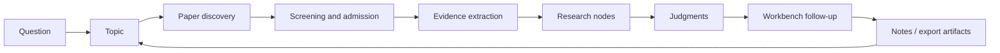

[English](../README.md) | [简体中文](README.zh-CN.md) | [日本語](README.ja-JP.md) | [한국어](README.ko-KR.md) | [Deutsch](README.de-DE.md) | [Français](README.fr-FR.md) | [Español](README.es-ES.md) | [Русский](README.ru-RU.md)

<p align="center">
  
</p>

<h1 align="center">TraceMind</h1>

<p align="center">
  <strong>Eine KI-Forschungswerkbank für Einzelpersonen, die ein Feld wirklich verstehen wollen, statt nur schnelle Antworten daraus zu ziehen.</strong>
</p>

<p align="center">
  <a href="../LICENSE"></a>
  
  
  
  
</p>

## Was TraceMind ist

TraceMind ist eine KI-Forschungswerkbank für Einzelpersonen. Es richtet sich an den Moment nach "Ich habe schon viele Papers gesammelt" und vor "Ich kann klar erklären, was in diesem Forschungsfeld eigentlich passiert".

Statt Forschung als Haufen aus Chats, Lesezeichen und isolierten Zusammenfassungen zu behandeln, verwandelt TraceMind:

- Papers in wiederverwendbare Evidenz
- Evidenz in Forschungsknoten
- Knoten in belastbare Urteile
- Urteile in Folgefragen, die den Kontext behalten

Das Ziel ist nicht mehr Text. Das Ziel ist Lesbarkeit eines Forschungsfelds.

## Produktüberblick

Am leichtesten versteht man TraceMind über seine fünf zentralen Produktflächen.

| Oberfläche | Wofür sie da ist | Was man schnell verstehen soll |
| --- | --- | --- |
| Topic Page | Den Zustand einer Forschungsrichtung sehen | Welche Stufen existieren, welche Knoten wichtig sind und welche Papers die Hauptlinie tragen |
| Node Page: Research View | Schneller Einstieg in einen Knoten | Worum es im Knoten geht, welche Evidenz zählt und wo Konsens oder Streit liegen |
| Node Page: Article View | Tiefes Verständnis eines Knotens | Wie die Papers im Knoten zusammenhängen und wie die lange Darstellung evidenzgestützt ist |
| Workbench | Kontextuelle Folgefragen stellen | Urteile hinterfragen, Zweige vergleichen und weiterfragen, ohne den Kontext neu aufzubauen |
| Modellzentrum | Den eigenen KI-Stack konfigurieren | Provider, Modelle, Base-URL, API-Key und Task-Routing selbst festlegen |

Kurz gesagt:

> TraceMind ist kein Paper-Ordner mit Chatfenster, sondern ein Werkzeug zum Aufbau von Forschungsstruktur.

## Topic Page: Die Richtung wirklich sehen

Die Topic Page ist die zentrale Orientierungsfläche des Produkts. Sie soll eine schwierige Frage schnell beantworten:

> "Wie weit ist diese Forschungsrichtung wirklich, und was bildet ihre aktuelle Hauptlinie?"

In TraceMind soll die Topic Page weder wie ein generisches Projektboard aussehen noch mit einer künstlichen `research planning`-Phase starten. Ein Topic beginnt leicht und wächst erst dann, wenn echtes Material eintrifft.

### Was auf der Topic Page sichtbar wird

- Eine Forschungsübersicht mit echten Zahlen zu Stufen, Knoten, Papers und Evidenzobjekten
- Eine Stufen-Timeline, die aus Paper Discovery, Screening, Node Synthesis und zeitlicher Akkumulation entsteht
- Ein Stage-Node-Graph mit Hauptlinie, Nebenästen und Zusammenführungen auf einer Fläche
- Bis zu zehn sichtbare Node-Karten pro Stufe, damit dichte Stufen lesbar bleiben
- Herausgehobene Key Papers statt vergrabener Listen
- Schnelle Einstiege in wichtige Knoten
- Noch nicht vollständig zugeordnete Materialien, damit unfertige Arbeit sichtbar bleibt
- Ein rechter Workbench-Einstieg für Folgefragen direkt aus dem Topic-Kontext

### Was eine gute Topic Page in 30 Sekunden zeigen sollte

- Ist dieses Topic noch explorativ oder schon strukturell klar?
- Welche Stufe beschreibt den Feldzustand am besten?
- Welche Äste sind wichtig genug, um sie weiter zu verfolgen?
- Welche Knoten tragen die Erklärungslast?
- Welche Papers definieren den aktuellen Zustand wirklich?
- Was hat sich zuletzt verändert?

Deshalb beginnt ein Topic in TraceMind nicht mit einer künstlichen Planungsphase. Eine Stufe muss aus Material entstehen, nicht aus Dekoration.

## Node Page: Ein Knoten, zwei Ansichten

Ein Node ist keine Einzelseite für ein Paper. Ein Node ist eine strukturierte Einheit des Verstehens innerhalb eines Topics: eine Methodenfamilie, ein Engpass, ein Streitpunkt, ein Mechanismus, eine Grenze oder ein Wendepunkt.

Darum hat die Node Page zwei klar getrennte Aufgaben, die TraceMind als Dual View sichtbar macht.

| Ansicht | Zweck | Geeignet für |
| --- | --- | --- |
| Research View | Schnelles strukturiertes Verstehen | Die ersten Minuten, in denen man die Form des Knotens erfassen will |
| Article View | Tiefes synthetisches Lesen | Die Zeit danach, wenn man die Papers des Knotens als zusammenhängende Erzählung lesen will |

### Research View: der schnelle Verständniszugang

Research View ist eher ein Forschungsbriefing als ein gewöhnlicher Artikel. Das gewünschte Gefühl ist:

> "Mein Forschungsassistent hat diesen Knoten schon gelesen und mir den schnellsten seriösen Einstieg vorbereitet."

Research View betont:

- die Kernfrage des Knotens
- visuelle Argumentkarten
- Schlüsselpapers und ihre Rollen
- Evidenzketten aus Abbildungen, Tabellen, Formeln und Zitaten
- Methoden, Befunde und Grenzen
- Kontroversen, offene Fragen und Spannungen
- ein aktuelles Syntheseurteil

Die Ansicht soll bildreicher, strukturierter und schneller lesbar sein als eine klassische Artikelseite.

### Article View: tief verstehen, ohne sofort jedes Originalpaper neu zu lesen

Article View ist die Langform-Ebene des Knotens. Sie soll Originalpapers nicht dauerhaft ersetzen. Sie soll aber den Moment hinauszögern, an dem man zehn PDFs nur deshalb neu öffnen muss, um die Hauptlinie wiederzufinden.

Dafür bietet Article View:

- einen durchgehenden Node-Artikel statt flacher Einzelzusammenfassungen
- Inline-Referenzen mit Bindung an Papers und Evidenzobjekte
- Einbindung von Abbildungen, Tabellen und Formeln, wenn sie verfügbar sind
- eine Synthese mehrerer Papers innerhalb desselben Knotens
- zuerst eine stabile Lesefläche und danach schrittweise tiefere Artikelverdichtung

Das ist eine Kernwette von TraceMind: Ein Nutzer sollte die Literatur eines Knotens tief verstehen können, bevor er entscheidet, welche Originalpapers er noch einmal genau lesen muss.

## Workbench: Fragen jederzeit weiterführen

Forschungsverständnis endet nicht nach einem einzelnen Seitenaufruf. Deshalb braucht TraceMind eine Workbench.

Die Workbench existiert in zwei Formen:

- als rechter Kontextbereich auf Topic- und Node-Seiten
- als eigenständige Seite für längere Sitzungen

Sie ist kein generischer Chat. Ihre Aufgabe ist kontextgebundene Folgearbeit. Gute Fragen an die Workbench sind zum Beispiel:

- Welcher Zweig dieses Topics hat momentan die schwächste Evidenz?
- Was müsste passieren, um das aktuelle Node-Urteil umzuwerfen?
- Sind diese zwei Knoten komplementär oder konkurrierende Erklärungen?
- Welche Papers sind wirklich zentral und welche nur benachbarter Lärm?
- Wenn ich nur drei Originalpapers erneut lesen könnte, welche sollten es sein?

Der entscheidende Punkt ist Kontexterhalt. Die Workbench soll das aktive Topic oder den aktiven Knoten erben, statt jedes Gespräch wieder bei null beginnen zu lassen.

## Modelle und APIs: Den eigenen Stack mitbringen

TraceMind ist für Nutzer gebaut, die ihren Modell-Stack selbst kontrollieren wollen.

Im Modellzentrum und im Prompt Studio lassen sich konfigurieren:

- ein Standard-Slot für Sprachmodelle
- ein Standard-Slot für multimodale Modelle
- benutzerdefinierte Modelle für Forschungsrollen
- Task-Routing für Chat, Topic Synthesis, PDF Parsing, Bildanalyse, Formel-Erkennung, Tabellenextraktion und Evidenzerklärung
- Provider, Modellname, Base-URL, API-Key und providerspezifische Optionen

Damit kann TraceMind mit offiziellen Anbietern wie OpenAI, Anthropic und Google arbeiten, mit integrierten Providerfamilien der Omni-Schicht sowie mit OpenAI-kompatiblen Gateways oder eigenen Endpunkten.

Die Leitidee ist einfach: Der Forschungsworkflow soll nicht fest an einen einzelnen Provider gebunden sein.

## Forschungsschleife: Wie ein Topic wächst

TraceMind versteht man am besten als Akkumulationsschleife statt als Einmal-Assistenten.



Wichtig ist, dass TraceMind nicht direkt von `question` zu `answer` springen will. Es will die Zwischenstruktur bewahren:

- warum diese Papers aufgenommen wurden
- welche Evidenz wirklich wichtig war
- wie daraus Knoten wurden
- welches Urteil die Knoten tragen konnten
- welche neuen Fragen daraus entstanden

## Schnellstart

### Voraussetzungen

- Node.js `18+`
- npm `9+`
- Python `3.10+`
- mindestens ein nutzbarer Modell-API-Key

### Backend starten

```bash
cd skills-backend
npm install
cp .env.example .env
npm run db:generate
npm run dev
```

### Frontend starten

```bash
cd frontend
npm install
npm run dev
```

### Optional: mit Docker

```bash
docker compose up --build
```

### Standardadressen

- Frontend: `http://localhost:5173`
- Backend-Healthcheck: `http://localhost:3303/health`

### Erste Schritte

1. Öffne zuerst die Einstellungen oder das Modellzentrum.
2. Konfiguriere mindestens ein Sprachmodell und bei Bedarf ein multimodales Modell für PDFs, Bilder, Tabellen und Formeln.
3. Lege ein echtes Topic an, das du über Wochen verstehen willst.
4. Starte Paper Discovery und screene den Kandidatenpool, statt alles aufzunehmen.
5. Kehre zur Topic Page zurück und prüfe, ob Stufen, Knoten und Key Papers bereits sinnvolle Form annehmen.
6. Öffne Nodes zuerst im Research View und wechsle für Tiefe in den Article View.
7. Nutze die Workbench, um das aktuelle Urteil auf seine schwächsten Stellen zu prüfen.

## Stärken

- Echte Fortschrittsdarstellung auf der Topic Page
- Stage-Node-Graph mit Timeline, Ästen und Zusammenführungen
- Dual View auf Node-Ebene: schnell verstehen und tief lesen
- Evidenzbasierte Synthese mit Abbildungen, Tabellen und Formeln
- Kontexttreue Workbench für Folgefragen
- Benutzerkontrolliertes Modell-Routing
- Self-hosted-Ausrichtung
- Achtsprachige Dokumentation und i18n-Grundlage

## Vergleich

TraceMind will nicht jedes Forschungswerkzeug ersetzen. Es besetzt die Schicht zwischen Literatursammlung und belastbarem Verständnis.

| Werkzeugtyp | Typische Stärke | Unterschied von TraceMind |
| --- | --- | --- |
| Generischer KI-Chat | Schnelle Antworten | TraceMind bewahrt Topic Memory, Paper-Struktur, Node-Struktur und Evidenzbezug über Zeit |
| Literaturverwaltung | Sammeln und Zitieren | TraceMind fokussiert auf Knotenbildung, Evidenzketten und Forschungsurteile |
| Notiz-App oder Wiki | Flexible manuelle Ordnung | TraceMind formt Literatur in Forschungsobjekte statt nur manuelle Notizen zu sammeln |
| Einzelsummarizer für Papers | Schnelles Paper-Verständnis | TraceMind arbeitet auf Node-Ebene über mehrere Papers hinweg |

## Tutorial: Ein guter persönlicher Workflow

1. Von einer Richtung ausgehen, nicht von einem einzelnen Paper.
2. Einen Kandidatenpool aufbauen und dann konsequent aussortieren.
3. Nodes aus Teilproblemen entstehen lassen.
4. Erst die Topic Page lesen, dann tiefer in Nodes gehen.
5. Zuerst Research View, dann Article View.
6. Article View nutzen, um den Node tief zu verstehen, bevor Originalpapers erneut gelesen werden.
7. Die Workbench auf die schwachen Stellen ansetzen.
8. Erst exportieren, wenn der Knoten wirklich lesbar geworden ist.

Wenn der Workflow gut funktioniert, wandelt sich das Gefühl von "Ich habe viele Papers" zu "Ich kann diesen Zweig des Feldes erklären".

## Gestaltungsprinzipien

- Kein künstlicher Planungsabschnitt bei der Topic-Erstellung
- Stufen müssen aus realem Material entstehen
- Nodes sind Verstehenseinheiten, keine Ordner
- Research View ist der schnelle Zugang
- Article View macht den Node tief lesbar
- Urteile bleiben revidierbar und evidenzgebunden
- Die Workbench bleibt im Topic-Gedächtnis verankert

## Motivation

Ein einzelnes Forschungsupdate reicht fast nie aus, um eine ganze Richtung zu überblicken. In der heutigen KI-Forschung sind Tempo, Trenddruck und Follow-Kultur hoch. Belohnt wird oft, wer am schnellsten reagiert, nicht wer am klarsten versteht.

Das hilft bei Aufmerksamkeit, aber nicht immer bei Erkenntnis. Wenn alle nur dem Neuesten hinterherlaufen, verfolgen immer weniger Menschen geduldig,

- was sich wirklich aufbaut
- was nur neu verpackt ist
- welche Konflikte ungelöst bleiben
- welche Evidenz den Feldzustand tatsächlich verändert

TraceMind beginnt deshalb mit einer anderen Frage:

> Kann KI Literatur über Zeit verfolgen, Evidenz akkumulieren und aus dieser Akkumulation heraus antworten?

Das ist der eigentliche Forschungsgedanke hinter dem Projekt. KI soll nicht bloß flüssig antworten, sondern ein treuer, strenger Assistent werden, der Linien, Abzweigungen und ungelöste Spannungen eines Feldes sichtbar macht.

## Technik

- Frontend: React + Vite
- Backend: Express + Prisma
- Standarddatenbank: SQLite
- Modellschicht: Omni-Gateway mit konfigurierbaren Providern, Slots und Task-Routing
- Forschungsobjekte: Papers, Figures, Tables, Formulas, Nodes, Stages und Exporte

## Schluss

Forschungsverständnis akkumuliert nicht automatisch. Papers wachsen schneller als Urteile, und Zusammenfassungen schneller als Struktur.

TraceMind ist für die langsamere, aber wertvollere Schicht dazwischen gebaut: die Schicht, in der man zu einem Topic zurückkehrt und immer noch sehen kann, was im Feld geschieht, warum ein Urteil entstanden ist und was weiterhin hinterfragt werden muss.
