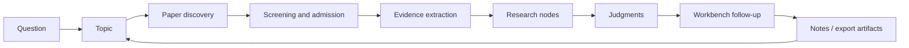

[English](../README.md) | [简体中文](README.zh-CN.md) | [日本語](README.ja-JP.md) | [한국어](README.ko-KR.md) | [Deutsch](README.de-DE.md) | [Français](README.fr-FR.md) | [Español](README.es-ES.md) | [Русский](README.ru-RU.md)

<p align="center">
  
</p>

<h1 align="center">TraceMind</h1>

<p align="center">
  <strong>Una mesa de trabajo personal de investigación con IA, pensada para ver con claridad una dirección de investigación y no solo obtener respuestas rápidas.</strong>
</p>

<p align="center">
  <a href="../LICENSE"></a>
  
  
  
  
</p>

## Qué es TraceMind

TraceMind es una mesa de trabajo personal de investigación impulsada por IA. Está pensada para el momento en el que ya no dices "todavía no encuentro artículos", sino "ya reuní muchos artículos, pero aún no veo con claridad qué está ocurriendo realmente en esta línea".

TraceMind no trata la investigación como una pila de chats, marcadores y resúmenes aislados. Intenta transformar:

- artículos en evidencia reutilizable
- evidencia en nodos de investigación
- nodos en juicios fundamentados
- juicios en nuevas preguntas que conservan el contexto

La meta no es generar más texto. La meta es volver legible una dirección de investigación.

## Introducción al producto

La forma más sencilla de entender TraceMind es a través de sus cinco superficies principales.

| Superficie | Para qué sirve | Qué debería comprenderse rápidamente |
| --- | --- | --- |
| Página de tema | Ver el estado actual de una dirección | Qué etapas existen, qué nodos importan y qué artículos forman la línea principal |
| Página de nodo: Research View | Entrada rápida a un nodo | Qué estudia el nodo, qué evidencia importa y dónde hay acuerdo o división |
| Página de nodo: Article View | Comprensión profunda del nodo | Cómo se conectan los artículos dentro del nodo y cómo la lectura larga está sustentada por evidencia |
| Workbench | Hacer preguntas con contexto | Cuestionar juicios, comparar ramas y seguir preguntando sin reiniciar el contexto |
| Centro de modelos | Configurar tu propio stack de IA | Definir provider, modelo, base URL, clave API y ruteo por tarea |

En una frase:

> TraceMind no es una lista de papers con una caja de chat encima. Es una herramienta para construir estructura de investigación.

## Página de tema: ver la dirección con claridad

La página de tema es la superficie principal de orientación. Debe responder rápidamente a una pregunta difícil:

> "¿En qué estado real se encuentra hoy esta dirección de investigación?"

En TraceMind, la página de tema no debería parecer un tablero genérico de proyecto ni empezar con una fase artificial de `research planning`. Un tema comienza ligero y solo crece cuando llegan materiales reales.

### Qué debe mostrar la página de tema

- un resumen de progreso con el número real de etapas, nodos, papers y objetos de evidencia
- una timeline de etapas que nace del descubrimiento de papers, el filtrado, la síntesis de nodos y la acumulación temporal
- un grafo de etapas y nodos con línea principal, ramas laterales y puntos de convergencia
- hasta diez tarjetas visibles de nodo por etapa para mantener la legibilidad
- artículos clave destacados en la parte superior
- accesos rápidos a nodos relevantes
- material todavía no mapeado para que el trabajo incompleto siga visible
- una entrada al workbench en el lateral derecho para continuar desde el contexto del tema

### Qué debería decir una buena página de tema en 30 segundos

- ¿El tema sigue en exploración o ya tiene estructura clara?
- ¿Qué etapa describe mejor el estado del campo?
- ¿Qué ramas merece la pena seguir?
- ¿Qué nodos cargan con la explicación principal?
- ¿Qué artículos definen de verdad el estado actual?
- ¿Qué cambió recientemente?

Por eso TraceMind no crea un stage de planificación ficticia al iniciar un tema. Una etapa debe ganarse con material real.

## Página de nodo: un nodo, dos formas de lectura

Un nodo no es una página de un solo paper. Es una unidad estructurada de comprensión dentro de un tema: una familia de métodos, una controversia, un cuello de botella, un mecanismo, un límite o un punto de giro.

Por eso la página de nodo tiene dos funciones distintas, y TraceMind las hace explícitas con una vista dual.

| Vista | Objetivo | Cuándo usarla |
| --- | --- | --- |
| Research View | Comprensión estructurada rápida | Cuando primero quieres ver la forma del nodo sin hundirte en demasiado texto |
| Article View | Lectura profunda sintetizada | Cuando quieres entender el conjunto de papers del nodo como una narrativa coherente |

### Research View: la entrada rápida

Research View se parece más a un briefing de investigación que a un artículo común. La sensación buscada es:

> "Mi asistente de investigación ya leyó este nodo, organizó la evidencia y me preparó la entrada seria más rápida posible."

Esta vista enfatiza:

- la pregunta central del nodo
- tarjetas visuales de argumentos
- papers clave y sus roles
- cadenas de evidencia con figuras, tablas, fórmulas y citas
- métodos, hallazgos y limitaciones principales
- controversias y preguntas abiertas
- un juicio de síntesis actual

Debe ser más visual, más estructurada y más rápida de recorrer que una página de artículo tradicional.

### Article View: comprensión profunda sin volver de inmediato a todos los originales

Article View es la capa de lectura larga del nodo. No intenta reemplazar para siempre los papers originales. Intenta reducir el momento en el que el usuario necesita reabrir inmediatamente muchos PDF solo para recuperar la línea principal.

Por eso ofrece:

- un artículo continuo a nivel de nodo en lugar de un montón de resúmenes planos
- referencias inline conectadas con papers y evidencia
- integración de figuras, tablas y fórmulas cuando están disponibles
- síntesis de varios papers dentro del mismo nodo
- primero una superficie estable de lectura y después una profundización más rica

Una apuesta central de TraceMind es esta: antes de decidir qué papers originales releer, el usuario debería poder entender profundamente qué está diciendo en conjunto la literatura del nodo.

## Workbench: preguntar en cualquier momento

La comprensión de una dirección de investigación no termina tras una sola lectura. Por eso TraceMind incluye un workbench.

El workbench existe de dos formas:

- como panel contextual derecho en páginas de tema y de nodo
- como página independiente para sesiones más largas

No es una conversación genérica. Su papel es la continuación anclada en contexto. Buenas preguntas serían:

- ¿Qué rama de este tema tiene la evidencia más débil?
- ¿Qué podría cambiar más probablemente el juicio actual del nodo?
- ¿Estos dos nodos son complementarios o compiten como explicación?
- ¿Qué papers son centrales y cuáles son solo ruido adyacente?
- Si solo pudiera releer tres originales, ¿cuáles elegiría?

La clave es heredar el contexto. El workbench debe continuar desde el tema o nodo activo en lugar de reiniciar cada conversación.

## Modelos y APIs: trae tu propia pila

TraceMind está diseñado para usuarios que quieren controlar su stack de modelos.

En el centro de modelos y Prompt Studio puedes configurar:

- un slot por defecto para modelo de lenguaje
- un slot multimodal por defecto
- modelos personalizados para roles de investigación
- ruteo de tareas para chat, síntesis de temas, parsing de PDF, análisis de figuras, reconocimiento de fórmulas, extracción de tablas y explicación de evidencia
- provider, nombre de modelo, base URL, clave API y opciones específicas

En la práctica, esto permite trabajar con OpenAI, Anthropic, Google, familias de provider soportadas por Omni, gateways OpenAI-compatible y endpoints propios o autoalojados.

La idea es simple: el flujo de investigación no debería quedar atado a un único provider.

## Bucle de investigación: cómo crece un tema

TraceMind se entiende mejor como un bucle de acumulación que como un asistente de un solo disparo.



Lo importante es que TraceMind no intenta saltar directamente de `question` a `answer`. Intenta preservar la estructura intermedia:

- por qué se admitieron ciertos papers
- qué evidencia importó de verdad
- cómo esa evidencia formó nodos
- qué juicio podía sostenerse en ese momento
- qué nuevas preguntas nacieron de ese juicio

## Inicio rápido

### Requisitos

- Node.js `18+`
- npm `9+`
- Python `3.10+`
- al menos una clave API de modelo utilizable

### Iniciar backend

```bash
cd skills-backend
npm install
cp .env.example .env
npm run db:generate
npm run dev
```

### Iniciar frontend

```bash
cd frontend
npm install
npm run dev
```

### Opcional: ejecutar con Docker

```bash
docker compose up --build
```

### Direcciones locales por defecto

- Frontend: `http://localhost:5173`
- Health check del backend: `http://localhost:3303/health`

### Primer recorrido recomendado

1. Abre primero ajustes o el centro de modelos.
2. Configura al menos un modelo de lenguaje y, si quieres más capacidad con PDF, imágenes, tablas y fórmulas, añade también uno multimodal.
3. Crea un tema real que quieras entender durante semanas.
4. Ejecuta el descubrimiento de papers y luego filtra el pool candidato con criterio.
5. Vuelve a la página de tema y verifica si etapas, nodos y artículos clave empiezan a tener sentido.
6. Entra en un nodo primero por Research View y pasa a Article View cuando necesites profundidad.
7. Usa el workbench para atacar la parte más débil del juicio actual.

## Fortalezas

- páginas de tema basadas en progreso real
- grafo de etapas y nodos con timeline, ramas y convergencias
- nodos con doble vista
- síntesis centrada en evidencia
- workbench contextualizado
- ruteo de modelos controlado por el usuario
- orientación self-hosted
- documentación rica en ocho idiomas

## Comparación

TraceMind no pretende sustituir todas las herramientas de investigación. Ocupa la capa entre la recolección bibliográfica y la comprensión estructurada.

| Tipo de herramienta | Fortaleza típica | Diferencia de TraceMind |
| --- | --- | --- |
| Chat IA genérico | Respuestas rápidas | TraceMind conserva memoria de tema, estructura de papers, estructura de nodos y anclaje en evidencia |
| Gestor bibliográfico | Recolección y citas | TraceMind se enfoca en formación de nodos, cadenas de evidencia y juicios |
| Aplicación de notas / wiki | Organización manual flexible | TraceMind convierte literatura en objetos de investigación estructurados |
| Resumidor de un solo paper | Digestión rápida de un artículo | TraceMind sintetiza a nivel de nodo, entre múltiples papers |

## Tutorial: una buena forma de usarlo a nivel personal

1. Empieza por una dirección, no por un solo paper.
2. Construye un pool candidato y luego rechaza el ruido con decisión.
3. Deja que los nodos emerjan de subproblemas reales.
4. Lee la página de tema antes de profundizar en un nodo.
5. Empieza por Research View y luego pasa a Article View.
6. Usa Article View para entender el nodo en profundidad antes de volver a todos los originales.
7. Usa el workbench para presionar los puntos débiles.
8. Exporta solo cuando el nodo ya sea verdaderamente legible.

Si el flujo funciona bien, la sensación debería pasar de "tengo muchos papers" a "puedo explicar lo que hace esta rama del campo".

## Principios de diseño

- no crear una etapa de planificación falsa al crear un tema
- las etapas deben emerger de material real
- los nodos son unidades de comprensión, no carpetas
- Research View debe ser la entrada más rápida
- Article View debe volver profundamente legible al nodo
- los juicios deben seguir siendo revisables y vinculados a evidencia
- el workbench debe permanecer anclado en la memoria del tema

## Origen

Una sola actualización de investigación rara vez permite ver una dirección completa. En la investigación en IA actual, el ritmo es rápido, la presión por seguir tendencias es fuerte y muchas veces se recompensa a quien reacciona antes.

Eso ayuda a estar al día, pero no siempre ayuda a comprender. Si todos persiguen solo lo más nuevo, cada vez menos personas siguen con paciencia:

- qué se está acumulando realmente
- qué es solo un reempaquetado
- qué tensiones siguen sin resolverse
- qué evidencia cambia de verdad el estado del campo

TraceMind parte de otra pregunta:

> ¿Puede la IA seguir literatura en el tiempo, acumular evidencia y responder desde esa acumulación?

Esa es la intuición fundacional del proyecto. La idea es que la IA se convierta en un asistente leal y riguroso, capaz de mostrar la genealogía, las ramas y las tensiones no resueltas de un campo.

## Stack técnico

- Frontend: React + Vite
- Backend: Express + Prisma
- Base de datos por defecto: SQLite
- Capa de modelos: gateway Omni con providers, slots y ruteo configurables
- Objetos de investigación: papers, figures, tables, formulas, nodes, stages y exports

## Cierre

La comprensión de investigación no se acumula sola. Los papers crecen más rápido que los juicios, y los resúmenes más rápido que la estructura.

TraceMind está construido para esa capa intermedia, más lenta pero mucho más valiosa: la capa en la que una persona vuelve a un tema y todavía puede ver qué está ocurriendo en el campo, por qué existe el juicio actual y qué debe seguir poniéndose a prueba.
