[English](../README.md) | [简体中文](README.zh-CN.md) | [日本語](README.ja-JP.md) | [한국어](README.ko-KR.md) | [Deutsch](README.de-DE.md) | [Français](README.fr-FR.md) | [Español](README.es-ES.md) | [Русский](README.ru-RU.md)

<p align="center">
  
</p>

<h1 align="center">TraceMind</h1>

<p align="center">
  <strong>Un banco personal de investigación con IA para quienes quieren entender una dirección de trabajo, no solo acumular respuestas rápidas.</strong>
</p>

<p align="center">
  <a href="../LICENSE"></a>
  
  
  
</p>

## En una idea

Una sola novedad rara vez basta para ver con claridad la trayectoria de un campo. En la investigación de IA abundan la velocidad, el ruido y el seguimiento de tendencias, pero no necesariamente la comprensión acumulada. TraceMind quiere ayudar a que la IA siga la literatura, acumule evidencia y responda desde esa base para que el usuario vea mejor la forma real de una dirección de investigación.

## Qué es TraceMind

TraceMind es un banco personal de investigación con IA.

No es solo un chat ni solo una biblioteca de artículos. Reúne artículos, PDF, figuras, fórmulas, citas, nodos de investigación, juicios y preguntas de seguimiento en un mismo espacio de trabajo.

Está pensado para:
- estudiantes que preparan tesis o revisiones
- investigadores independientes
- ingenieros y responsables técnicos
- analistas que necesitan notas con fundamento

## Por qué hace falta

La investigación no se atasca solo por falta de información. A menudo se atasca porque la comprensión no llega a consolidarse.

Las herramientas de chat general responden bien, pero conservan mal:
- por qué se formuló un juicio
- qué evidencia lo sostiene
- qué partes siguen inciertas
- cómo cambia un campo con el tiempo

TraceMind se apoya en cuatro ideas:
- `evidencia antes que impresión`
- `memoria antes que chat`
- `estructura antes que acumulación`
- `juicio humano en el centro`

## Cómo leer el producto

| Superficie | Qué debería dejar claro enseguida |
| --- | --- |
| Home | qué temas estás siguiendo ahora |
| Topic page | cuánto ha avanzado el tema y qué nodos o artículos importan |
| Node research view | cuál es la pregunta central y qué cadena de evidencia sostiene la lectura actual |
| Workbench | qué pregunta conviene hacer después |
| Export | cómo convertir el trabajo en notas o material de informe |

## Por qué importan los topics y los nodes

TraceMind no crea una fase artificial de `plan de investigación` al abrir un tema. Las etapas deben crecer a partir de descubrimiento real, selección real y evidencia real.

Tampoco trata la página de nodo como una página de artículo aislada. La idea es que el usuario recupere rápido la línea principal de un subproblema.

## Qué puedes hacer hoy

- descubrir artículos desde varias fuentes académicas
- seleccionar qué trabajos sí pertenecen al tema
- extraer texto, figuras, tablas, fórmulas y citas desde PDF
- organizar una dirección en nodos de investigación
- construir briefs de nodo estructurados
- hacer preguntas de seguimiento conservando el contexto del tema
- exportar notas o materiales de informe

## Modelo mental simple

| Objeto | Significado |
| --- | --- |
| Topic | una dirección de investigación a la que volverás muchas veces |
| Paper | artículo, PDF, metadatos, citas y activos extraídos |
| Evidence | fragmentos, figuras, tablas, fórmulas y referencias reutilizables |
| Node | unidad estructurada alrededor de un problema, método o controversia |
| Judgment | lectura actual de lo que la evidencia respalda |
| Memory | contexto acumulado para futuras preguntas |

## Inicio rápido

Requisitos:
- Node.js `18+`
- npm `9+`
- Python `3.10+`
- una clave API de al menos un proveedor de modelos

Backend:

```bash
cd skills-backend
npm install
cp .env.example .env
npm run db:generate
npm run dev
```

Frontend:

```bash
cd frontend
npm install
npm run dev
```

Direcciones por defecto:
- frontend: `http://localhost:5173`
- backend health: `http://localhost:3303/health`

## La primera hora

1. Inicia la aplicación y configura un proveedor de modelos.
2. Crea un tema que realmente quieras seguir durante semanas o meses.
3. Ejecuta la búsqueda de artículos y revisa los candidatos con criterio.
4. Conserva solo los artículos que de verdad pertenecen a la línea central.
5. Abre una vista de nodo para recuperar la estructura del problema.
6. Haz una pregunta de prueba como `¿Cuál es la evidencia más débil de esta rama?`
7. Exporta el resultado o sigue enriqueciendo el tema.

## Bucle de investigación

```mermaid
flowchart LR
    A["Aparece una pregunta"] --> B["Descubrir artículos"]
    B --> C["Filtrar candidatos"]
    C --> D["Extraer evidencia de los PDF"]
    D --> E["Construir nodos de investigación"]
    E --> F["Formular juicios por etapas"]
    F --> G["Hacer preguntas de seguimiento"]
    G --> H["Exportar notas e informes"]
    H --> I["Volver a la memoria del tema"]
```



## Comparación

| Herramienta | Destaca en | Papel de TraceMind |
| --- | --- | --- |
| Zotero | recopilar y citar | conecta la literatura con nodos, evidencia y juicios |
| NotebookLM | preguntas sobre un corpus dado | mantiene esas preguntas dentro de un tema duradero |
| Elicit | búsqueda y revisiones | se orienta más a la acumulación continua |
| Perplexity | respuestas rápidas con fuentes | convierte una respuesta puntual en memoria de tema |
| ChatGPT / Claude | razonamiento y redacción | ofrece un espacio de investigación, no un chat vacío |

## Límites

TraceMind no promete:
- respuestas perfectas del modelo
- extracción PDF sin errores
- reemplazar el juicio experto humano

Se vuelve más valioso cuando el usuario quiere inspeccionar, cuestionar y corregir los resultados.

## Base técnica e inspiraciones

TraceMind se apoya en `React`, `Vite`, `Express`, `Prisma`, `PyMuPDF`, `OpenAI`, `Anthropic`, `Google`, `arXiv`, `OpenAlex`, `Crossref` y `Semantic Scholar`.

Para claridad documental y presentación pública, también se aprendió de proyectos como `Supabase`, `Dify`, `LangChain`, `Immich`, `Next.js`, `Visual Studio Code`, `Excalidraw` y `Open WebUI`.

## Contribución, seguridad y licencia

- Guía de contribución: [CONTRIBUTING.md](../CONTRIBUTING.md)
- Política de seguridad: [SECURITY.md](../SECURITY.md)
- Licencia: [MIT](../LICENSE)

## Cierre

Es difícil ver una dirección de investigación a partir de una sola novedad, y más aún en un entorno que recompensa la velocidad y la moda.

TraceMind intenta convertir la IA en un asistente que sigue la literatura, acumula evidencia y ayuda a formular mejores preguntas. No para hablar más alto que la investigación, sino para ayudar a verla con mayor claridad.
