[English](../README.md) | [简体中文](README.zh-CN.md) | [日本語](README.ja-JP.md) | [한국어](README.ko-KR.md) | [Deutsch](README.de-DE.md) | [Français](README.fr-FR.md) | [Español](README.es-ES.md) | [Русский](README.ru-RU.md)

<p align="center">
  
</p>

<h1 align="center">TraceMind</h1>

<p align="center">
  <strong>Un atelier personnel de recherche avec IA pour celles et ceux qui veulent comprendre une direction de recherche, pas seulement collectionner des réponses rapides.</strong>
</p>

<p align="center">
  <a href="../LICENSE"></a>
  
  
  
</p>

## En une idée

Une seule avancée ne suffit presque jamais à rendre lisible tout un domaine de recherche. Dans l'IA actuelle, les tendances vont vite, les résumés aussi, mais la compréhension profonde s'accumule plus lentement. TraceMind veut aider l'IA à suivre la littérature, accumuler les preuves et répondre à partir de cette mémoire afin d'éclairer la trajectoire réelle d'un sujet.

## Qu'est-ce que TraceMind

TraceMind est un atelier personnel de recherche assisté par l'IA.

Ce n'est ni une simple interface de chat, ni une simple bibliothèque d'articles. C'est un espace qui relie articles, PDF, figures, formules, citations, nœuds de recherche, jugements et questions de suivi.

Il s'adresse notamment :
- aux étudiants en mémoire ou thèse
- aux chercheurs indépendants
- aux ingénieurs et responsables techniques
- aux analystes qui ont besoin de notes appuyées sur des preuves

## Pourquoi ce projet existe

La recherche ne bloque pas seulement faute d'information. Elle bloque souvent parce que la compréhension ne se consolide pas assez bien dans le temps.

Les outils de chat généralistes répondent vite, mais gardent mal :
- pourquoi un jugement a été formulé
- quelles preuves l'appuient
- ce qui reste incertain
- comment un domaine évolue avec le temps

TraceMind repose donc sur quatre idées :
- `preuve avant impression`
- `mémoire avant chat`
- `structure avant accumulation brute`
- `jugement humain au centre`

## Comment lire le produit

| Surface | Ce qu'elle doit faire comprendre rapidement |
| --- | --- |
| Home | quels sujets sont suivis en ce moment |
| Topic page | où en est le sujet, quels nœuds et quels articles comptent |
| Node research view | quelle est la question centrale et quelle chaîne de preuves soutient la lecture actuelle |
| Workbench | quelle question poser ensuite pour tester ou affiner la compréhension |
| Export | comment transformer le travail en note, brief ou matériau de rapport |

## Pourquoi les topics et les nodes comptent tant

TraceMind n'ajoute pas une fausse étape de planification lors de la création d'un sujet. Les étapes doivent émerger de la découverte réelle, du tri, de l'extraction et de l'accumulation.

De la même façon, une page de nœud ne doit pas ressembler à une simple page d'article. Elle doit aider l'utilisateur à retrouver rapidement la ligne principale d'un sous-problème.

## Ce que l'on peut déjà faire

- découvrir des articles depuis plusieurs sources académiques
- sélectionner les articles vraiment centraux pour un sujet
- extraire texte, figures, tableaux, formules et citations depuis les PDF
- organiser un domaine en nœuds de recherche
- produire des briefs de nœuds structurés
- poser des questions de suivi en gardant le contexte du sujet
- exporter des notes ou matériaux de rapport

## Modèle mental simple

| Objet | Signification |
| --- | --- |
| Topic | une direction de recherche suivie sur la durée |
| Paper | un article avec son PDF, ses métadonnées, ses citations et ses extractions |
| Evidence | un élément réutilisable comme un extrait, une figure, un tableau ou une formule |
| Node | une unité de recherche structurée autour d'un problème, d'une méthode ou d'une controverse |
| Judgment | la meilleure lecture actuelle de ce que les preuves soutiennent |
| Memory | le contexte accumulé qui ancre les questions suivantes |

## Démarrage rapide

Pré-requis :
- Node.js `18+`
- npm `9+`
- Python `3.10+`
- une clé API pour au moins un fournisseur de modèles

Backend :

```bash
cd skills-backend
npm install
cp .env.example .env
npm run db:generate
npm run dev
```

Frontend :

```bash
cd frontend
npm install
npm run dev
```

Adresses locales :
- frontend : `http://localhost:5173`
- backend health : `http://localhost:3303/health`

## La première heure

1. Démarrer l'application et configurer un fournisseur de modèles.
2. Créer un sujet que vous voulez suivre réellement dans le temps.
3. Lancer la découverte d'articles et relire les candidats avec recul.
4. Garder seulement les articles qui appartiennent vraiment à la ligne principale.
5. Ouvrir une vue de nœud pour retrouver la structure du problème.
6. Poser une question de test, par exemple : `Quelle est la preuve la plus faible dans cette branche ?`
7. Exporter le résultat ou continuer à enrichir le sujet.

## Boucle de recherche

```mermaid
flowchart LR
    A["Une question apparaît"] --> B["Découvrir des articles"]
    B --> C["Trier les candidats"]
    C --> D["Extraire les preuves des PDF"]
    D --> E["Construire des nœuds de recherche"]
    E --> F["Formuler des jugements d'étape"]
    F --> G["Poser des questions de suivi"]
    G --> H["Exporter des notes ou rapports"]
    H --> I["Revenir à la mémoire du sujet"]
```



## Comparaison

| Outil | Point fort | Place de TraceMind |
| --- | --- | --- |
| Zotero | collecte et citation | relie la littérature aux nœuds, aux preuves et aux jugements |
| NotebookLM | questions sur un corpus donné | garde ces questions dans un sujet durable |
| Elicit | recherche et revue | s'oriente davantage vers l'accumulation continue |
| Perplexity | réponses rapides avec sources | transforme une réponse ponctuelle en mémoire de sujet |
| ChatGPT / Claude | raisonnement et rédaction | fournit un espace de recherche au lieu d'un chat vide |

## Limites

TraceMind ne promet pas :
- des réponses de modèle toujours justes
- une extraction PDF parfaite
- le remplacement du jugement d'un expert humain

Il devient plus utile quand l'utilisateur accepte d'inspecter, de contester et d'affiner les résultats.

## Bases techniques et inspirations

TraceMind s'appuie sur `React`, `Vite`, `Express`, `Prisma`, `PyMuPDF`, `OpenAI`, `Anthropic`, `Google`, `arXiv`, `OpenAlex`, `Crossref` et `Semantic Scholar`.

Pour la clarté documentaire et la présentation publique, les projets `Supabase`, `Dify`, `LangChain`, `Immich`, `Next.js`, `Visual Studio Code`, `Excalidraw` et `Open WebUI` ont servi de références utiles.

## Contribution, sécurité, licence

- Guide de contribution : [CONTRIBUTING.md](../CONTRIBUTING.md)
- Politique de sécurité : [SECURITY.md](../SECURITY.md)
- Licence : [MIT](../LICENSE)

## Conclusion

Comprendre une direction de recherche à partir d'une seule nouveauté est difficile, surtout dans un environnement qui récompense la vitesse et la mode.

TraceMind cherche à faire de l'IA un assistant qui suit la littérature, accumule les preuves et aide à poser de meilleures questions. Non pas pour parler plus fort que la recherche elle-même, mais pour aider à en voir la forme avec plus de netteté.
