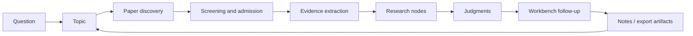

[English](../README.md) | [简体中文](README.zh-CN.md) | [日本語](README.ja-JP.md) | [한국어](README.ko-KR.md) | [Deutsch](README.de-DE.md) | [Français](README.fr-FR.md) | [Español](README.es-ES.md) | [Русский](README.ru-RU.md)

<p align="center">
  
</p>

<h1 align="center">TraceMind</h1>

<p align="center">
  <strong>Un atelier de recherche personnel propulsé par l'IA, conçu pour aider à comprendre une direction de recherche en profondeur, pas seulement à produire des réponses rapides.</strong>
</p>

<p align="center">
  <a href="../LICENSE"></a>
  
  
  
  
</p>

## Qu'est-ce que TraceMind

TraceMind est un atelier de recherche personnel alimenté par l'IA. Il s'adresse au moment où l'on n'est plus au stade "je cherche encore des articles", mais au stade "j'ai déjà beaucoup de papiers, pourtant je n'arrive pas encore à voir clairement la structure réelle du domaine".

TraceMind ne traite pas la recherche comme un amas de conversations, d'onglets, de signets et de résumés isolés. Il cherche plutôt à transformer :

- les articles en preuves réutilisables
- les preuves en nœuds de recherche
- les nœuds en jugements argumentés
- les jugements en nouvelles questions qui gardent le contexte

L'objectif n'est pas de générer plus de texte. L'objectif est de rendre une direction de recherche lisible.

## Présentation du produit

Le moyen le plus simple de comprendre TraceMind est de regarder ses cinq surfaces principales.

| Surface | Rôle | Ce que l'utilisateur doit comprendre vite |
| --- | --- | --- |
| Page de thème | Voir l'état actuel d'une direction | Quelles étapes existent, quels nœuds comptent et quels articles définissent la ligne principale |
| Page de nœud : Research View | Entrée rapide dans un nœud | Ce que le nœud étudie, quelles preuves comptent et où se situent consensus et désaccords |
| Page de nœud : Article View | Compréhension profonde d'un nœud | Comment les articles du nœud s'articulent et comment la lecture longue est soutenue par les preuves |
| Workbench | Poser des questions contextualisées | Tester un jugement, comparer des branches et poursuivre l'exploration sans repartir de zéro |
| Centre des modèles | Configurer sa propre pile IA | Choisir provider, modèle, base URL, clé API et routage par tâche |

En une phrase :

> TraceMind n'est pas une liste de papiers avec une boîte de chat au-dessus. C'est un outil de structuration de la recherche.

## Page de thème : voir clairement la direction

La page de thème est la surface d'orientation centrale. Elle doit répondre très vite à une question difficile :

> "Où en est réellement cette direction de recherche aujourd'hui ?"

Dans TraceMind, la page de thème ne doit pas ressembler à un simple tableau de projet. Elle ne doit pas non plus commencer par une phase artificielle de `research planning`. Un thème commence léger, puis ne grandit qu'à mesure que de vrais matériaux de recherche arrivent.

### Ce que la page de thème doit montrer

- un résumé de progression avec le nombre réel d'étapes, de nœuds, d'articles et d'objets de preuve
- une timeline d'étapes issue de la découverte d'articles, du tri, de la synthèse de nœuds et de l'accumulation temporelle
- un graphe étapes - nœuds montrant ligne principale, branches latérales et points de fusion
- jusqu'à dix cartes de nœud visibles par étape pour préserver la lisibilité
- des articles clés mis en avant, au lieu d'être enfouis dans une longue liste
- des entrées rapides vers les nœuds les plus utiles
- du matériel encore non mappé, pour que le travail incomplet reste visible
- un accès workbench à droite pour prolonger l'enquête directement depuis le contexte du thème

### Ce qu'une bonne page de thème doit dire en 30 secondes

- Le thème est-il encore exploratoire ou déjà structuré ?
- Quelle étape décrit le mieux l'état actuel du champ ?
- Quelles branches méritent d'être suivies ?
- Quels nœuds portent la charge explicative principale ?
- Quels articles définissent réellement l'état du champ ?
- Qu'est-ce qui a changé récemment ?

C'est pourquoi TraceMind refuse de commencer par une étape de planification inventée. Une étape doit être méritée par du matériau réel.

## Page de nœud : un nœud, deux modes de lecture

Un nœud n'est pas une page d'article unique. C'est une unité de compréhension structurée à l'intérieur d'un thème : une famille de méthodes, une controverse, un goulot d'étranglement, un mécanisme, une limite ou un tournant.

La page de nœud assume donc deux fonctions distinctes, rendues explicites par une double vue.

| Vue | Objectif | Quand l'utiliser |
| --- | --- | --- |
| Research View | Comprendre vite la structure | Quand on veut d'abord voir la forme du nœud sans se noyer dans le texte |
| Article View | Lire la synthèse en profondeur | Quand on veut comprendre comment les articles du nœud forment un récit cohérent |

### Research View : l'entrée rapide

Research View ressemble davantage à un briefing de recherche qu'à un article classique. L'expérience visée est proche de :

> "Mon assistant de recherche a déjà lu ce nœud, organisé les preuves et préparé la meilleure entrée sérieuse possible."

Cette vue met en avant :

- la question centrale du nœud
- des cartes visuelles d'arguments
- les articles clés et leur rôle
- des chaînes de preuves issues d'images, tableaux, formules et citations
- les méthodes, résultats et limites principales
- les controverses et questions ouvertes
- un jugement de synthèse actuel

Elle doit être plus visuelle, plus structurée et plus rapide à parcourir qu'une page d'article ordinaire.

### Article View : comprendre en profondeur sans rouvrir tout de suite chaque article

Article View est la couche de lecture longue du nœud. Elle ne vise pas à remplacer définitivement les articles originaux. Elle vise à retarder le moment où l'utilisateur doit rouvrir immédiatement une multitude de PDF juste pour retrouver la ligne principale.

Pour cela, Article View offre :

- un article continu au niveau du nœud plutôt qu'un tas de résumés plats
- des références inline toujours liées aux sources et aux preuves
- l'intégration des figures, tableaux et formules quand ils sont disponibles
- une synthèse de plusieurs articles à l'intérieur d'un même nœud
- une lecture stable d'abord, puis un enrichissement plus profond ensuite

L'un des paris essentiels de TraceMind est ici : un utilisateur doit pouvoir comprendre profondément un nœud avant de décider quels articles originaux relire de près.

## Workbench : poser des questions à tout moment

La compréhension d'une direction de recherche ne se termine jamais après une seule page. C'est pourquoi TraceMind inclut un workbench.

Le workbench existe sous deux formes :

- en panneau contextuel à droite sur les pages de thème et de nœud
- en page dédiée pour les sessions plus longues

Ce n'est pas une conversation générique. Son rôle est la relance fondée sur le contexte. Les bonnes questions ressemblent à :

- Quelle branche de ce thème a actuellement la preuve la plus faible ?
- Qu'est-ce qui renverserait le plus probablement le jugement actuel du nœud ?
- Ces deux nœuds sont-ils complémentaires ou concurrents ?
- Quels articles sont vraiment centraux et lesquels ne sont qu'adjacents ?
- Si je ne pouvais relire que trois articles originaux, lesquels choisir ?

Le point crucial est l'héritage du contexte. Le workbench doit reprendre le thème ou le nœud actif au lieu de recommencer chaque conversation de zéro.

## Modèles et API : brancher sa propre pile

TraceMind est conçu pour des utilisateurs qui veulent contrôler leur propre pile de modèles.

Le centre des modèles et Prompt Studio permettent de configurer :

- un slot de modèle de langage par défaut
- un slot multimodal par défaut
- des modèles dédiés à certains rôles de recherche
- le routage de tâches pour chat, synthèse de thème, parsing PDF, analyse de figures, reconnaissance de formules, extraction de tableaux et explication de preuves
- provider, nom de modèle, base URL, clé API et options spécifiques

En pratique, cela permet de travailler avec des providers officiels comme OpenAI, Anthropic ou Google, avec les familles de providers prises en charge par la couche Omni, ainsi qu'avec des passerelles OpenAI-compatibles ou des endpoints auto-hébergés.

L'idée est simple : le flux de recherche ne doit pas être enfermé dans un seul provider.

## Boucle de recherche : comment un thème grandit

TraceMind se comprend le mieux comme une boucle d'accumulation de recherche, pas comme un assistant à usage unique.



L'essentiel est que TraceMind n'essaie pas de sauter directement de `question` à `answer`. Il cherche à préserver la structure intermédiaire :

- pourquoi ces articles ont été admis
- quelles preuves ont réellement compté
- comment elles ont formé des nœuds
- quel jugement ces nœuds pouvaient soutenir
- quelles nouvelles questions ce jugement a fait naître

## Démarrage rapide

### Pré-requis

- Node.js `18+`
- npm `9+`
- Python `3.10+`
- au moins une clé API de modèle utilisable

### Démarrer le backend

```bash
cd skills-backend
npm install
cp .env.example .env
npm run db:generate
npm run dev
```

### Démarrer le frontend

```bash
cd frontend
npm install
npm run dev
```

### Optionnel : avec Docker

```bash
docker compose up --build
```

### Adresses locales par défaut

- Frontend : `http://localhost:5173`
- Vérification backend : `http://localhost:3303/health`

### Parcours conseillé pour la première utilisation

1. Ouvrir d'abord les réglages ou le centre des modèles.
2. Configurer au moins un modèle de langage, puis un modèle multimodal si vous voulez mieux exploiter PDF, images, tableaux et formules.
3. Créer un vrai thème que vous souhaitez comprendre sur plusieurs semaines.
4. Lancer la découverte d'articles puis trier sérieusement le pool candidat.
5. Revenir à la page de thème pour voir si étapes, nœuds et articles clés commencent à faire sens.
6. Entrer dans un nœud via Research View avant de passer à Article View.
7. Utiliser le workbench pour tester la solidité du jugement actuel.

## Points forts

- page de thème fondée sur la progression réelle
- graphe étapes - nœuds avec timeline, branches et fusions
- double vue au niveau du nœud
- synthèse centrée sur l'évidence
- workbench contextuel
- routage de modèles contrôlé par l'utilisateur
- posture self-hosted
- documentation riche en huit langues

## Comparaison

TraceMind ne cherche pas à remplacer tous les outils de recherche. Il occupe la couche entre collecte bibliographique et compréhension structurée.

| Type d'outil | Force principale | Différence de TraceMind |
| --- | --- | --- |
| Chat IA générique | Réponses rapides | TraceMind conserve mémoire de thème, structure d'articles, structure de nœuds et ancrage dans l'évidence |
| Gestionnaire bibliographique | Collecte et citation | TraceMind se concentre sur la formation des nœuds, les chaînes de preuves et les jugements |
| Application de notes / wiki | Organisation manuelle flexible | TraceMind transforme la littérature en objets de recherche structurés |
| Résumeur d'article unique | Digestion rapide d'un papier | TraceMind synthétise au niveau du nœud, sur plusieurs articles |

## Tutoriel : une bonne manière de l'utiliser seul

1. Partir d'une direction, pas d'un article isolé.
2. Construire un pool candidat puis rejeter agressivement le bruit.
3. Laisser les nœuds émerger à partir de sous-problèmes.
4. Lire la page de thème avant d'approfondir un nœud.
5. Commencer par Research View puis passer à Article View.
6. Utiliser Article View pour comprendre profondément le nœud avant de retourner aux originaux.
7. Employer le workbench pour attaquer les points faibles.
8. Exporter seulement quand le nœud est vraiment lisible.

Quand l'usage est bon, la sensation doit passer de "j'ai beaucoup d'articles" à "je peux expliquer cette branche du champ".

## Principes de conception

- pas de fausse étape de planification à la création d'un thème
- les étapes doivent émerger de matériaux réels
- les nœuds sont des unités de compréhension, pas des dossiers
- Research View doit être l'entrée la plus rapide
- Article View doit rendre un nœud profondément lisible
- les jugements doivent rester révisables et liés aux preuves
- le workbench doit rester ancré dans la mémoire du thème

## Intention d'origine

Une seule avancée de recherche suffit rarement à voir une direction entière. Dans la recherche en IA actuelle, le rythme est rapide, la pression de suivre les tendances est forte et la récompense va souvent à celui qui réagit le plus vite.

Cela aide à suivre l'actualité, mais pas forcément à comprendre en profondeur. Si tout le monde court uniquement derrière la nouveauté, de moins en moins de personnes suivent avec patience :

- ce qui s'accumule réellement
- ce qui n'est qu'un reconditionnement
- quels désaccords restent ouverts
- quelles preuves changent vraiment l'état du champ

TraceMind part donc d'une autre question :

> Peut-on faire en sorte que l'IA suive la littérature dans le temps, accumule des preuves et réponde à partir de cette accumulation ?

C'est l'intuition fondatrice du projet. L'idée est que l'IA devienne un assistant loyal et rigoureux, capable d'aider à voir la lignée, les branches et les tensions non résolues d'un champ.

## Stack technique

- Frontend : React + Vite
- Backend : Express + Prisma
- Base de données par défaut : SQLite
- Couche modèle : passerelle Omni avec providers, slots et routage configurables
- Objets de recherche : papers, figures, tables, formulas, nodes, stages et exports

## Conclusion

La compréhension de la recherche ne s'accumule pas automatiquement. Les papiers croissent plus vite que les jugements, et les résumés plus vite que la structure.

TraceMind est construit pour la couche intermédiaire, plus lente mais beaucoup plus précieuse : celle qui permet de revenir à un thème et de voir encore ce que le champ est en train de faire, pourquoi un jugement existe et ce qu'il faut encore mettre à l'épreuve.
