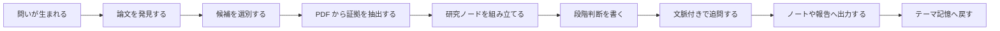

[English](../README.md) | [简体中文](README.zh-CN.md) | [日本語](README.ja-JP.md) | [한국어](README.ko-KR.md) | [Deutsch](README.de-DE.md) | [Français](README.fr-FR.md) | [Español](README.es-ES.md) | [Русский](README.ru-RU.md)

<p align="center">
  
</p>

<h1 align="center">TraceMind</h1>

<p align="center">
  <strong>速い答えではなく、研究分野の流れそのものを理解したい人のための AI パーソナル研究ワークベンチ。</strong>
</p>

<p align="center">
  <a href="../LICENSE"></a>
  
  
  
</p>

## 一段でわかる TraceMind

一度の研究進展だけで、研究分野全体の形は見えてきません。現在の AI 研究は速く、話題も多く、要約も大量に作れますが、それだけでは何が本当に問題を解いているのかは分かりません。TraceMind は、AI が文献を追跡し、証拠を蓄積し、その証拠にもとづいて答えることで、研究者にとって忠実で厳密な助手になれるかを問い直すプロジェクトです。

## これは何か

TraceMind は AI パーソナル研究ワークベンチです。

単なるチャット UI でも、単なる論文リストでもありません。論文、PDF、図、式、引用、研究ノード、判断、追問、記憶を一つの研究空間の中でつなぎ直すためのツールです。

向いている人:
- 学位研究やレビューを進める学生
- 長期的に方向を追う独立研究者
- 技術の主線を見たいエンジニアや技術リード
- 証拠付きのメモを必要とするアナリスト

## なぜ必要か

研究が難しいのは、情報が足りないからではなく、理解が積み上がりにくいからです。

一般的なチャットツールは即答に強い一方で、次のものを残しにくいです。
- なぜその判断になったのか
- どの証拠が支えているのか
- 何がまだ不確かか
- 分野が時間とともにどう変わったのか

TraceMind は `証拠優先`、`記憶優先`、`構造優先`、`最終判断は人間` という姿勢で設計されています。

## プロダクトの見方

| 画面 | すぐに分かるべきこと |
| --- | --- |
| ホーム | 今どのテーマを追っているか |
| トピックページ | どこまで研究が進み、どのノードと論文が重要か |
| ノード研究ビュー | 核心問題、重要論文、証拠連鎖、限界、現在の判断 |
| Workbench | いまの理解に対して次にどんな質問を投げるか |
| Export | ノート、簡報、レポート素材としてどう持ち出すか |

## トピックページとノードページが重要な理由

TraceMind は、テーマを作った瞬間に偽の「研究計画段階」を作りません。段階は、実際の論文発見、選別、証拠抽出、ノード生成、判断の積み重ねから育つべきだからです。

また、ノードページは単一論文ページであってはいけません。ユーザーがノードを開いたときに知りたいのは、「この問題の主線は何か」「重要な論文は何か」「どの証拠がいまの理解を支えているか」です。

## できること

- 学術ソースをまたいで論文候補を発見する
- 論文をテーマの中心線に入れるかどうか選別する
- PDF から本文、図、表、式、引用を抽出する
- テーマを研究ノードへ整理する
- ノード単位で構造化された研究ブリーフを作る
- テーマ文脈を保持したまま追問する
- ノートや報告素材として書き出す

## 心智モデル

| オブジェクト | 意味 |
| --- | --- |
| Topic | 長期的に追う研究方向 |
| Paper | 論文とその PDF、メタデータ、引用、抽出資産 |
| Evidence | テキスト断片、図、表、式、引用などの再利用可能な証拠 |
| Node | 問題、方法、限界、論争などで整理された研究単位 |
| Judgment | 現時点で証拠が何を支持するかという判断 |
| Memory | 次の追問を地に足のついたものにする長期文脈 |

## クイックスタート

必要条件:
- Node.js `18+`
- npm `9+`
- Python `3.10+`
- モデル提供者の API キー

Backend:

```bash
cd skills-backend
npm install
cp .env.example .env
npm run db:generate
npm run dev
```

Frontend:

```bash
cd frontend
npm install
npm run dev
```

ローカル既定:
- frontend: `http://localhost:5173`
- backend health: `http://localhost:3303/health`

## 最初の 1 時間

1. アプリを起動してモデルを設定します。
2. 本当に追いたいテーマを一つ作ります。
3. 論文探索を実行し、候補をそのまま信用せず見直します。
4. 関係の深い論文だけを採用します。
5. ノード研究ビューを開いて主線を把握します。
6. `この枝で最も弱い証拠は何か` のような質問を投げます。
7. 結果をメモや簡報として持ち出すか、さらにテーマを成長させます。

## 研究ループ



## 比較

| ツール | 強い点 | TraceMind の位置 |
| --- | --- | --- |
| Zotero | 文献収集と引用管理 | 論文をノード、証拠、判断へ変える |
| NotebookLM | 与えられた資料への質問 | その質問を長期テーマに固定する |
| Elicit | 検索とレビュー支援 | 一回のレビューより継続研究を重視する |
| Perplexity | 素早いソース付き回答 | 一回の答えをテーマ記憶へ変える |
| ChatGPT / Claude | 推論と文章生成 | 空のチャットではなく研究空間を与える |

## 限界

TraceMind は強力ですが、次のことは約束しません。
- モデル出力が常に正しいこと
- PDF 抽出が完全であること
- AI が専門家の最終判断を置き換えること

このプロジェクトは、結果を検査し、疑い、修正する人ほど大きな価値を得られます。

## 参考基盤

TraceMind は `React`、`Vite`、`Express`、`Prisma`、`PyMuPDF`、`OpenAI`、`Anthropic`、`Google`、`arXiv`、`OpenAlex`、`Crossref`、`Semantic Scholar` などの成熟した基盤の上に構築されています。

README の書き方や公開プロジェクトとしての明快さは、`Supabase`、`Dify`、`LangChain`、`Immich`、`Next.js`、`Visual Studio Code`、`Excalidraw`、`Open WebUI` から学んでいます。

## 貢献・セキュリティ・ライセンス

- 貢献ガイド: [CONTRIBUTING.md](../CONTRIBUTING.md)
- セキュリティ方針: [SECURITY.md](../SECURITY.md)
- ライセンス: [MIT](../LICENSE)

## 終わりに

研究分野は、一つの新しい結果だけでは見通せません。特に、速度と流行が報酬になる現在の AI 研究ではなおさらです。

TraceMind は、AI が文献を追い、証拠を蓄え、質問を支え、研究の主線を見えやすくするための道具です。研究そのものより大きな声を出すためではなく、研究をもっと正確に見せるために存在します。
