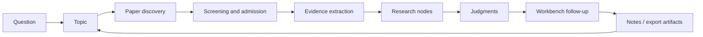

[English](../README.md) | [简体中文](README.zh-CN.md) | [日本語](README.ja-JP.md) | [한국어](README.ko-KR.md) | [Deutsch](README.de-DE.md) | [Français](README.fr-FR.md) | [Español](README.es-ES.md) | [Русский](README.ru-RU.md)

<p align="center">
  
</p>

<h1 align="center">TraceMind</h1>

<p align="center">
  <strong>論文をたくさん集めるだけでなく、研究分野の主線、分岐、証拠、判断まで見通せるようにするための AI パーソナル研究ワークベンチ。</strong>
</p>

<p align="center">
  <a href="../LICENSE"></a>
  
  
  
  
</p>

## TraceMind とは

TraceMind は AI パーソナル研究ワークベンチです。対象にしているのは、「まだ論文が見つからない」段階ではありません。むしろ、「論文はかなり集まったのに、この分野の本当の流れがまだ見えない」という段階です。

多くのツールは情報を速く手に入れる助けになりますが、研究で本当に難しいのは「もっと見つけること」ではなく、「理解を少しずつ積み上げること」です。論文、チャット、ブックマーク、断片的なメモは簡単に増えます。しかし時間が経つと、何を信じるべきか、どの論文が主線なのか、どの図や比較が判断を支えていたのかが見えなくなっていきます。

TraceMind はこの崩れやすい研究過程を、もう一度構造として持ち直そうとします。具体的には、

- 論文を再利用可能な証拠へ
- 証拠を研究ノードへ
- ノードを根拠付きの判断へ
- 判断を文脈を失わない次の問いへ

と変換していきます。

目標は「もっと多くの文章を出すこと」ではありません。研究方向を読める形にすることです。

## プロダクト紹介

TraceMind を理解する最も良い方法は、先にユーザーが実際に触れる画面を理解することです。このプロジェクトは、単なるモデル機能の寄せ集めではなく、いくつかの研究面が互いに役割分担しながら動くように設計されています。

| 画面 | 役割 | すぐに理解すべきこと |
| --- | --- | --- |
| トピックページ | 研究方向全体の現在地をつかむ | どんなステージがあり、どのノードが重要で、どの論文が主線を作っているか |
| ノードページ: Research View | ノードへの高速入口 | このノードが何を扱い、どの証拠が重要で、どこに合意と分岐があるか |
| ノードページ: Article View | ノードを深く読み切る | ノード内の論文群がどうつながり、長い叙述がどう証拠に支えられているか |
| Workbench | 文脈を持った追質問を続ける | 現在の判断を疑い、枝を比較し、背景説明をやり直さずに研究を前に進める |
| モデルセンター | 自分の AI 構成を持ち込む | provider、model、base URL、API key、タスクごとのルーティングを設定する |

一文で言うなら、

> TraceMind は「論文リストの上にチャットを載せたもの」ではなく、「研究構造を育てるための仕事場」です。

## トピックページ: まず方向全体を見えるようにする

トピックページは、研究方向の現在位置を一目でつかむための中心画面です。ここで素早く答えるべき問いは、次のようなものです。

> 「この研究方向は今どこまで進み、何が本当の主線になっているのか」

TraceMind のトピックページは、一般的なプロジェクト管理ボードのようであってはいけません。また、テーマを作成した瞬間に架空の `research planning` ステージを置くこともしません。トピックは軽く始まり、実際の研究材料が入ってきた後にだけ、ステージ、ノード、判断が育っていくべきだと考えています。

### トピックページで見えるもの

- いま何段階まで実際に研究が進み、いくつのノード、重要論文、証拠オブジェクトが蓄積されているかを示す進捗サマリー
- 論文発見、選別、ノード統合、時間窓の蓄積から育つ本物のステージタイムライン
- 主線、枝分かれ、合流点を一枚で見せるステージ - ノード図譜
- 各ステージにつき最大 10 枚までの可視ノードカードを維持し、複雑になっても読める密度に抑える設計
- 長い一覧に埋もれないよう上へ持ち上げられたキーペーパー
- すぐに重要ノードへ入れる高速入口
- まだ未整理の材料を可視化する pending 領域
- 現在のトピック文脈を保ったまま追質問できる右側 workbench

### 良いトピックページが 30 秒で伝えるべきこと

- このトピックはまだ探索段階か、かなり構造化されているか
- 今の分野を最もよく表すステージはどれか
- 継続して追うべき枝はどこか
- どのノードが説明の中心を担っているか
- どの論文が本当に現状を定義しているのか
- 最近どんな変化が起きたのか

だからこそ TraceMind では、トピック作成時に「研究計画ステージ」を置きません。ステージはテンプレートでも飾りでもなく、研究材料によって支えられる結果であるべきだからです。

## ノードページ: 一つのノードに二つの読み方

ノードは単一論文ページではありません。ノードはトピック内部の「構造化された理解単位」です。方法ファミリー、技術的対立、ボトルネック、仕組み、制約、転換点などを表します。

そのためノードページには二つの異なる役割があります。ひとつは「まず全体像をつかむこと」。もうひとつは「重要だと分かった後に深く読み切ること」。TraceMind はこの二つを Dual View として分けています。

| View | 目的 | 向いている場面 |
| --- | --- | --- |
| Research View | 構造を素早くつかむ | まず主線と証拠の骨格を短時間で理解したいとき |
| Article View | 深く読み切る | ノードが重要だと分かった後、論文群をひとつの叙述として理解したいとき |

### Research View: 速い理解の入口

Research View は、普通の記事の短縮版ではありません。むしろ研究ブリーフに近い画面です。理想的な体験は次のような感覚です。

> 「研究アシスタントがこのノードを先に読み、いちばん速く真面目に理解できる形に整理してくれた」

そのため Research View は、文章量よりも理解効率を優先します。主に見せるのは、

- ノードの中心にある問い
- 全体像をつかむための視覚的な論点カード
- ノード内の重要論文とその役割
- 図、表、式、引用断片から組まれるエビデンスチェーン
- 覚えておくべき方法、発見、限界
- 論争、分岐、未解決問題
- 現時点での総合判断

です。画像や構造を豊かにし、短い時間で「このノードは何を言っているのか」を掴めるようにすることが重要です。

### Article View: 原文を全部開き直さなくても深く理解できる

Article View はノードの長文読解レイヤーです。原論文を永久に置き換えるものではありません。目標は、主線を取り戻すためだけに大量の PDF をすぐ開き直さなくても済むようにすることです。

良いノード記事とは、単に要約を並べたものではありません。ユーザーが原文に戻る前に、まず次のことを理解できるべきです。

- このノードを定義する主要論文は何か
- それぞれの論文が何を前進させ、どこで弱いのか
- 論文同士が継承、補完、対立のどれに当たるのか
- 全体としてなぜ現在の判断に至るのか

そのため Article View は、

- 平たい要約の山ではなく、連続したノード記事
- 論文や証拠オブジェクトに結びついたインライン参照
- 利用可能な場合の図、表、式の叙述への組み込み
- 同じノード内の複数論文を一本の理解線にまとめる構成
- まず安定した読み面を出し、その後により深い記事生成を段階的に強化する流れ

を提供します。

TraceMind の大きな賭けの一つはここにあります。ユーザーは、どの原論文を精読し直すか決める前に、まず「このノードの論文群全体は何を言っているのか」を深く理解できるべきだという考えです。

## Workbench: 研究の途中でいつでも聞ける

研究方向の理解は、一回の閲覧で終わりません。本当の価値は、そのあとに始まる追質問にあることが多いです。どの枝が弱いのか。今の判断は何に依存しているのか。何が出てきたら見方を変えるべきか。二つのノードはどういう関係なのか。

だから TraceMind には workbench が必要です。そしてそれは、単なる汎用チャットであってはいけません。

Workbench には二つの形があります。

- トピックページやノードページに埋め込まれた右側のコンテキスト workbench
- より長い対話のための独立した full workbench page

役割は、研究文脈を持ったまま質問を続けることです。たとえば次のような問いです。

- このトピックでいま最も証拠が薄い枝はどこか
- 現在のノード判断を覆すには何が必要か
- この二つのノードは補完関係か、競合する説明か
- 本当に主線にある論文はどれで、近いだけの論文はどれか
- いま原文を三本だけ読み直すなら何を選ぶべきか

大事なのは、「会話できること」そのものではありません。「トピックやノードの文脈を引き継いだまま研究を続けられること」です。

## モデルと API: 自分の構成を持ち込める

TraceMind は、ユーザーが自分でモデル構成を選びたいという前提で設計されています。どの provider を使うか、どのモデルをどの仕事に割り当てるかは、研究ワークフローそのものの一部です。

モデルセンターと Prompt Studio では、次のものを設定できます。

- デフォルトの言語モデルスロット
- デフォルトのマルチモーダルモデルスロット
- 研究ロールごとのカスタムモデル
- チャット、トピック統合、PDF 解析、図解析、数式認識、表抽出、証拠説明などのタスク別ルーティング
- provider、model 名、base URL、API key、provider 固有オプション

つまり TraceMind は、

- OpenAI、Anthropic、Google などの公式 provider
- Omni レイヤーが対応する組み込み provider 群
- カスタム base URL を持つ OpenAI-compatible gateway
- 企業内 proxy や self-hosted endpoint

に対応できます。

研究ワークフローが単一 provider に縛られるべきではない、というのが基本思想です。

## 研究ループ: トピックはどう育つか

TraceMind を最も正しく理解する方法は、一回限りの AI アシスタントとしてではなく、研究蓄積ループとして見ることです。



TraceMind が大事にしているのは、`question` から `answer` に一気に飛ぶことではありません。残したいのは、その途中にある研究の中間構造です。

- なぜこの論文群が採用されたのか
- どの証拠が本当に重要だったのか
- それらがどうノードになったのか
- その時点でどんな判断まで支えられたのか
- その判断がどんな次の問いを生んだのか

この構造が残ることで、研究は毎回ゼロからやり直すものではなく、少しずつ積み上がるものになります。

## クイックスタート

### 必要要件

- Node.js `18+`
- npm `9+`
- Python `3.10+`
- 少なくとも一つの利用可能なモデル API key

### バックエンド起動

```bash
cd skills-backend
npm install
cp .env.example .env
npm run db:generate
npm run dev
```

### フロントエンド起動

```bash
cd frontend
npm install
npm run dev
```

### 任意: Docker で起動

```bash
docker compose up --build
```

### 既定のローカルアドレス

- Frontend: `http://localhost:5173`
- Backend health check: `http://localhost:3303/health`

### 最初の使い方

1. まず設定ページまたはモデルセンターを開きます。
2. 少なくとも一つの言語モデルを設定し、PDF、図、表、式の扱いを強くしたいならマルチモーダルモデルも追加します。
3. 本当に数週間から数か月単位で理解したいテーマをトピックとして作成します。
4. 論文発見を走らせたあと、候補をそのまま全部採用せず、主線に必要なものだけを残すつもりで選別します。
5. トピックページに戻り、ステージ、ノード、キーペーパーが意味を持ち始めているか確認します。
6. ノードはまず Research View から入り、必要に応じて Article View へ移って深く読みます。
7. Workbench で現在の判断を押し返し、どこがまだ弱いのか、何を読み直すべきかを掘ります。

## 主要な強み

これらの能力が、TraceMind のプロダクトとしての方向性を最もよく表しています。

- 実進捗ベースのトピックページ: ステージは初日の計画ではなく、論文、ノード、証拠から育つ
- ステージ - ノード図譜: タイムライン、分岐、合流点、重要ノードを一画面で把握できる
- ノード双視図: Research View は速さ、Article View は深さを担当する
- Evidence-first の統合: 図、表、式、引用断片が推論面の一部になる
- Contextual workbench: 文脈を失わずに質問を続けられる
- ユーザー主導のモデルルーティング: 言語、マルチモーダル、タスク別にモデルを分けて設定できる
- Self-hosted 指向: 自分の環境で運用したいユーザーに向いている
- 多言語基盤: 8 言語の公開 README と i18n 前提の UI 基盤を持つ

## 比較

TraceMind はすべての研究ツールを置き換えるものではありません。文献を集める層と、研究を理解する層のあいだを埋める存在として考えるのが自然です。

| ツール種別 | 得意なこと | TraceMind の違い |
| --- | --- | --- |
| 汎用 AI チャット | 素早い回答、発想支援 | トピック記憶、論文構造、ノード構造、証拠 grounding を長期に保つ |
| 文献管理ツール | 論文収集、引用管理 | ノード形成、証拠鎖、研究判断に重心がある |
| ノート / Wiki | 柔軟な手動整理 | 文献を研究オブジェクトへ変換する流れを持つ |
| 単一論文要約ツール | 一論文の高速消化 | 複数論文をまたぐノード単位の統合を重視する |

正しい理解は、「TraceMind が全部に勝つか」ではなく、「研究方向を読める状態にする層を TraceMind が担う」というものです。

## チュートリアル: 個人研究者がうまく使う流れ

個人研究者として TraceMind をうまく使うなら、次のような流れが自然です。

1. 論文ではなく方向から始めます。たとえば「マルチモーダル agent planning で何が変わっているのか」を問います。
2. 候補プールを作ったら、大胆に落とします。近いだけの論文を入れすぎると、トピックは決して澄みません。
3. サブ問題からノードを自然に育てます。良いノードは方法群、ボトルネック、評価論争、技術転換を中心に生まれます。
4. 深く読む前にトピックページを見ます。どのノードに先に入るべきかをトピックページが教えるべきです。
5. 先に Research View、その後に Article View。まず構造を取り戻し、そのあと深読みに入ります。
6. Article View を使って、原文を全部開き直す前にノード全体を理解します。
7. Workbench で弱点を攻めます。何が誇張か、何が不足か、何が判断を変えるかを聞きます。
8. ノードが読める状態になってから、ノート、レポート素材、発表メモを出力します。

うまく使えているときの感覚は、「論文が増えた」から「この枝が何をやっているか説明できる」へ変わっていくはずです。

## 設計原則

TraceMind の背後には、いくつかの強い設計原則があります。これがあるからこそ、プロダクトが単なる“うまく話す AI”ではなく、研究構造を支える道具として保たれます。

- トピック作成時に架空の計画ステージを置かない
- ステージは実際の研究材料から育つべき
- ノードはフォルダではなく理解単位
- Research View は最速の入口であるべき
- Article View はノードを深く読めるようにするべき
- 判断は修正可能で証拠に結びついているべき
- Workbench は常にトピック記憶の上に立つべき

## 初心

一つの研究アップデートだけで、分野全体の姿が見えることはほとんどありません。とくに現在の AI 研究はスピードが速く、トレンド追従の圧力が強く、最初に反応した人が報われやすい環境です。

それは情報把握には役立ちますが、本質理解には十分ではありません。皆が新しさだけを追うと、次のことを継続的に追跡する人が減ってしまいます。

- 何が本当に積み上がっているのか
- 何がただの再包装なのか
- どの分岐がまだ未解決なのか
- どの証拠が本当に流れを変えたのか

TraceMind は、ここから別の問いを立てます。

> AI に文献を継続的に追跡させ、証拠を蓄積させ、その蓄積を根拠に答えさせることはできないか。

それがこのプロジェクトの研究的出発点です。AI を、その場で流暢に話すだけの存在ではなく、系譜、分岐、未解決の緊張まで一緒に追ってくれる忠実で厳密な研究アシスタントにしたいのです。

## 技術スタック

- Frontend: React + Vite
- Backend: Express + Prisma
- 既定 DB: SQLite
- モデル層: provider、slot、task routing を構成できる Omni gateway
- 研究オブジェクト: papers、figures、tables、formulas、nodes、stages、exports

## 終わりに

研究理解は自動では積み上がりません。論文は判断より速く増え、要約は構造より速く増えます。

TraceMind が作りたいのは、そのあいだにある、もっと遅いけれどずっと価値の高い層です。あるテーマに戻ったときに、その分野が何をしているのか、なぜ今の判断が成り立っているのか、どこをまだ疑うべきなのかを見失わないための層です。
