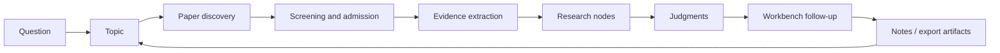

[English](../README.md) | [简体中文](README.zh-CN.md) | [日本語](README.ja-JP.md) | [한국어](README.ko-KR.md) | [Deutsch](README.de-DE.md) | [Français](README.fr-FR.md) | [Español](README.es-ES.md) | [Русский](README.ru-RU.md)

<p align="center">
  
</p>

<h1 align="center">TraceMind</h1>

<p align="center">
  <strong>論文を集めるだけでなく、研究分野の輪郭そのものを見えるようにするための AI パーソナル研究ワークベンチ。</strong>
</p>

<p align="center">
  <a href="../LICENSE"></a>
  
  
  
  
</p>

## TraceMind とは

TraceMind は AI パーソナル研究ワークベンチです。対象にしているのは、

「まだ論文が見つからない」段階ではなく、
「論文はかなり集まったのに、この分野の本当の流れがまだ見えない」段階です。

TraceMind は研究を、チャット履歴やブックマークや断片的な要約の山として扱いません。代わりに、

- 論文を再利用可能な証拠へ
- 証拠を研究ノードへ
- ノードを根拠付きの研究判断へ
- 判断を文脈を失わない次の問いへ

と変換していきます。

目標は単に文章を増やすことではありません。研究分野を「読める状態」にすることです。

## プロダクト紹介

TraceMind は、ユーザーが使う五つの主要画面から理解するのが最も簡単です。

| 画面 | 役割 | すぐに理解できるべきこと |
| --- | --- | --- |
| トピックページ | 研究方向全体の現在地をつかむ | どんなステージがあり、どのノードが重要で、どの論文が主線を作っているか |
| ノードページ: Research View | ノードへの高速入口 | このノードは何を扱い、どの証拠が重要で、どこに合意と分岐があるか |
| ノードページ: Article View | ノードの深い理解 | ノード内の複数論文がどうつながり、長文の理解がどう証拠に支えられているか |
| Workbench | 文脈付きの追質問 | 現在の判断を疑い、枝を比較し、背景説明をやり直さずに質問を続ける |
| モデルセンター | 自分の AI 構成を持ち込む | provider、model、base URL、API key、タスク別ルーティングを設定する |

一文で言うなら、

> TraceMind は「論文リストの上にチャットを載せたもの」ではなく、「研究構造を育てるための道具」です。

## トピックページ: まず方向全体を見えるようにする

トピックページは、研究方向の現在地を把握するための中核画面です。ここで素早く答えるべき問いは次です。

> 「この研究方向は今どこまで進んでいて、何が主線になっているのか」

TraceMind のトピックページは、一般的なプロジェクト管理ボードのようであってはいけません。テーマを作成した瞬間に、架空の `research planning` ステージを置くこともしません。トピックは軽い殻として始まり、実際の研究材料が入ってきた後にだけ、ステージ、ノード、判断が育っていきます。

### トピックページで見えるもの

- 現在のステージ数、研究ノード数、重要論文数、証拠数を一目で示す研究進捗サマリー
- 論文発見、選別、ノード統合、時間窓の蓄積から育つ実在のステージタイムライン
- 主線、枝分かれ、合流点を一枚で見せるステージ - ノード図譜
- 各ステージに最大 10 枚までの可視ノードカードを保ち、複雑になっても読みやすさを失わない表示
- 長い一覧に埋もれないよう上部に持ち上げられたキーペーパー
- 重要ノードへ即座に入れる高速入口
- まだ未整理の材料も見えるようにする pending 表示
- トピック文脈を保ったまま追質問できる右側 workbench

### 良いトピックページが 30 秒で伝えるべきこと

- このトピックはまだ探索段階か、それともかなり構造化されているか
- 今の分野を最もよく表すステージはどれか
- 追い続けるべき枝はどれか
- どのノードが説明の中心を担っているか
- どの論文が本当に現状を定義しているか
- 最近何が変わったか

だからこそ、TraceMind ではトピック作成直後に「研究計画ステージ」を置きません。ステージは装飾ではなく、研究材料によって支えられるべきだからです。

## ノードページ: 一つのノードに二つの読み方

ノードは単一論文ページではありません。ノードは、トピック内部の「構造化された理解単位」です。方法ファミリー、技術的対立、ボトルネック、仕組み、限界、転換点などを表します。

そのためノードページには本質的に二つの役割があり、TraceMind はそれを明示的に双視図として分けています。

| View | 目的 | 向いている場面 |
| --- | --- | --- |
| Research View | 構造を素早くつかむ | まず全体像を短時間で理解したいとき |
| Article View | 深く読み切る | このノードが重要だと分かった後、論文群をまとまった叙述として読みたいとき |

### Research View: 速い理解の入口

Research View は、ブログ記事よりも研究ブリーフに近い画面です。理想的な感覚は次に近いものです。

> 「研究アシスタントがこのノードを先に読んで、最短で真面目に理解できる形に整理してくれた」

Research View が重視するのは、

- ノードの核心となる問い
- 視覚的なコア主張カード
- ノード内の重要論文とその役割
- 図、表、式、引用片から成るエビデンスチェーン
- 主な方法、発見、限界
- 対立、論争、未解決問題
- 現時点での総合判断

です。文章量よりも構造と視認性を優先し、短時間で主線を取り戻せることを狙っています。

### Article View: 原文をすべて開き直さなくても深く理解できる

Article View はノードの長文読解レイヤーです。原論文を永久に置き換えるものではありません。目的は、主線を取り戻すためだけに多数の PDF をすぐ開き直さなければならない状態を減らすことです。

そのために Article View は、

- ばらばらの要約ではなく連続したノード記事
- 論文や証拠と結びついたインライン参照
- 利用可能な場合は図・表・式を組み込んだ叙述
- ノード内の複数論文を一つの理解線にまとめる構成
- まず安定した記事を見せ、その後により深い合成を段階的に強化する流れ

を提供します。

TraceMind の大きな賭けの一つはここです。ユーザーは、どの原論文を精読し直すか決める前に、まず「このノードの論文群は全体として何を言っているのか」を深く理解できるべきです。

## Workbench: 研究の途中でいつでも聞ける

研究方向の理解は、一回の閲覧で終わりません。だから TraceMind には workbench が必要です。

Workbench には二つの形があります。

- トピックページやノードページに埋め込まれた右側のコンテキスト workbench
- より長い対話のための独立した full workbench page

これは汎用チャットではありません。役割は「文脈を保った追質問」です。良い質問の例は次のようなものです。

- このトピックで今もっとも証拠が弱い枝はどれか
- 現在のノード判断を覆すには何が出てくる必要があるか
- 二つのノードは補完関係か、競合する説明か
- 本当に主線にある論文はどれで、ただ近くにあるだけの論文はどれか
- 今すぐ原文に戻るなら三本だけ何を読むべきか

重要なのは「会話できること」ではなく、「トピックやノードの文脈を継承したまま質問を続けられること」です。

## モデルと API: 自分の構成を持ち込める

TraceMind は、ユーザー自身がモデル構成をコントロールする使い方を前提に設計されています。

モデルセンターと Prompt Studio では、次のものを設定できます。

- デフォルトの言語モデルスロット
- デフォルトのマルチモーダルモデルスロット
- 研究ロールごとのカスタムモデル
- チャット、トピック統合、PDF 解析、図解析、数式認識、表抽出、証拠説明などのタスク別ルーティング
- provider、model 名、base URL、API key、provider 固有オプション

これにより TraceMind は、

- OpenAI、Anthropic、Google などの公式 provider
- Omni レイヤーが対応する組み込み provider 群
- カスタム base URL を持つ OpenAI-compatible gateway
- 企業内 proxy や self-hosted endpoint

に対応できます。

思想はシンプルです。研究ワークフローは一つの provider に縛られるべきではありません。

## 研究ループ: トピックはどう育つか

TraceMind は、一回限りの AI アシスタントではなく、研究蓄積ループとして考えると最も分かりやすくなります。



重要なのは、TraceMind が `question` から `answer` へ一気に飛ぼうとしていないことです。守りたいのはその途中構造です。

- なぜこの論文が採用されたのか
- どの証拠が本当に重要だったのか
- それらがどうノードになったのか
- その時点でどの判断まで支えられたのか
- その判断がどんな次の問いを生んだのか

## クイックスタート

### 必要要件

- Node.js `18+`
- npm `9+`
- Python `3.10+`
- 少なくとも一つの利用可能なモデル API key

### バックエンド起動

```bash
cd skills-backend
npm install
cp .env.example .env
npm run db:generate
npm run dev
```

### フロントエンド起動

```bash
cd frontend
npm install
npm run dev
```

### 任意: Docker で起動

```bash
docker compose up --build
```

### 既定のローカルアドレス

- Frontend: `http://localhost:5173`
- Backend health check: `http://localhost:3303/health`

### 最初の使い方

1. まず設定ページまたはモデルセンターを開きます。
2. 少なくとも一つの言語モデルを設定し、PDF・図・表・式を強く使うならマルチモーダルモデルも追加します。
3. 本当に数週間追いかけたいテーマをトピックとして作成します。
4. 論文発見を走らせたあと、候補をそのまま全部採用せず、しっかり選別します。
5. トピックページに戻り、ステージ、ノード、キーペーパーが意味を持ち始めているか確認します。
6. ノードは Research View から入り、必要なら Article View に移って深く読みます。
7. Workbench で現在の判断を疑い、どこが弱いかを掘ります。

## 主要な強み

- 実進捗ベースのトピックページ: ステージは初日の計画ではなく、論文・ノード・証拠から育つ
- ステージ - ノード図譜: タイムライン、分岐、合流点、重要ノードを一画面に集約
- ノード双視図: Research View は速さ、Article View は深さを担当
- Evidence-first の統合: 図、表、式、引用断片が推論面の一部になる
- Grounded workbench: 文脈を失わずに質問し続けられる
- ユーザー主導のモデルルーティング: 言語、マルチモーダル、タスク別に分けて設定可能
- Self-hosted 指向: 自分の環境で運用したいユーザーに向いている
- 多言語基盤: 8 言語ドキュメントと国際化 UI の土台を備える

## 比較

TraceMind はすべての研究ツールを置き換えるものではありません。文献収集と研究理解のあいだを埋める層として位置づけるのが自然です。

| ツール種別 | 得意なこと | TraceMind の違い |
| --- | --- | --- |
| 汎用 AI チャット | 素早い回答、発想支援 | トピック記憶、論文構造、ノード構造、証拠 grounding を長期に保つ |
| 文献管理ツール | 論文収集、引用管理 | ノード形成、証拠鎖、研究判断に重心がある |
| ノート / Wiki | 柔軟な手動整理 | 手動ノートだけに頼らず、文献を研究オブジェクトへ変換する |
| 単一論文要約ツール | 一論文の高速消化 | 複数論文をまたぐノード単位の統合を重視する |

正しい見方は「TraceMind が全部に勝つか」ではなく、「研究方向を読める状態にする層を TraceMind が担う」ということです。

## チュートリアル: 個人研究者がうまく使う流れ

1. 論文ではなく方向から始める。
   例: 「マルチモーダル agent planning で何が変わっているか」を問う。
2. 候補プールを作ったら、積極的に落とす。
   近いだけの論文を入れすぎると、トピックは決して澄みません。
3. サブ問題からノードを自然に育てる。
   良いノードは、方法群、ボトルネック、評価論争、技術転換を中心に生まれます。
4. 深く読む前にトピックページを見る。
   どのノードに先に入るべきかをトピックページが教えるべきです。
5. 先に Research View、その後に Article View。
   まず構造を取り戻し、そのあと深読みに入ります。
6. Article View を使って、原文を全部開き直す前にノード全体を理解する。
7. Workbench で弱点を攻める。
   何が誇張か、何が不足か、何が判断を変えるかを聞きます。
8. ノードが読める状態になってから、ノートやレポート素材を出力する。

うまく使えているときの感覚は、「論文が増えた」から「この枝が何をやっているか説明できる」に変わっていくはずです。

## 設計原則

- トピック作成時に架空の計画ステージを置かない
- ステージは実際の研究材料から育つべき
- ノードはフォルダではなく理解単位
- Research View は最速入口であるべき
- Article View はノードを深く読めるようにするべき
- 判断は修正可能で証拠に結びついているべき
- Workbench は常にトピック記憶の上に立つべき

研究プロダクトは、見栄えのいい出力を優先するとすぐにノイズ化します。だからこの原則が必要です。

## 初心

一つの研究アップデートだけでは、分野全体はほとんど見えません。特に現在の AI 研究はスピードが速く、トレンド追従の圧力が強く、最初に反応した人が報われやすい環境です。

それは情報把握には役立ちますが、必ずしも本質理解にはつながりません。なぜなら、皆が新しさだけを追うと、

- 何が本当に積み上がっているのか
- 何がただの再包装なのか
- どの対立が未解決なのか
- どの証拠が本当に流れを変えたのか

を地道に追う人が減ってしまうからです。

TraceMind はここから出発します。

> AI に文献を継続的に追跡させ、証拠を蓄積させ、その蓄積を根拠に答えさせることはできないか。

それがこのプロジェクトの研究的な出発点です。AI を、ただその場で流暢に話す相手ではなく、系譜、分岐、未解決の緊張関係まで一緒に追ってくれる忠実で厳密な研究アシスタントにしたいのです。

## 技術スタック

- Frontend: React + Vite
- Backend: Express + Prisma
- 既定 DB: SQLite
- モデル層: provider、slot、task routing を設定できる Omni gateway
- 研究オブジェクト: papers、figures、tables、formulas、nodes、stages、exports

## 終わりに

研究理解は自動では積み上がりません。論文は判断より速く増え、要約は構造より速く増えます。

TraceMind が作りたいのは、その間にある、より遅いがずっと価値の高い層です。あるテーマに戻ったときに、その分野が何をしているのか、なぜ今の判断が成り立つのか、どこをまだ疑うべきなのかを見失わないための層です。
