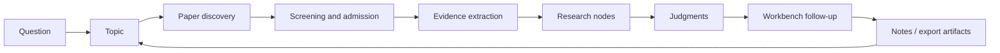

[English](../README.md) | [简体中文](README.zh-CN.md) | [日本語](README.ja-JP.md) | [한국어](README.ko-KR.md) | [Deutsch](README.de-DE.md) | [Français](README.fr-FR.md) | [Español](README.es-ES.md) | [Русский](README.ru-RU.md)

<p align="center">
  
</p>

<h1 align="center">TraceMind</h1>

<p align="center">
  <strong>논문을 많이 모으는 것을 넘어, 한 연구 방향의 주선, 분기, 근거, 판단까지 실제로 보이게 만드는 AI 개인 연구 워크벤치.</strong>
</p>

<p align="center">
  <a href="../LICENSE"></a>
  
  
  
  
</p>

## TraceMind란 무엇인가

TraceMind는 AI 개인 연구 워크벤치입니다. 이 프로젝트가 다루는 순간은 "아직 논문을 못 찾았다"가 아니라, "논문은 이미 많이 모였는데 이 방향이 실제로 어떻게 움직이고 있는지는 아직 잘 보이지 않는다"는 순간입니다.

많은 도구는 더 빠르게 정보를 찾게 도와주지만, 연구에서 더 어려운 일은 늘 "더 많이 찾는 것"이 아니라 "이해를 무너지지 않게 축적하는 것"입니다. 논문, 채팅, 북마크, 메모는 쉽게 늘어나지만 시간이 지나면 무엇이 실제 주선이었는지, 어떤 그림과 비교가 판단을 지탱했는지, 지금 남아 있는 긴장이 무엇인지 놓치기 쉽습니다.

TraceMind는 이 흩어지기 쉬운 연구 과정을 다시 구조로 묶으려 합니다. 구체적으로는,

- 논문을 재사용 가능한 근거로
- 근거를 연구 노드로
- 노드를 근거 있는 판단으로
- 판단을 맥락을 유지한 다음 질문으로

바꾸어 갑니다.

목표는 텍스트를 더 많이 생성하는 것이 아닙니다. 연구 방향을 읽을 수 있는 상태로 만드는 것입니다.

## 프로젝트 소개

TraceMind를 이해하는 가장 좋은 방법은, 먼저 사용자가 실제로 보게 되는 제품 표면을 이해하는 것입니다. 이 프로젝트는 단순히 여러 모델 기능을 묶어놓은 것이 아니라, 몇 개의 연구 표면이 서로 역할을 나누며 하나의 연구 흐름을 형성하도록 설계되어 있습니다.

| 표면 | 역할 | 사용자가 빠르게 이해해야 하는 것 |
| --- | --- | --- |
| 주제 페이지 | 한 연구 방향의 현재 상태를 파악 | 어떤 stage가 있고, 어떤 node가 중요하며, 어떤 논문이 주선을 이루는가 |
| 노드 페이지: Research View | 노드에 빠르게 진입 | 이 node가 무엇을 다루고, 어떤 근거가 중요하며, 어디서 합의와 분기가 생기는가 |
| 노드 페이지: Article View | 노드를 깊게 읽기 | node 내부 논문들이 어떻게 연결되고, 긴 서술이 어떤 근거 위에 서 있는가 |
| Workbench | 맥락 있는 후속 질문 지속 | 현재 판단을 밀어보고, branch를 비교하고, 배경을 반복 설명하지 않고 연구를 이어가는 것 |
| 모델 센터 | 자신의 AI 스택 구성 | provider, model, base URL, API key, 작업별 routing을 직접 정하는 것 |

한 문장으로 말하면,

> TraceMind는 "논문 리스트 위에 채팅창을 얹은 도구"가 아니라 "연구 구조를 자라게 하는 작업대"입니다.

## 주제 페이지: 먼저 방향을 보이게 만들기

주제 페이지는 연구 방향의 현재 위치를 잡는 핵심 표면입니다. 이 페이지가 먼저 대답해야 하는 질문은 다음과 같습니다.

> "이 연구 방향은 지금 실제로 어디까지 왔고, 무엇이 현재의 주선인가?"

TraceMind의 주제 페이지는 일반적인 프로젝트 보드처럼 보이면 안 됩니다. 또한 주제를 만들자마자 가짜 `research planning` stage를 넣어서 페이지를 채우지도 않습니다. 주제는 가볍게 시작하고, 실제 연구 재료가 들어온 뒤에만 stage, node, judgment가 자라야 합니다.

### 주제 페이지에서 보여야 하는 것

- 현재 실제로 몇 개의 stage, 연구 node, 핵심 논문, evidence object가 쌓였는지 보여주는 진행 개요
- 논문 발견, 선별, 노드 합성, 시간창 축적에서 자라는 실제 stage timeline
- 주선, 옆가지, 합류 지점을 한 표면에서 보여주는 stage - node graph
- 각 stage당 최대 10개의 visible node card만 유지해 복잡해져도 읽기 쉬운 밀도를 보장하는 구조
- 긴 목록에 묻히지 않도록 위로 끌어올린 key paper
- 중요한 node로 즉시 들어갈 수 있는 빠른 입구
- 아직 정리되지 않은 material도 드러내는 pending 영역
- 현재 topic 맥락에서 바로 후속 질문을 이어갈 수 있는 오른쪽 workbench

### 좋은 주제 페이지가 30초 안에 알려줘야 하는 것

- 이 topic은 아직 탐색 단계인가, 아니면 이미 구조가 자랐는가
- 지금 이 분야를 가장 잘 설명하는 stage는 무엇인가
- 계속 추적해야 할 branch는 어디인가
- 어떤 node가 설명의 중심을 맡고 있는가
- 어떤 논문이 현재 상태를 실제로 정의하는가
- 최근 무엇이 달라졌는가

그래서 TraceMind는 주제 생성 직후 가짜 계획 stage를 넣지 않습니다. stage는 장식이 아니라 연구 재료로부터 생겨나야 하기 때문입니다.

## 노드 페이지: 하나의 노드, 두 가지 읽기 방식

노드는 단일 논문 페이지가 아닙니다. 노드는 topic 안의 "구조화된 이해 단위"입니다. 방법 계열, 기술적 논쟁, 병목, 메커니즘, 한계, 전환점 등이 노드가 될 수 있습니다.

그렇기 때문에 노드 페이지에는 두 가지 다른 역할이 동시에 존재합니다. 하나는 빠르게 구조를 복구하는 일이고, 다른 하나는 이 노드가 중요하다고 판단한 뒤 깊게 읽어내는 일입니다. TraceMind는 이를 dual view로 분리합니다.

| View | 목적 | 적합한 순간 |
| --- | --- | --- |
| Research View | 구조를 빠르게 파악 | 먼저 주선과 핵심 근거를 짧은 시간 안에 잡고 싶을 때 |
| Article View | 깊게 읽어 내기 | 이 node가 중요하다고 확인한 뒤 논문군을 하나의 서사로 읽고 싶을 때 |

### Research View: 빠른 이해의 입구

Research View는 일반적인 글의 축약본이 아닙니다. 오히려 연구 브리프에 가깝습니다. 이상적인 감각은 다음과 같습니다.

> "연구 보조가 이 node를 먼저 읽고, 가장 빨리 진지하게 이해할 수 있는 형태로 정리해 두었다."

그래서 Research View는 문장 수보다 이해 효율을 우선합니다. 여기서 강조되는 것은 다음과 같습니다.

- node의 핵심 질문
- 전체 윤곽을 빠르게 세워 주는 시각적 핵심 주장 카드
- node 내부 중요 논문과 각 논문의 역할
- 그림, 표, 수식, 인용 조각으로 이루어진 evidence chain
- 기억해야 할 주요 방법, 발견, 제한
- 갈등, 논쟁, 미해결 문제
- 현재의 종합 판단

이 표면은 글을 길게 늘어놓기보다, 사용자가 짧은 시간 안에 "이 node가 무엇을 말하는가"를 잡을 수 있도록 설계되어야 합니다.

### Article View: 원문을 다 다시 열지 않아도 깊게 이해하게 해주기

Article View는 node의 장문 읽기 레이어입니다. 이것은 원논문을 영구적으로 대체하려는 것이 아닙니다. 목적은 주선을 회복하기 위해 수많은 PDF를 즉시 다시 열어야 하는 상황을 줄이는 데 있습니다.

좋은 node article은 요약을 나열하는 것이 아니라, 사용자가 원문으로 돌아가기 전에 먼저 다음을 이해하게 해야 합니다.

- 이 node를 정의하는 핵심 논문은 무엇인가
- 각 논문은 무엇을 전진시켰고 어디서 약한가
- 논문들 사이의 관계는 계승, 보완, 충돌 중 무엇인가
- 전체적으로 왜 현재의 judgment에 도달했는가

이를 위해 Article View는 다음을 제공합니다.

- 흩어진 요약이 아니라 연속된 node article
- 논문과 evidence object에 연결된 inline reference
- 가능할 때 그림, 표, 수식을 실제 서사 안으로 끌어오는 구성
- 같은 node 안의 여러 논문을 하나의 이해선으로 묶는 통합
- 먼저 안정적인 읽기 표면을 보여 주고 이후 더 깊은 종합을 강화하는 흐름

TraceMind의 중요한 제품 판단 중 하나는 여기 있습니다. 사용자는 어떤 원논문을 다시 정독할지 결정하기 전에, 먼저 "이 node의 논문 묶음이 전체적으로 무엇을 말하는가"를 깊게 이해할 수 있어야 합니다.

## Workbench: 연구 도중 언제든 질문하기

연구 방향에 대한 이해는 한 번의 읽기로 끝나지 않습니다. 진짜 가치 있는 순간은 종종 그 다음 질문에서 시작됩니다. 어떤 branch가 약한가, 현재 판단은 무엇에 기대고 있는가, 무엇이 나오면 관점을 바꿔야 하는가, 두 node는 어떤 관계인가 같은 질문들입니다.

그래서 TraceMind에는 workbench가 필요합니다. 그리고 이것은 맥락 없는 일반 채팅창이어서는 안 됩니다.

Workbench는 두 형태로 존재합니다.

- topic 페이지와 node 페이지에 붙는 오른쪽 contextual workbench
- 더 긴 대화를 위한 독립 full workbench page

역할은 연구 맥락을 유지한 채 질문을 이어가는 것입니다. 좋은 질문은 보통 다음과 같습니다.

- 이 topic에서 지금 가장 근거가 약한 branch는 어디인가
- 현재 node judgment를 뒤집으려면 어떤 새 증거가 필요할까
- 두 node는 상호보완적인가, 아니면 경쟁하는 설명인가
- 진짜 주선 논문은 무엇이고, 그저 주변에 있는 논문은 무엇인가
- 지금 원문 세 편만 다시 읽는다면 무엇을 골라야 할까

중요한 것은 "대화가 되는가"가 아니라 "topic이나 node의 맥락을 이어받아 연구를 계속할 수 있는가"입니다.

## 모델과 API: 나만의 스택을 연결하기

TraceMind는 사용자가 자신의 모델 구성을 직접 통제하기를 원하는 상황을 전제로 설계되었습니다. 어떤 provider를 쓰는지, 어떤 모델을 어느 작업에 배정하는지는 연구 경험의 일부입니다.

모델 센터와 Prompt Studio에서는 다음을 설정할 수 있습니다.

- 기본 language model slot
- 기본 multimodal model slot
- 연구 role별 custom model
- chat, topic synthesis, PDF parse, figure analysis, formula recognition, table extraction, evidence explanation 같은 작업별 routing
- provider, model 이름, base URL, API key, provider-specific option

이 덕분에 TraceMind는 다음 환경에서 유연하게 동작할 수 있습니다.

- OpenAI, Anthropic, Google 같은 공식 provider
- Omni 레이어가 지원하는 내장 provider 군
- custom base URL을 쓰는 OpenAI-compatible gateway
- 사내 proxy나 self-hosted endpoint

핵심 아이디어는 간단합니다. 연구 워크플로우가 하나의 provider에 하드코딩되어서는 안 된다는 것입니다.

## 연구 루프: topic은 어떻게 자라는가

TraceMind는 일회성 AI 도우미보다, 연구 축적 루프로 이해할 때 가장 잘 보입니다.



핵심은 TraceMind가 `question`에서 `answer`로 바로 점프하려 하지 않는다는 점입니다. 남기려는 것은 그 중간 구조입니다.

- 왜 이 논문들이 topic에 들어왔는가
- 실제로 어떤 evidence가 중요했는가
- 그것들이 어떻게 node가 되었는가
- 그 시점에 어떤 judgment까지 지탱할 수 있었는가
- 그 judgment가 어떤 다음 질문을 만들었는가

이 구조가 남아야 연구는 매번 처음부터 다시 시작하는 일이 아니라, 조금씩 쌓이는 과정이 됩니다.

## 빠른 시작

### 요구 사항

- Node.js `18+`
- npm `9+`
- Python `3.10+`
- 최소 하나의 사용 가능한 모델 API key

### 백엔드 시작

```bash
cd skills-backend
npm install
cp .env.example .env
npm run db:generate
npm run dev
```

### 프런트엔드 시작

```bash
cd frontend
npm install
npm run dev
```

### 선택 사항: Docker로 실행

```bash
docker compose up --build
```

### 기본 로컬 주소

- Frontend: `http://localhost:5173`
- Backend health check: `http://localhost:3303/health`

### 첫 사용 순서

1. 먼저 settings 페이지나 model center를 엽니다.
2. 최소 하나의 language model을 설정하고, PDF, 이미지, 표, 수식 처리를 강화하려면 multimodal model도 추가합니다.
3. 몇 주 이상 실제로 이해하고 싶은 topic을 만듭니다.
4. 논문 발견을 실행한 뒤 후보를 그대로 다 넣지 말고 신중하게 선별합니다.
5. topic 페이지로 돌아가 stage, node, key paper가 실제 의미를 가지기 시작했는지 확인합니다.
6. node는 Research View부터 들어가고, 필요하면 Article View로 이동해 깊게 읽습니다.
7. workbench에서 현재 판단을 밀어보고 어디가 여전히 약한지 확인합니다.

## 핵심 강점

이 능력들이 TraceMind의 제품 방향과 완성도를 가장 잘 보여 줍니다.

- 실제 진행 기반 topic page: stage는 첫날 계획이 아니라 논문, node, evidence에서 자란다
- stage - node graph: 타임라인, branch, merge point, key node를 한 화면에 모은다
- dual-view node: Research View는 빠름, Article View는 깊이를 담당한다
- evidence-first synthesis: 그림, 표, 수식, 인용 조각이 reasoning surface의 일부가 된다
- contextual workbench: 맥락을 잃지 않고 질문을 계속할 수 있다
- user-controlled model routing: language, multimodal, task별 모델을 분리해 설정할 수 있다
- self-hosted 지향: 자기 환경을 직접 운영하고 싶은 사용자에게 맞는다
- 다국어 기반: 8개 언어 공개 README와 국제화 UI 기반을 갖춘다

## 비교

TraceMind는 모든 연구 도구를 대체하려는 것이 아닙니다. 문헌 수집과 연구 이해 사이를 메우는 층으로 보는 것이 더 정확합니다.

| 도구 유형 | 잘하는 일 | TraceMind의 차이 |
| --- | --- | --- |
| 범용 AI 채팅 | 빠른 답변, 브레인스토밍 | topic memory, paper structure, node structure, evidence grounding을 장기 유지한다 |
| 레퍼런스 매니저 | 논문 수집, 인용 관리 | node 형성, evidence chain, research judgment에 초점을 둔다 |
| 노트 앱 / 위키 | 유연한 수동 정리 | 문헌을 연구 객체로 바꾸는 흐름을 제공한다 |
| 단일 논문 요약 도구 | 한 논문 빠른 소화 | 여러 논문을 묶는 node-level synthesis를 강조한다 |

올바른 이해는 "TraceMind가 모든 것을 대체한다"가 아니라 "연구 방향을 읽히게 만드는 층을 TraceMind가 담당한다"는 것입니다.

## 튜토리얼: 개인 연구자가 잘 쓰는 흐름

개인 연구자가 TraceMind를 잘 쓰는 흐름은 보통 다음과 같습니다.

1. 논문이 아니라 방향에서 시작합니다. 예를 들어 "멀티모달 agent planning에서 무엇이 바뀌고 있는가"를 묻습니다.
2. 후보 풀을 만든 뒤에는 과감하게 거절합니다. 주변 논문을 너무 많이 넣으면 topic은 절대 맑아지지 않습니다.
3. 하위 문제를 중심으로 node가 자연스럽게 자라게 합니다. 좋은 node는 방법 계열, 병목, 평가 논쟁, 기술 전환을 중심으로 형성됩니다.
4. 깊게 읽기 전에 topic page를 봅니다. 어느 node를 먼저 볼지 topic page가 알려줘야 합니다.
5. 먼저 Research View, 그다음 Article View로 갑니다. 먼저 구조를 회복하고, 그다음 깊이 읽습니다.
6. Article View를 이용해 원문을 전부 다시 열기 전에 node 전체를 이해합니다.
7. Workbench에서 약점을 공격합니다. 무엇이 과장되었는지, 무엇이 부족한지, 무엇이 판단을 바꿀지를 묻습니다.
8. node가 읽히는 상태가 되었을 때 notes, brief, report material을 내보냅니다.

잘 사용하면 감각이 "논문이 많아졌다"에서 "이 branch가 실제로 무엇을 하고 있는지 설명할 수 있다"로 바뀌어야 합니다.

## 설계 원칙

TraceMind 뒤에는 몇 가지 강한 설계 원칙이 있습니다. 이 원칙들이 있기 때문에 제품이 단순히 "그럴듯하게 말하는 AI"로 미끄러지지 않고 연구 구조를 붙드는 도구로 남습니다.

- topic 생성 시 가짜 planning stage를 두지 않는다
- stage는 실제 연구 재료에서 자라야 한다
- node는 폴더가 아니라 이해 단위다
- Research View는 가장 빠른 입구여야 한다
- Article View는 node를 깊게 읽히게 해야 한다
- judgment는 수정 가능해야 하며 evidence와 연결되어야 한다
- Workbench는 항상 topic memory 위에 서야 한다

## 시작점

하나의 연구 업데이트만으로는 전체 방향을 거의 볼 수 없습니다. 특히 오늘날 AI 연구는 속도가 빠르고, 유행을 따라가는 압력이 강하며, 먼저 반응한 사람이 보상을 받기 쉽습니다.

그것은 정보 파악에는 도움이 되지만, 진짜 이해에는 충분하지 않습니다. 모두가 최신성만 쫓으면, 다음을 꾸준히 추적하는 사람이 줄어듭니다.

- 무엇이 실제로 축적되고 있는가
- 무엇이 단지 재포장인가
- 어떤 분기가 아직 해결되지 않았는가
- 어떤 근거가 실제로 흐름을 바꾸었는가

TraceMind는 여기서 출발합니다.

> AI가 문헌을 계속 추적하고 근거를 축적하며, 그 축적을 바탕으로 대답하게 만들 수 없을까.

이것이 프로젝트의 출발점입니다. AI를 그저 그 순간 유창하게 말하는 도구가 아니라, 계보, 분기, 미해결 긴장까지 함께 추적해 주는 충실하고 엄밀한 연구 조력자로 만들고자 합니다.

## 기술 스택

- Frontend: React + Vite
- Backend: Express + Prisma
- 기본 DB: SQLite
- 모델 레이어: provider, slot, task routing을 구성할 수 있는 Omni gateway
- 연구 객체: papers, figures, tables, formulas, nodes, stages, exports

## 맺음말

연구 이해는 자동으로 누적되지 않습니다. 논문은 판단보다 빨리 늘고, 요약은 구조보다 빨리 늘어납니다.

TraceMind가 만들고 싶은 것은 그 사이의 더 느리지만 훨씬 가치 있는 층입니다. 한 주제로 돌아왔을 때, 그 분야가 실제로 무엇을 하고 있는지, 왜 현재 판단이 성립하는지, 무엇을 아직 더 의심해야 하는지를 잃지 않도록 돕는 층입니다.
