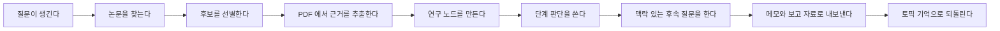

[English](../README.md) | [简体中文](README.zh-CN.md) | [日本語](README.ja-JP.md) | [한국어](README.ko-KR.md) | [Deutsch](README.de-DE.md) | [Français](README.fr-FR.md) | [Español](README.es-ES.md) | [Русский](README.ru-RU.md)

<p align="center">
  
</p>

<h1 align="center">TraceMind</h1>

<p align="center">
  <strong>빠른 답변이 아니라 연구 방향의 맥락과 축적을 이해하고 싶은 사람을 위한 AI 개인 연구 워크벤치.</strong>
</p>

<p align="center">
  <a href="../LICENSE"></a>
  
  
  
</p>

## 한 문단 요약

한 번의 연구 업데이트만으로는 어떤 분야의 실제 흐름을 보기 어렵습니다. 지금의 AI 연구는 빠르고 시끄럽고 유행을 따라가기 쉽지만, 그것만으로는 무엇이 진짜 문제를 푸는지 알기 어렵습니다. TraceMind 는 AI 가 문헌을 추적하고, 증거를 축적하고, 그 축적 위에서 답하도록 만들어 연구자가 한 방향의 맥락을 더 분명하게 볼 수 있게 돕습니다.

## 무엇인가

TraceMind 는 AI 개인 연구 워크벤치입니다.

그냥 채팅 UI 가 아니라, 논문, PDF, 그림, 수식, 인용, 연구 노드, 판단, 추후 질문을 하나의 연구 공간 안에 모으는 도구입니다.

잘 맞는 사람:
- 논문이나 리뷰를 준비하는 학생
- 장기적으로 분야를 따라가는 독립 연구자
- 기술의 주선을 파악하려는 엔지니어와 기술 리드
- 근거 기반 메모가 필요한 분석가

## 왜 필요한가

연구가 힘든 이유는 정보가 없어서가 아니라, 이해가 충분히 누적되지 않아서인 경우가 많습니다.

일반 채팅 도구는 즉답에 강하지만 다음을 오래 붙잡아 두지 못합니다.
- 왜 그런 판단이 나왔는지
- 어떤 증거가 그것을 지지하는지
- 무엇이 아직 불확실한지
- 분야가 시간에 따라 어떻게 변했는지

TraceMind 는 `증거 우선`, `기억 우선`, `구조 우선`, `최종 판단은 사람에게` 라는 원칙을 따릅니다.

## 어떻게 보면 되는가

| 화면 | 사용자가 먼저 알아야 하는 것 |
| --- | --- |
| 홈 | 지금 추적 중인 주제가 무엇인가 |
| 토픽 페이지 | 연구가 어디까지 왔고 어떤 노드와 논문이 핵심인가 |
| 노드 연구 뷰 | 핵심 질문, 주요 논문, 증거 사슬, 한계, 현재 판단 |
| Workbench | 지금 이해를 밀어붙이거나 의심하려면 무엇을 물어야 하는가 |
| Export | 이 축적을 메모나 보고 자료로 어떻게 꺼낼 수 있는가 |

## 토픽 페이지와 노드 페이지가 중요한 이유

TraceMind 는 주제를 만들자마자 가짜 `연구 계획 단계`를 붙이지 않습니다. 단계는 실제 논문 발견, 선별, 증거 추출, 노드 형성, 판단 축적에서 자라야 하기 때문입니다.

또한 노드 페이지는 단일 논문 페이지여서는 안 됩니다. 사용자가 노드를 열었을 때 알고 싶은 것은 `이 문제의 주선이 무엇인지`, `어떤 논문이 중요하고`, `어떤 증거가 현재 이해를 지탱하는지` 입니다.

## 오늘 바로 할 수 있는 일

- 학술 소스 전반에서 논문 후보 찾기
- 주제에 진짜 속하는 논문과 아닌 논문 구분하기
- PDF 에서 본문, 그림, 표, 수식, 인용 추출하기
- 방향을 연구 노드로 조직하기
- 노드 단위의 구조화된 연구 브리프 만들기
- 주제 문맥을 유지한 채 후속 질문하기
- 메모, 브리프, 보고 자료로 내보내기

## 간단한 마음속 모델

| 객체 | 의미 |
| --- | --- |
| Topic | 오랫동안 다시 돌아올 연구 방향 |
| Paper | 논문과 PDF, 메타데이터, 인용, 추출 자산 |
| Evidence | 텍스트 조각, 그림, 표, 수식, 출처 같은 재사용 가능한 근거 |
| Node | 문제, 방법, 한계, 논쟁 등으로 정리된 연구 단위 |
| Judgment | 현재 근거가 지지하는 최선의 읽기 |
| Memory | 다음 질문이 방향을 잃지 않게 하는 장기 문맥 |

## 빠른 시작

필수 조건:
- Node.js `18+`
- npm `9+`
- Python `3.10+`
- 모델 제공자 API 키

Backend:

```bash
cd skills-backend
npm install
cp .env.example .env
npm run db:generate
npm run dev
```

Frontend:

```bash
cd frontend
npm install
npm run dev
```

기본 주소:
- frontend: `http://localhost:5173`
- backend health: `http://localhost:3303/health`

## 첫 1시간

1. 앱을 켜고 모델 제공자를 설정합니다.
2. 정말 오래 따라가고 싶은 주제를 만듭니다.
3. 논문 탐색을 실행하고 후보를 그대로 믿지 않습니다.
4. 중심선에 들어갈 논문만 남깁니다.
5. 노드 연구 뷰를 열어 핵심 구조를 먼저 읽습니다.
6. `이 분기에서 가장 약한 증거는 무엇인가` 같은 질문을 던집니다.
7. 결과를 메모나 보고 자료로 내보내거나 계속 축적합니다.

## 연구 루프



## 비교

| 도구 | 강점 | TraceMind 의 역할 |
| --- | --- | --- |
| Zotero | 수집, 주석, 인용 관리 | 논문을 노드, 근거, 판단으로 연결 |
| NotebookLM | 주어진 자료에 대한 질문 | 그 질문을 장기 주제 안에 묶음 |
| Elicit | 검색과 리뷰 흐름 | 일회성 리뷰보다 지속 연구에 초점 |
| Perplexity | 빠른 출처 기반 답변 | 단발성 답을 토픽 기억으로 전환 |
| ChatGPT / Claude | 추론과 글쓰기 | 빈 채팅 대신 연구 공간 제공 |

## 한계

TraceMind 는 다음을 약속하지 않습니다.
- 모델 출력의 완전한 정확성
- PDF 추출의 완전무결함
- AI 가 전문가의 최종 판단을 대신하는 일

오히려 결과를 검토하고 수정하는 사용자일수록 더 큰 가치를 얻습니다.

## 기반과 참고

TraceMind 는 `React`, `Vite`, `Express`, `Prisma`, `PyMuPDF`, `OpenAI`, `Anthropic`, `Google`, `arXiv`, `OpenAlex`, `Crossref`, `Semantic Scholar` 같은 성숙한 기반 위에 서 있습니다.

공개 문서와 프로젝트 표현 방식에서는 `Supabase`, `Dify`, `LangChain`, `Immich`, `Next.js`, `Visual Studio Code`, `Excalidraw`, `Open WebUI` 의 명료함에서 배웠습니다.

## 기여, 보안, 라이선스

- 기여 가이드: [CONTRIBUTING.md](../CONTRIBUTING.md)
- 보안 정책: [SECURITY.md](../SECURITY.md)
- 라이선스: [MIT](../LICENSE)

## 마무리

한 번의 결과만으로 연구 방향을 선명하게 보는 것은 어렵습니다. 특히 속도와 유행이 보상되는 AI 연구 생태에서는 더 그렇습니다.

TraceMind 는 AI 가 문헌을 추적하고 근거를 축적하며, 그 위에서 후속 질문을 돕는 조수가 되도록 만드는 시도입니다. 연구보다 더 크게 말하는 도구가 아니라, 연구를 더 정확하게 보게 해주는 도구가 되고자 합니다.
