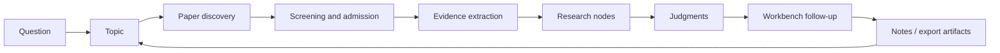

[English](../README.md) | [简体中文](README.zh-CN.md) | [日本語](README.ja-JP.md) | [한국어](README.ko-KR.md) | [Deutsch](README.de-DE.md) | [Français](README.fr-FR.md) | [Español](README.es-ES.md) | [Русский](README.ru-RU.md)

<p align="center">
  
</p>

<h1 align="center">TraceMind</h1>

<p align="center">
  <strong>Персональный исследовательский AI-воркбенч для тех, кто хочет видеть логику развития направления, а не просто получать быстрые ответы.</strong>
</p>

<p align="center">
  <a href="../LICENSE"></a>
  
  
  
  
</p>

## Что такое TraceMind

TraceMind — это персональный исследовательский AI-воркбенч. Он нужен не для момента "я еще не нашел статьи", а для момента "статей уже много, но я все еще не вижу, что на самом деле происходит в этом направлении".

TraceMind не рассматривает исследование как набор чатов, закладок и несвязанных саммари. Он пытается превращать:

- статьи в переиспользуемые доказательства
- доказательства в исследовательские узлы
- узлы в обоснованные суждения
- суждения в новые вопросы, которые сохраняют контекст

Цель — не произвести больше текста. Цель — сделать исследовательское направление читаемым.

## Описание продукта

Проще всего понять TraceMind через пять основных пользовательских поверхностей.

| Поверхность | Для чего нужна | Что должно быть понятно быстро |
| --- | --- | --- |
| Страница темы | Понять текущее состояние направления | Какие этапы уже есть, какие узлы важны и какие статьи образуют главную линию |
| Страница узла: Research View | Быстрый вход в узел | О чем этот узел, какие доказательства важны и где есть согласие или расхождение |
| Страница узла: Article View | Глубокое понимание узла | Как статьи внутри узла связаны между собой и как длинное изложение опирается на доказательства |
| Workbench | Задавать вопросы с контекстом | Проверять текущие выводы, сравнивать ветви и продолжать исследование без перезапуска контекста |
| Центр моделей | Подключить свой AI-стек | Настроить provider, model, base URL, API key и маршрутизацию по задачам |

Коротко:

> TraceMind — это не список статей с чатом сверху. Это инструмент выращивания исследовательской структуры.

## Страница темы: сначала увидеть направление целиком

Страница темы — главная поверхность ориентации. Она должна быстро отвечать на сложный вопрос:

> "На какой реальной стадии находится это исследовательское направление сейчас?"

В TraceMind страница темы не должна выглядеть как обычная доска задач. Она также не должна начинаться с вымышленного этапа `research planning`. Тема стартует легко и растет только тогда, когда в нее действительно приходит исследовательский материал.

### Что показывает страница темы

- обзор прогресса с реальным числом этапов, узлов, статей и объектов доказательств
- таймлайн этапов, возникающий из поиска статей, отбора, синтеза узлов и накопления по временным окнам
- граф этапов и узлов с главной линией, боковыми ветвями и точками слияния
- до десяти видимых карточек узлов на этап, чтобы плотные этапы оставались читаемыми
- ключевые статьи, поднятые наверх, а не утопленные в длинном списке
- быстрые входы в важные узлы
- еще не сопоставленный материал, чтобы незавершенная работа оставалась видимой
- правый workbench для продолжения вопросов прямо из контекста темы

### Что хорошая страница темы должна сообщать за 30 секунд

- Эта тема все еще исследуется вслепую или уже стала структурно понятной?
- Какой этап лучше всего описывает состояние поля?
- Какие ветви стоит продолжать отслеживать?
- Какие узлы несут основную объяснительную нагрузку?
- Какие статьи действительно определяют текущее состояние?
- Что изменилось недавно?

Именно поэтому TraceMind не создает фиктивный планировочный этап при создании темы. Этап должен возникать из реального материала, а не из оформления.

## Страница узла: один узел, два режима чтения

Узел — это не страница одной статьи. Узел — это структурная единица понимания внутри темы: семейство методов, спор, узкое место, механизм, ограничение или поворотный момент.

Поэтому страница узла выполняет две разные задачи, и TraceMind делает это явным через двойной режим.

| Режим | Цель | Когда полезен |
| --- | --- | --- |
| Research View | Быстрое структурное понимание | Когда нужно сначала увидеть форму узла и не утонуть в длинном тексте |
| Article View | Глубокое синтетическое чтение | Когда нужно связать статьи узла в одну понятную линию |

### Research View: быстрый вход в понимание

Research View ближе к исследовательскому брифу, чем к обычной статье. Идеальное ощущение такое:

> "Мой исследовательский ассистент уже прочитал этот узел, собрал доказательства и подготовил для меня самый быстрый серьезный вход."

Research View подчеркивает:

- главный вопрос узла
- визуальные карточки аргументов
- ключевые статьи и их роли
- цепочки доказательств из фигур, таблиц, формул и цитат
- основные методы, результаты и ограничения
- споры и открытые вопросы
- текущее синтетическое суждение

Эта поверхность должна быть более визуальной, более структурной и быстрее считываться, чем обычная статья.

### Article View: глубокое понимание без немедленного возврата ко всем оригиналам

Article View — это слой длинного чтения внутри узла. Он не должен навсегда заменять оригинальные статьи. Его задача — сократить количество ситуаций, когда пользователю приходится немедленно заново открывать множество PDF только для того, чтобы вернуть себе основную линию.

Поэтому Article View дает:

- непрерывную статью уровня узла, а не плоскую россыпь саммари
- встроенные ссылки, связанные с источниками и доказательствами
- интеграцию фигур, таблиц и формул, когда они доступны
- синтез нескольких статей внутри одного узла
- сначала стабильную поверхность чтения, затем более глубокое усиление синтеза

Одна из ключевых ставок TraceMind состоит в том, что пользователь должен уметь глубоко понять литературу узла до того, как решит, какие оригинальные статьи перечитывать внимательно.

## Workbench: задавать вопросы в любой момент

Понимание исследовательского направления не заканчивается после одной страницы. Поэтому в TraceMind есть workbench.

Workbench существует в двух формах:

- как правый контекстный блок на страницах темы и узла
- как отдельная страница для длинных исследовательских сессий

Это не просто общий чат. Его задача — продолжение исследования с опорой на контекст. Хорошие вопросы к workbench звучат так:

- Какая ветвь этой темы сейчас имеет самую слабую доказательную базу?
- Что с наибольшей вероятностью изменило бы текущее суждение по узлу?
- Эти два узла дополняют друг друга или конкурируют как объяснения?
- Какие статьи действительно центральные, а какие только выглядят связанными?
- Если бы я перечитал только три оригинальные статьи, какие выбрать?

Ключевой момент — наследование контекста. Workbench должен продолжать работу из активной темы или узла, а не заставлять пользователя каждый раз заново собирать фон.

## Модели и API: подключайте свой стек

TraceMind спроектирован для пользователей, которые хотят сами управлять модельным стеком.

В центре моделей и Prompt Studio можно настроить:

- основной слот языковой модели
- основной мультимодальный слот
- отдельные модели для исследовательских ролей
- маршрутизацию задач для чата, синтеза темы, разбора PDF, анализа фигур, распознавания формул, извлечения таблиц и объяснения доказательств
- provider, имя модели, base URL, API key и специфические параметры provider

На практике это позволяет работать с OpenAI, Anthropic, Google, встроенными семействами provider в слое Omni, OpenAI-compatible gateway и собственными endpoints.

Идея проста: исследовательский workflow не должен быть жестко привязан к одному provider.

## Исследовательский цикл: как растет тема

TraceMind лучше всего понимать как цикл накопления, а не как одноразового помощника.



Важно то, что TraceMind не пытается прыгнуть напрямую от `question` к `answer`. Он стремится сохранить промежуточную структуру:

- почему именно эти статьи были приняты
- какие доказательства действительно имели значение
- как из них сформировались узлы
- какое суждение эти узлы могли поддержать
- какие новые вопросы появились после этого

## Быстрый старт

### Требования

- Node.js `18+`
- npm `9+`
- Python `3.10+`
- как минимум один рабочий API key для модели

### Запуск backend

```bash
cd skills-backend
npm install
cp .env.example .env
npm run db:generate
npm run dev
```

### Запуск frontend

```bash
cd frontend
npm install
npm run dev
```

### Опционально: через Docker

```bash
docker compose up --build
```

### Локальные адреса по умолчанию

- Frontend: `http://localhost:5173`
- Проверка backend: `http://localhost:3303/health`

### Рекомендованный первый проход

1. Сначала откройте настройки или центр моделей.
2. Настройте хотя бы одну языковую модель, а для более сильной работы с PDF, изображениями, таблицами и формулами добавьте мультимодальную.
3. Создайте настоящую тему, которую хотите понимать неделями, а не демонстрационный запрос.
4. Запустите поиск статей и затем тщательно отберите кандидатный пул.
5. Вернитесь на страницу темы и проверьте, начали ли этапы, узлы и ключевые статьи складываться в осмысленную структуру.
6. Входите в узлы сначала через Research View, а затем переходите в Article View для глубины.
7. Используйте workbench, чтобы атаковать слабые места текущего суждения.

## Сильные стороны

- страницы тем на основе реального прогресса
- граф этапов и узлов с таймлайном, ветвями и слияниями
- двойной режим узла: быстро понять и глубоко прочитать
- синтез, основанный на доказательствах
- контекстный workbench
- управление маршрутизацией моделей со стороны пользователя
- self-hosted-подход
- богатая документация на восьми языках

## Сравнение

TraceMind не пытается заменить все исследовательские инструменты. Он занимает слой между сбором литературы и структурным пониманием.

| Тип инструмента | Сильная сторона | Чем отличается TraceMind |
| --- | --- | --- |
| Универсальный AI-чат | Быстрые ответы | TraceMind сохраняет память темы, структуру статей, структуру узлов и привязку к доказательствам |
| Менеджер литературы | Сбор статей и цитирований | TraceMind фокусируется на узлах, цепочках доказательств и исследовательских суждениях |
| Заметки / wiki | Гибкая ручная организация | TraceMind превращает литературу в исследовательские объекты, а не только в ручные заметки |
| Саммаризатор одной статьи | Быстрое понимание одной статьи | TraceMind работает на уровне узла и нескольких статей сразу |

## Учебный сценарий: как использовать это в одиночной работе

1. Начинайте с направления, а не с одной статьи.
2. Соберите кандидатный пул и затем жестко удаляйте шум.
3. Позвольте узлам возникать из подпроблем.
4. Сначала смотрите страницу темы, а потом углубляйтесь в узел.
5. Сначала Research View, затем Article View.
6. Используйте Article View, чтобы глубоко понять узел, прежде чем возвращаться ко всем оригиналам.
7. Задавайте workbench вопросы по слабым местам.
8. Экспортируйте материалы только тогда, когда узел стал действительно читаемым.

Хороший результат работы ощущается как переход от "у меня много статей" к "я могу объяснить, что делает эта ветвь поля".

## Принципы дизайна

- не создавать фиктивный этап планирования при создании темы
- этапы должны расти из реального материала
- узлы — это единицы понимания, а не папки
- Research View должен быть самым быстрым входом
- Article View должен делать узел глубоко читаемым
- суждения должны оставаться пересматриваемыми и связанными с доказательствами
- workbench должен оставаться привязанным к памяти темы

## Исходная мотивация

Одного исследовательского обновления почти никогда не достаточно, чтобы увидеть целое направление. В современной AI-исследовательской среде темп высок, давление следовать трендам велико, а вознаграждается часто тот, кто быстрее всех реагирует.

Это помогает быть в курсе, но не всегда помогает понимать. Если все гонятся только за самым новым, все меньше людей последовательно отслеживают:

- что действительно накапливается
- что является лишь новой упаковкой
- какие разногласия остаются нерешенными
- какие доказательства действительно меняют картину поля

TraceMind начинается с другого вопроса:

> Можно ли заставить ИИ отслеживать литературу во времени, накапливать доказательства и отвечать, опираясь на это накопление?

В этом и состоит исходная исследовательская интуиция проекта. ИИ должен стать не просто fluent assistant, а лояльным и строгим помощником, который помогает видеть линии происхождения, разветвления и нерешенные напряжения поля.

## Технический стек

- Frontend: React + Vite
- Backend: Express + Prisma
- База данных по умолчанию: SQLite
- Модельный слой: Omni gateway с настраиваемыми provider, slot и task routing
- Исследовательские объекты: papers, figures, tables, formulas, nodes, stages и exports

## Завершение

Исследовательское понимание не накапливается автоматически. Статей становится больше быстрее, чем суждений, а саммари — быстрее, чем структуры.

TraceMind создан для более медленного, но гораздо более ценного промежуточного слоя: слоя, в котором человек может вернуться к теме и все еще видеть, что делает поле, почему существует текущее суждение и что еще необходимо ставить под сомнение.
