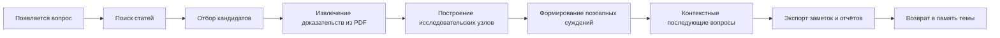

[English](../README.md) | [简体中文](README.zh-CN.md) | [日本語](README.ja-JP.md) | [한국어](README.ko-KR.md) | [Deutsch](README.de-DE.md) | [Français](README.fr-FR.md) | [Español](README.es-ES.md) | [Русский](README.ru-RU.md)

<p align="center">
  
</p>

<h1 align="center">TraceMind</h1>

<p align="center">
  <strong>Персональный исследовательский AI-воркбенч для тех, кто хочет понять направление исследований, а не просто собирать быстрые ответы.</strong>
</p>

<p align="center">
  <a href="../LICENSE"></a>
  
  
  
</p>

## Коротко

Одного нового результата почти никогда не хватает, чтобы увидеть всю траекторию исследовательского направления. В современной AI-среде много скорости, шума и следования трендам, но меньше устойчивого понимания. TraceMind пытается сделать так, чтобы ИИ отслеживал литературу, накапливал доказательства и отвечал, опираясь на эту накопленную основу.

## Что это такое

TraceMind — это персональный исследовательский AI-воркбенч.

Это не просто чат и не просто список статей. Это рабочее пространство, где статьи, PDF, рисунки, формулы, цитаты, исследовательские узлы, суждения и последующие вопросы соединяются в единую долгоживущую структуру.

Подходит для:
- студентов, пишущих обзор или диссертацию
- независимых исследователей
- инженеров и технических лидов
- аналитиков, которым нужны заметки, опирающиеся на доказательства

## Зачем он нужен

Проблема исследований часто не в нехватке информации, а в том, что понимание плохо накапливается.

Обычные чат-инструменты хорошо отвечают, но плохо удерживают:
- почему появился тот или иной вывод
- какие доказательства его поддерживают
- что остаётся неясным
- как направление меняется во времени

TraceMind строится вокруг четырёх принципов:
- `сначала доказательства`
- `сначала память`
- `сначала структура`
- `человек сохраняет финальное суждение`

## Как смотреть на продукт

| Поверхность | Что она должна быстро объяснить |
| --- | --- |
| Home | какие темы вы сейчас отслеживаете |
| Topic page | насколько продвинулась тема и какие узлы и статьи важны |
| Node research view | в чём центральный вопрос и какая цепочка доказательств поддерживает текущую картину |
| Workbench | какой вопрос задать следующим, чтобы проверить или уточнить понимание |
| Export | как превратить накопленное в заметку или материал для отчёта |

## Почему важны темы и узлы

TraceMind не создаёт искусственную фазу `плана исследования` в момент создания темы. Этапы должны вырастать из реального поиска литературы, отбора, извлечения и накопления.

Именно поэтому страница узла не должна быть просто страницей одной статьи. Её задача — быстро вернуть пользователю главную линию подзадачи.

## Что можно делать уже сейчас

- искать статьи по академическим источникам
- отбирать работы, действительно входящие в тему
- извлекать текст, рисунки, таблицы, формулы и цитаты из PDF
- организовывать направление в исследовательские узлы
- строить структурированные briefs по узлам
- задавать последующие вопросы, не теряя контекст темы
- экспортировать заметки и материалы для отчётов

## Простой ментальный каркас

| Объект | Значение |
| --- | --- |
| Topic | исследовательское направление, к которому вы будете возвращаться |
| Paper | статья, PDF, метаданные, цитаты и извлечённые материалы |
| Evidence | переиспользуемое доказательство: фрагмент, рисунок, таблица, формула, источник |
| Node | структурированная единица вокруг проблемы, метода, ограничения или спора |
| Judgment | текущая лучшая интерпретация того, что поддерживают доказательства |
| Memory | накопленный контекст для следующих вопросов |

## Быстрый старт

Требования:
- Node.js `18+`
- npm `9+`
- Python `3.10+`
- API-ключ хотя бы одного поставщика моделей

Backend:

```bash
cd skills-backend
npm install
cp .env.example .env
npm run db:generate
npm run dev
```

Frontend:

```bash
cd frontend
npm install
npm run dev
```

Адреса по умолчанию:
- frontend: `http://localhost:5173`
- backend health: `http://localhost:3303/health`

## Первый час

1. Запустите приложение и настройте поставщика моделей.
2. Создайте тему, которую действительно хотите отслеживать долго.
3. Выполните поиск статей и критически просмотрите кандидатов.
4. Оставьте только работы, которые реально принадлежат основной линии темы.
5. Откройте исследовательский вид узла и сначала прочитайте структурированный обзор.
6. Задайте проверочный вопрос, например: `Какое доказательство в этой ветке самое слабое?`
7. Экспортируйте результат или продолжайте наращивать тему.

## Исследовательский цикл



## Сравнение

| Инструмент | Сильная сторона | Роль TraceMind |
| --- | --- | --- |
| Zotero | сбор и цитирование | связывает литературу с узлами, доказательствами и суждениями |
| NotebookLM | вопросы по заданному набору источников | удерживает эти вопросы внутри долгоживущей темы |
| Elicit | поиск и обзорные процессы | сильнее ориентирован на длительное накопление |
| Perplexity | быстрые ответы с источниками | превращает разовый ответ в память темы |
| ChatGPT / Claude | рассуждение и письмо | даёт модели исследовательское пространство, а не пустой чат |

## Ограничения

TraceMind не обещает:
- идеальной корректности ответов модели
- безошибочного извлечения из PDF
- замены экспертного человеческого суждения

Он становится ценнее тогда, когда пользователь готов проверять, оспаривать и уточнять результаты.

## Техническая база и ориентиры

TraceMind опирается на `React`, `Vite`, `Express`, `Prisma`, `PyMuPDF`, `OpenAI`, `Anthropic`, `Google`, `arXiv`, `OpenAlex`, `Crossref` и `Semantic Scholar`.

В структуре README и публичной подаче проект также ориентируется на ясность таких open source примеров, как `Supabase`, `Dify`, `LangChain`, `Immich`, `Next.js`, `Visual Studio Code`, `Excalidraw` и `Open WebUI`.

## Вклад, безопасность, лицензия

- Руководство по вкладу: [CONTRIBUTING.md](../CONTRIBUTING.md)
- Политика безопасности: [SECURITY.md](../SECURITY.md)
- Лицензия: [MIT](../LICENSE)

## Завершение

Трудно увидеть направление исследований по одному новому результату, особенно в среде, где поощряются скорость и следование трендам.

TraceMind пытается сделать ИИ помощником, который отслеживает литературу, накапливает доказательства и поддерживает дальнейшие вопросы на этой основе. Не голосом громче самой науки, а инструментом, который помогает увидеть её форму яснее.
