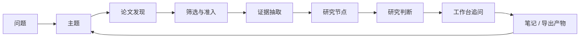

[English](../README.md) | [简体中文](README.zh-CN.md) | [日本語](README.ja-JP.md) | [한국어](README.ko-KR.md) | [Deutsch](README.de-DE.md) | [Français](README.fr-FR.md) | [Español](README.es-ES.md) | [Русский](README.ru-RU.md)

<p align="center">
  
</p>

<h1 align="center">溯知 TraceMind</h1>

<p align="center">
  <strong>面向长期研究者的 AI 个人研究工作台，帮助你看清一个研究方向的主线、分支、证据和判断，而不只是快速拿到一句回答。</strong>
</p>

<p align="center">
  <a href="../LICENSE"></a>
  
  
  
  
</p>

## 溯知是什么

溯知是一个 AI 个人研究工作台。它服务的不是“我还没找到论文”的阶段，而是“我已经收集了很多论文，但我仍然看不清这个方向真正的结构”的阶段。

很多研究工具都能帮助你更快获得信息，但真正困难的部分往往不是“找到更多”，而是“让理解慢慢积累起来”。一篇篇论文、一轮轮聊天、一次次零散笔记，最后很容易变成分散在不同地方的碎片。你记得结论，却忘了它是被哪张图、哪组实验、哪段推理支撑起来的；你记得热点，却看不清主线；你知道谁在跟进，却不知道这个方向究竟在往哪里演化。

溯知想做的，就是把这种容易散掉的研究过程重新组织起来。它试图把：

- 论文变成可复用的证据
- 证据变成研究节点
- 节点变成可回溯的判断
- 判断再变成带着上下文继续推进的追问

它的目标不是帮你“生成更多字”，而是帮助你逐步形成一个真正可阅读、可解释、可返回的研究地图。

## 项目介绍

理解溯知，最好的方式不是从技术栈开始，而是先从用户实际会看到的产品表面开始。对一个使用者来说，溯知不是一堆后端能力的集合，而是几个紧密协作的研究界面。

| 界面 | 它负责什么 | 你应该快速看懂什么 |
| --- | --- | --- |
| 主题页 | 看清一个研究方向的整体状态 | 现在有几个阶段、哪些节点最重要、哪些论文构成主线、这个方向发展到了什么程度 |
| 节点页：研究视图 | 快速进入一个研究节点 | 这个节点到底在研究什么、哪些证据最关键、哪里有共识、哪里有争议 |
| 节点页：文章视图 | 完整读懂一个节点 | 这个节点里的论文怎样彼此连接、每篇论文到底贡献了什么、长文叙述如何建立在证据之上 |
| 工作台 | 持续追问当前主题或节点 | 可以继续比较分支、挑战判断、缩小问题，而不用每次重新解释背景 |
| 模型中心 | 配置你自己的 AI 能力栈 | 接入任意 provider、模型、base URL、API key，并把不同任务交给不同模型 |

如果只用一句话概括：

> 溯知不是“论文列表上加一个聊天框”，而是“让研究方向慢慢长成结构”的工作台。

## 主题页：先看清方向，再进入细节

主题页是溯知最核心的“定向界面”。一个用户刚进入主题页时，最需要的不是一串功能按钮，而是对当前研究方向状态的快速把握。主题页首先要回答的问题是：

> “这个研究方向现在到底发展到了什么程度？”

它不应该像一个普通项目管理页面，也不应该像一个由大模型凭空想出来的研究计划。它应该让用户一眼看到：真实进展已经沉淀出了什么，主线和支线各自走到了哪里，还有哪些东西仍然处在候选或未完成状态。

在溯知里，主题不是先被“规划”出来的，而是先被“建立”出来的。创建主题之后，系统不会先放一个假的“研究规划阶段”来占位；相反，它会等待真实材料进入，再由论文发现、论文筛选、节点生长和时间窗口归档，逐步长出阶段和结构。

### 主题页上应该看到什么

- 一个研究进展总览，用来快速显示当前已经积累了多少真实阶段、研究节点、关键论文和证据对象
- 一条真正从研究过程里长出来的阶段时间线，而不是在主题创建时就预设好的计划
- 一个阶段 - 节点图谱，把主线、支线、汇合点放在同一个可读表面上
- 每个阶段最多十张可见节点卡片，避免阶段一旦复杂起来就彻底失去可读性
- 被主动抬到上层的关键论文，让最重要的材料不会被埋在长列表里
- 快速进入节点的入口，让用户不必先滚完整个页面才能找到值得读的部分
- 仍然等待映射的材料，让未完成的研究工作也被看见，而不是静悄悄地消失
- 可以直接打开的右侧研究工作台，让追问从当前主题上下文自然继续

### 一个好的主题页，应该在 30 秒内告诉用户什么

- 这个主题还是处在探索期，还是已经长出了稳定结构
- 目前最能代表这个领域状态的是哪个阶段
- 哪些分支值得继续跟踪，哪些只是暂时的旁支
- 哪些节点承担了“解释主线”的任务
- 哪些论文是真正的关键论文，而不是“出现在附近的相关论文”
- 最近这段时间到底发生了什么值得注意的变化

这也是为什么溯知坚持不在主题创建时先放一个“研究规划阶段”。阶段在这个产品里不是装饰，不是流程模板，也不是让页面显得完整的视觉组件。阶段应该是被真实研究材料支撑出来的结果。

## 节点页：一个节点，两种阅读方式

节点不是单篇论文页。节点是主题内部的“结构化理解单元”。一个节点可以是某条方法线、一类争议、一种技术瓶颈、一个能力边界、一个评价问题，或者一个明显的研究转折。

用户进入节点时，会有两种完全不同但同样重要的需求。一种需求是“我先快速搞清楚这个节点在讲什么”；另一种需求是“我已经确认这个节点重要，现在我要把它真正读透”。这就是溯知为什么要把节点页明确拆成双视图。

| 视图 | 目的 | 最适合什么时候用 |
| --- | --- | --- |
| 研究视图 | 快速形成结构化理解 | 当你需要先恢复主线、看清关键证据，而不想先陷入大段文字时 |
| 文章视图 | 深入完成节点阅读 | 当你已经确认这个节点值得认真读，想把节点里的多篇论文串成一条清晰叙事时 |

### 研究视图：快速理解入口

研究视图不是普通文章的缩略版，而更像是一份研究助理提前整理好的 briefing。它理想中的体验应该接近：

> “研究助理已经替我读过一轮这个节点，并把最该先看的结构和证据整理出来了。”

因此，研究视图强调的不是铺陈，而是理解效率。它优先展示：

- 这个节点真正想回答的核心问题
- 一组能快速建立整体认知的核心论点卡片
- 节点内部最重要的论文，以及它们分别承担什么角色
- 由图、表、公式、引用片段构成的证据链
- 最值得记住的方法、发现和限制
- 分歧、争议和尚未解决的问题
- 当前最合理的综合判断

它的设计目标不是“替代文章”，而是“成为最快的理解入口”。因此它更适合图多、结构强、层次清楚，让用户在短时间内把一个节点的大致骨架抓住。

### 文章视图：不用先重读所有原文，也能深度理解节点

文章视图是节点的深度阅读层。它不是为了永远替代原论文，而是为了减少这样一种高成本状态：用户为了重新找回主线，不得不立刻重新打开十几篇 PDF，从头拼接它们之间的关系。

一个好的节点文章视图，应该让用户在进入原文之前，先完成一次“节点级理解”。也就是说，用户先要知道：

- 这个节点里到底有哪些关键论文
- 每篇论文的核心贡献和局限在哪里
- 这些论文之间是继承关系、互补关系，还是冲突关系
- 整个节点为什么会导向当前的综合判断

因此，文章视图要承担这些任务：

- 给出一篇连续、可读的节点文章，而不是平铺的一堆摘要
- 保持文中引用和论文、证据对象之间的连接
- 在可用时真正把图、表、公式纳入叙述，而不是只做附件展示
- 把同一个节点内部多篇论文的关系串起来，而不是各讲各的
- 先输出稳定的可读文章，再在后台逐步增强更深的综合生成

这是溯知非常重要的一条产品判断：用户应该先能把“这个节点里的论文整体在说什么”读明白，再决定具体回头精读哪几篇原文。

## 工作台：在研究过程中随时提问

研究理解从来不是“看完一个页面就结束”。很多时候，真正有价值的部分恰恰发生在你开始追问的时候：哪条分支证据更弱？为什么这个判断看起来成立？什么新材料会推翻它？两个节点之间到底是什么关系？

因此，溯知必须有工作台，而且工作台不能只是一个和任何上下文都脱离的普通聊天框。

它有两种形态：

- 主题页、节点页中的右侧上下文工作台
- 独立打开的完整工作台页面

它真正的职责是“带着研究上下文继续追问”。好的工作台提问通常像这样：

- 这个主题里哪条分支目前证据最薄弱？
- 如果要推翻当前节点判断，最可能需要出现什么新证据？
- 这两个节点到底是互补关系，还是竞争性解释？
- 哪些论文是真正主线，哪些论文只是看起来相关？
- 如果我现在只回头重读三篇原文，应该选哪三篇？

工作台最关键的价值，不是“能聊天”，而是“能继承当前主题或节点的上下文”。用户不应该每次提问都重新铺设背景，也不应该把研究理解退化成一次次孤立的 prompt。

## 模型与 API：把你自己的能力栈接进来

溯知从一开始就不是“绑定单一模型供应商”的产品。它更像是一个研究工作流外壳，而模型层是用户可以自己决定的能力基础设施。

项目内置模型中心和 Prompt Studio，可以配置：

- 默认语言模型槽位
- 默认多模态模型槽位
- 面向不同研究角色的自定义模型
- 针对聊天、主题综合、PDF 解析、图像分析、公式识别、表格抽取、证据解释等任务的单独路由
- provider、模型名、base URL、API key 以及 provider 专属选项

这意味着溯知可以接入：

- OpenAI、Anthropic、Google 等官方 provider
- Omni 层内置支持的 provider 家族
- 带自定义 base URL 的 OpenAI-compatible 网关
- 企业内代理、自建网关或兼容接口服务

设计思想非常明确：研究工作流不应该被硬编码到单一 provider 上。对很多认真使用研究工具的人来说，模型选择、任务路由和 API 接入方式本身就是工作台体验的一部分。

## 研究流程：一个主题是怎么长出来的

理解溯知的最好方式，不是把它当成一次性助手，而是把它看成一个会不断积累的研究循环。



这个循环重要的地方在于，溯知并不试图从 `问题` 一步跳成 `答案`。它真正想保留的是中间结构：

- 为什么这些论文会进入主题
- 到底哪些证据对象真正重要
- 这些证据是如何组织成节点的
- 节点在当时能够支撑什么判断
- 这个判断又带来了哪些新的追问

一旦这些中间结构被保留下来，研究就不再是一次次从零开始，而是能够慢慢积累、慢慢变清楚。

## 快速启动

### 运行要求

- Node.js `18+`
- npm `9+`
- Python `3.10+`
- 至少一个可用的模型 API key

### 启动后端

```bash
cd skills-backend
npm install
cp .env.example .env
npm run db:generate
npm run dev
```

### 启动前端

```bash
cd frontend
npm install
npm run dev
```

### 可选：使用 Docker

```bash
docker compose up --build
```

### 默认本地地址

- 前端：`http://localhost:5173`
- 后端健康检查：`http://localhost:3303/health`

### 第一次使用清单

1. 先打开设置页或模型中心。
2. 至少配置一个语言模型；如果你希望 PDF、图、表、公式处理更强，再补一个多模态模型。
3. 创建一个你真的打算长期理解的主题，而不是随手输入一个临时演示问题。
4. 先执行论文发现，再认真筛选候选池，不要一股脑全部准入。
5. 回到主题页，看看阶段、节点和关键论文是不是已经开始长出结构意义。
6. 进入节点时先看研究视图，再根据需要切到文章视图深读。
7. 用工作台去挑战当前判断，看看哪里仍然薄弱、哪里最值得回头重读。

## 亮点功能

这些能力最能代表溯知的产品方向和完成度。

- 真实进展驱动的主题页：阶段来自论文、节点和证据，而不是创建主题时的一次性规划
- 阶段 - 节点图谱：在同一主题界面里同时看到时间线、分支、汇合点和关键节点
- 节点双视图：研究视图负责快速理解，文章视图负责深度阅读
- 证据优先的节点综合：图、表、公式、引用片段进入推理表面，而不是只做附件
- 上下文工作台：用户可以继续发问，而不必每次重新讲背景
- 用户可控的模型路由：语言模型、多模态模型、任务级模型都可以拆开配置
- 自托管导向：项目适合希望自己掌控研究环境和模型接入方式的用户
- 多语言基础：文档和界面都以国际化为前提，而不是后补翻译

## 对比

溯知不是要替代所有研究工具。它更像是“文献收集”和“研究理解”之间缺失的那一层。

| 工具类型 | 它最擅长什么 | 溯知的不同点 |
| --- | --- | --- |
| 通用 AI 聊天 | 快速回答、快速头脑风暴 | 溯知长期保留主题记忆、论文结构、节点结构和证据支撑 |
| 文献管理器 | 收集论文、管理引用 | 溯知更关注节点形成、证据链和研究判断 |
| 笔记软件 / Wiki | 灵活手工组织 | 溯知试图把文献自动转成研究对象，而不只依赖手工整理 |
| 单篇论文摘要工具 | 快速消化一篇论文 | 溯知强调跨多篇论文的节点级综合 |

所以更准确的理解方式不是“溯知和所有工具竞争”，而是“溯知让一个研究方向终于变得可读”。

## 教程：个人研究者如何把它用好

一个比较健康、也比较符合产品设计的个人使用节奏通常是这样的：

1. 从一个方向出发，而不是从单篇论文出发。先问“这个领域正在发生什么变化”，再决定看哪篇论文。
2. 先建立候选池，再敢于拒绝。很多看起来“差不多相关”的论文，其实只会让主题变得更混乱。
3. 让节点围绕子问题自然长出。好节点通常围绕方法家族、能力边界、评价争议、技术瓶颈或范式转折形成。
4. 先读主题页，再决定深入哪个节点。主题页应该帮助你判断“哪里最值得先看”。
5. 进入节点时先看研究视图，再进入文章视图。先恢复结构，再投入深读。
6. 用文章视图完成节点级深理解，而不是立刻回到每篇原文里重新捞主线。
7. 用工作台持续攻击薄弱处。去问哪里被夸大了、哪里缺证据、什么新结果会真正改变当前判断。
8. 当节点真正变得可读之后，再导出笔记、简报或报告素材。

如果你用得好，感受应该会慢慢从“我收集了很多论文”变成“我终于能解释这个分支到底在做什么，以及为什么这样判断”。

## 设计原则

溯知背后有几条很强的产品原则，这些原则决定了它不会轻易滑向“看起来很聪明，但实际上缺少结构”的方向。

- 创建主题时不要先造一个假的规划阶段
- 阶段必须从真实研究材料中长出来
- 节点是理解单元，而不是文件夹
- 研究视图必须成为最快的入口
- 文章视图必须让节点真正可深读
- 判断必须可修正、可回到证据
- 工作台必须始终站在主题记忆之上

这些原则之所以重要，是因为研究产品一旦只追求“马上给出漂亮输出”，很快就会被噪声淹没。

## 初心

一次研究进展的探寻，几乎不可能让人真正看清一个完整方向。尤其是在今天的 AI 研究里，节奏快、热点密、follow 氛围强，很多时候被奖励的是“谁跟得更快”，而不是“谁看得更清楚”。

这当然有助于信息传播，却未必有助于找到真正解决问题的方法。因为如果大家都只追最新热点，就会越来越少有人持续追踪：

- 到底什么在真实积累
- 什么只是重新包装
- 哪些分歧至今没有被解决
- 哪些证据真的改变了这个方向

溯知正是从这里出发，提出了一个更慢、也更难，但更重要的问题：

> 能不能让 AI 真正去追踪文献、积累证据，并以这些积累作为后续回答和判断的依据？

这就是这个项目的研究初心。我们希望 AI 不只是一个当下会说话的助手，而是一个最忠诚、最严谨、最愿意陪你长期跟踪一个方向的研究助手。它应该帮助你看见一个领域的来龙去脉、分支演化和未解张力，而不是只在热点涌来时给你一段流畅的总结。

## 技术栈

- 前端：React + Vite
- 后端：Express + Prisma
- 默认数据库：SQLite
- 模型层：支持 provider、槽位和任务路由配置的 Omni 网关
- 研究对象：论文、图、表、公式、节点、阶段和导出产物

## 结束

研究理解不会自动积累。论文增长得往往比判断更快，摘要增长得往往比结构更快。

溯知想做的，就是中间那层更慢、却更有价值的工作：让一个人回到一个主题时，依然能看清这个方向到底在发生什么、为什么当前判断成立、还有哪些地方依然值得继续怀疑和追问。
