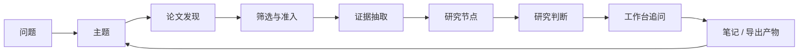

[English](../README.md) | [简体中文](README.zh-CN.md) | [日本語](README.ja-JP.md) | [한국어](README.ko-KR.md) | [Deutsch](README.de-DE.md) | [Français](README.fr-FR.md) | [Español](README.es-ES.md) | [Русский](README.ru-RU.md)

<p align="center">
  
</p>

<h1 align="center">溯知 TraceMind</h1>

<p align="center">
  <strong>面向长期研究者的 AI 个人研究工作台，帮助你真正看清一个研究方向，而不只是快速拿到一句回答。</strong>
</p>

<p align="center">
  <a href="../LICENSE"></a>
  
  
  
  
</p>

## 溯知是什么

溯知是一个 AI 个人研究工作台。它服务的是这样一个关键时刻:

不是“我还没找到论文”，而是“我已经收集了很多论文，但还没有真正看清这个方向到底在发生什么”。

溯知不把研究过程理解成聊天记录、收藏夹和零散摘要的堆积，而是尝试把：

- 论文变成可复用的证据
- 证据变成研究节点
- 节点变成可回溯的研究判断
- 判断再变成仍然带着上下文的追问

它追求的不是生成更多内容，而是让一个研究方向变得可读、可解释、可返回。

## 项目介绍

理解溯知，最简单的方式是先理解它面向用户的五个核心界面。

| 界面 | 它负责什么 | 用户应该快速看懂什么 |
| --- | --- | --- |
| 主题页 | 看清一个研究方向当前的整体状态 | 现在有哪些阶段、哪些节点最重要、哪些论文构成主线、这个方向研究到什么程度了 |
| 节点页：研究视图 | 快速进入一个研究节点 | 这个节点研究什么、哪些证据最关键、哪里有共识、哪里有分歧、当前判断是什么 |
| 节点页：文章视图 | 深度理解一个节点 | 节点内多篇论文如何串起来、每篇论文到底贡献了什么、长文叙述如何被证据支撑 |
| 工作台 | 随时发起有上下文的提问 | 继续追问、挑战当前判断、比较不同分支，而不用每次都重新铺垫背景 |
| 模型中心 | 配置自己的 AI 能力栈 | 接入自己的 provider、模型、base URL、API key，并把不同任务路由给不同模型 |

如果只记住一句话，请记住：

> 溯知不是“论文列表上面再加一个聊天框”，而是“把研究方向慢慢长成结构”的工具。

## 主题页：先看清方向，再进入细节

主题页是溯知最核心的“定向界面”。它首先要回答的是一个很难但很重要的问题：

> “这个研究方向现在到底发展到了什么程度？”

在溯知里，主题页不应该像一个普通任务看板，也不应该在创建主题时先出现一个假想出来的“研究规划阶段”。主题应该先是一个轻量外壳，然后只在真实材料进入之后，才逐步长出阶段、节点和判断。

### 主题页上应该看到什么

- 一个研究进展总览，快速显示当前已经积累了多少真实阶段、研究节点、关键论文和证据对象
- 一个由真实研究过程长出来的阶段时间线，而不是创建主题时提前写好的计划
- 一个阶段 - 节点图谱，把主线、支线、汇合点放在同一个视觉表面中
- 每个阶段最多展示十张可见节点卡片，避免阶段一旦变复杂就直接失去可读性
- 被主动抬到上层的关键论文，而不是埋在长列表里
- 可以快速进入节点的入口，让用户不必先滚完整个页面
- 尚未映射完成的材料，让不完整的研究工作也能被看到，而不是悄悄消失
- 可直接打开的右侧研究工作台，让用户站在当前主题语境里继续追问

### 一个好的主题页，应该让用户在 30 秒内看明白什么

- 这个主题还处于探索期，还是已经长出了比较稳定的结构？
- 目前最能代表这个方向状态的是哪个阶段？
- 哪些分支值得继续跟？
- 哪些节点承担了“解释主线”的任务？
- 哪些论文是真正定义现状的关键论文？
- 最近到底发生了什么实质变化？

这也是为什么溯知坚持不在主题创建时塞进去一个“研究规划阶段”。在这个产品里，阶段必须由研究材料支撑，而不是为了页面完整度而想象出来。

## 节点页：一个节点，两种阅读方式

节点不是单篇论文页。节点是一个主题内部的“结构化理解单元”。它可以是一个方法家族、一个技术争议、一个瓶颈、一个机制、一个限制，或者一个关键转折。

因此，节点页天然要承担两种不同任务，而溯知把它明确拆成双视图。

| 视图 | 目的 | 最适合什么时候用 |
| --- | --- | --- |
| 研究视图 | 快速形成结构化理解 | 当你只想先看清这个节点的形状，不想先陷入大量长文时 |
| 文章视图 | 深入完成节点阅读 | 当你已经知道这个节点值得认真读，需要把多篇论文连成一条可读叙事时 |

### 研究视图：快速理解入口

研究视图更像一份研究助理准备好的 briefing，而不是一篇普通文章。它理想中的体验应该接近：

> “研究助理已经帮我把这个节点读过一轮，并把最值得先看的结构整理出来了。”

在实际设计上，研究视图会强调：

- 节点的核心问题
- 视觉化的核心论点卡片
- 节点内部的重要论文及其角色
- 由图、表、公式、引用片段构成的证据链
- 关键方法、关键发现、关键限制
- 分歧、争议和尚未解决的问题
- 当前综合判断

它的目标是图多、结构强、扫描快，比传统文章视图更适合“先扫清这个方向”。

### 文章视图：不用立刻回到所有原文，也能深度理解节点

文章视图是节点的深度阅读层。它不是要永久替代原论文，而是尽量减少这样一种情况：

用户为了重新找回主线，不得不立刻重新打开十几篇 PDF，重新从头拼接它们之间的关系。

因此，文章视图的职责是：

- 给出一篇连续的节点文章，而不是一堆平铺的摘要
- 让文中引用依旧和论文、证据对象保持连接
- 在可用时，把图、表、公式真正纳入叙述过程
- 把同一个节点内部多篇论文的关系串起来
- 先稳定输出可读文章，再在后台逐步增强更深的综合叙事

这是溯知非常重要的一条产品判断：用户应该先能深度理解“这个节点里的论文整体在说什么”，再决定哪些原文需要回头精读。

## 工作台：在研究过程中随时提问

溯知之所以一定要有工作台，是因为一个研究方向从来不可能靠一次阅读就完成理解。

工作台有两种形态：

- 主题页、节点页中的右侧上下文工作台
- 独立打开的完整工作台页面

它不是一个泛泛聊天框，它的职责是“带着研究上下文继续追问”。好的工作台问题通常像这样：

- 这个主题里哪条分支目前证据最薄弱？
- 如果要推翻当前节点判断，最可能需要出现什么新证据？
- 这两个节点到底是互补关系，还是竞争性解释？
- 哪些论文是真正主线，哪些论文只是看起来相关？
- 如果我现在只回头重读三篇原文，应该选哪三篇？

关键不是“能不能聊天”，而是“能不能继承当前主题或节点的上下文，不让研究反复从零开始”。

## 模型与 API：把你自己的能力栈接进来

溯知从设计上就面向“用户自己掌控模型栈”的使用方式。

项目内置模型中心和 Prompt Studio，可以配置：

- 默认语言模型槽位
- 默认多模态模型槽位
- 面向不同研究角色的自定义模型
- 针对聊天、主题综合、PDF 解析、图像分析、公式识别、表格抽取、证据解释等任务的单独路由
- provider、模型名、base URL、API key 以及 provider 专属选项

这意味着溯知可以服务于：

- OpenAI、Anthropic、Google 等官方 provider
- Omni 层内置支持的 provider 家族
- 带自定义 base URL 的 OpenAI-compatible 网关
- 企业内部代理、自建网关或兼容接口服务

设计思想很简单：研究工作流不应该被硬编码到单一 provider 上。

## 研究流程：一个主题是怎么长出来的

最适合理解溯知的方式，不是把它当成一次性助手，而是把它看成一个研究积累循环。



这条链很重要，因为溯知不是想从 `问题` 一步跳成 `答案`。它真正想保留的是中间结构：

- 为什么是这些论文进入了主题
- 到底哪些证据对象真正重要
- 这些证据是怎么组织成节点的
- 这些节点当时能支撑什么判断
- 这个判断又带来了哪些新的追问

## 快速启动

### 运行要求

- Node.js `18+`
- npm `9+`
- Python `3.10+`
- 至少一个可用的模型 API key

### 启动后端

```bash
cd skills-backend
npm install
cp .env.example .env
npm run db:generate
npm run dev
```

### 启动前端

```bash
cd frontend
npm install
npm run dev
```

### 可选：使用 Docker

```bash
docker compose up --build
```

### 默认本地地址

- 前端：`http://localhost:5173`
- 后端健康检查：`http://localhost:3303/health`

### 第一次上手建议

1. 先打开设置页或模型中心。
2. 至少配置一个语言模型；如果你希望 PDF、图、表、公式能力更强，再补一个多模态模型。
3. 创建一个你真的想长期理解的主题，而不是临时演示词。
4. 先跑论文发现，再认真筛选，不要什么都准入。
5. 先回到主题页，看阶段、节点、关键论文是不是已经开始长出意义。
6. 进入节点时先看研究视图，再决定要不要转到文章视图深读。
7. 用工作台去挑战当前判断，问它哪里最弱、哪里最值得回头重读。

## 亮点功能

这些能力最能代表溯知的产品形态。

- 真实研究进展主题页：阶段来自论文、节点和证据，不来自主题创建时的一次性规划。
- 阶段 - 节点图谱：同一个主题界面里同时看到时间线、分支、汇合点和关键节点。
- 节点双视图：研究视图负责快，文章视图负责深。
- 证据优先的节点综合：图、表、公式、引用片段不再只是附件，而是推理表面的一部分。
- 上下文工作台：用户可以持续提问，而不必每次重新讲背景。
- 用户可控的模型路由：语言模型、多模态模型、任务级模型都可以拆开配置。
- 自托管导向：项目天然适合希望自己掌控环境的用户。
- 多语言基础：项目支持八种语言的文档与国际化界面能力。

## 对比

溯知不是要替代所有研究工具。它更像是“文献收集”和“研究理解”之间缺失的那一层。

| 工具类型 | 它最擅长什么 | 溯知的不同点 |
| --- | --- | --- |
| 通用 AI 聊天 | 快速回答、快速头脑风暴 | 溯知长期保留主题记忆、论文结构、节点结构和证据支撑 |
| 文献管理器 | 收集论文、管理引用 | 溯知更关注节点形成、证据链和研究判断 |
| 笔记软件 / Wiki | 灵活手工组织 | 溯知试图把文献自动转成研究对象，而不只依赖手工整理 |
| 单篇论文摘要工具 | 快速消化一篇论文 | 溯知强调跨多篇论文的节点级综合 |

更准确的理解方式不是“溯知和所有工具竞争”，而是“溯知让一个研究方向终于变得可读”。

## 教程：个人研究者如何把它用好

一个比较好的个人使用方式通常是这样的：

1. 从一个方向出发，而不是从单篇论文出发。
   例如问“多模态 agent 规划到底在发生什么变化”，而不是只导入一篇论文。
2. 先构建候选池，再敢于大量拒绝。
   一个主题一旦噪声太多，就很难再真正清晰。
3. 让节点围绕子问题自然长出。
   好的节点往往围绕方法家族、瓶颈、评测争议或技术转折形成。
4. 先读主题页，再决定深入哪个节点。
   主题页应该帮你决定“先看哪里最值”。
5. 先进入研究视图，再进入文章视图。
   先恢复结构，再投入深读。
6. 用文章视图完成节点级的深理解，而不是立刻回到每篇原文。
7. 用工作台专门攻击薄弱处。
   去问哪里被夸大了、哪里缺证据、什么新结果会改写当前判断。
8. 当节点真正变得可读之后，再导出笔记、简报或报告素材。

如果你用得好，感受应该会慢慢从“我收集了很多论文”变成“我终于能解释这个分支到底在做什么”。

## 设计原则

溯知背后有几条非常强的产品原则。

- 创建主题时不要先造一个假的规划阶段。
- 阶段必须从真实研究材料中长出来。
- 节点是理解单元，不是文件夹。
- 研究视图必须成为最快入口。
- 文章视图必须让节点真正可深读。
- 判断必须可修正、可回到证据。
- 工作台必须始终站在主题记忆之上。

这些原则重要，是因为研究产品一旦只追求“看起来很会说”，很快就会被噪声淹没。

## 初心

一次研究进展的探寻，几乎不可能让人真正看清一个完整方向。尤其是在今天的 AI 研究里，节奏快、热点密、follow 氛围强，很多时候被奖励的是“谁跟得更快”，而不是“谁看得更清楚”。

这有助于信息传播，却不一定有助于解决真正的问题。因为如果大家都只追最新热点，就会越来越少有人持续追踪：

- 到底什么在真实积累
- 什么只是重新包装
- 哪些分歧还没有被解决
- 哪些证据真的改变了这个方向

溯知正是从这里出发，提出了一个更慢但更重要的问题：

> 能不能让 AI 真正去追踪文献、积累证据，并以这些积累作为后续回答和判断的依据？

这就是这个项目的研究初心。我们希望 AI 不只是一个当下会说话的助手，而是一个最忠诚、最严谨、最愿意陪你长期追踪一个方向的研究助手，帮助你看见一个领域的来龙去脉、分支演化和未解张力。

## 技术栈

- 前端：React + Vite
- 后端：Express + Prisma
- 默认数据库：SQLite
- 模型层：支持可配置 provider、槽位和任务路由的 Omni 网关
- 研究对象：论文、图、表、公式、节点、阶段和导出产物

## 结束

研究理解不会自动积累。论文增长得往往比判断更快，摘要增长得往往比结构更快。

溯知想做的，就是中间那层更慢、却更有价值的工作：让一个人回到一个主题时，依然能看清这个方向到底在发生什么，为什么当前判断成立，还有哪些地方依然值得继续怀疑和追问。
