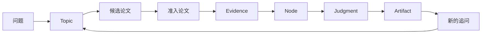
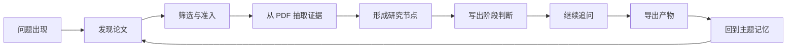

[English](../README.md) | [简体中文](README.zh-CN.md) | [日本語](README.ja-JP.md) | [한국어](README.ko-KR.md) | [Deutsch](README.de-DE.md) | [Français](README.fr-FR.md) | [Español](README.es-ES.md) | [Русский](README.ru-RU.md)

<p align="center">
  
</p>

<h1 align="center">溯知 TraceMind</h1>

<p align="center">
  <strong>面向长期研究者的 AI 个人研究工作台，帮助你理解一个方向，而不只是从这个方向里快速拿到一句答案。</strong>
</p>

<p align="center">
  <a href="../LICENSE"></a>
  
  
  
  
</p>

## 如果你只读一段

一次研究进展，几乎永远不够让人真正看清一个研究方向。今天的 AI 研究节奏很快，噪声很多，社会反馈也常常奖励“更快追热点的人”。这当然能帮助我们跟上信息，但不一定能帮助我们真正理解：什么在推动这个领域，什么只是表面新鲜，哪些论文构成主线，哪些证据真正站得住，哪些问题其实还远远没有定论。溯知想做的，就是让 AI 去持续追踪文献、积累证据、组织研究节点，并在这个基础上成为你最忠诚、最严谨的研究助手，帮助你真正看见一个方向的脉络。

## 溯知是什么

溯知是一个 AI 个人研究工作台。

它不是单纯的聊天框，不是更漂亮的论文收藏夹，也不是再多一个“帮你生成摘要”的工具。它是一套用来把论文、PDF、图表、公式、引用、研究节点、阶段判断、追问记录和长期记忆放到同一个研究现场里的工作系统。

它适合这些人：
- 正在做论文、综述、开题或长期方向积累的学生
- 需要对一个研究方向形成稳定理解的独立研究者
- 需要长期跟踪技术路线演化的工程师和技术负责人
- 需要依据而不是仅仅观点的分析师
- 想判断一个方法到底是真进展还是跟风包装的开源作者和研究型开发者

## 它要解决什么问题

研究流程真正崩掉，很多时候不是因为找不到信息，而是因为理解无法稳定积累。

一个很常见的过程是：
- 今天读到一篇感觉很重要的论文
- 几天后发现一篇方向相反的结果
- 两周后只记得结论，却记不得支撑结论的图和实验
- 一个月后，整个方向分散在聊天记录、浏览器标签页、收藏夹和半成品笔记里

通用 AI 很擅长在当下“回答你”，却不擅长长期保存这些更关键的东西：
- 这个判断为什么成立
- 它到底由哪些证据支持
- 哪些论文是真正的主线，哪些只是看起来相关
- 哪些地方仍然没有定论
- 这个方向是如何一步步演化到今天的

溯知希望让研究不要在每次回到主题时都从零开始。

## 它真正优化的是什么

溯知不是把“生成更多内容”当成北极星，它追求的是更难的一件事：

> 当研究者做出一个重要判断时，他应该能够回到支撑这个判断的论文、证据和推理路径。

这会直接影响产品长相：
- 新主题应该尽量轻，只在真实材料进入后才生长
- 阶段视图应该反映真实研究进展，而不是想象中的规划
- 节点页应该优先帮助用户快速理解，而不是堆更多字
- 不确定性应该被展示，而不是被掩盖
- 追问应该始终建立在主题记忆和证据上下文之上

## 站在用户角度，它像什么

你可以把溯知理解成由五个核心表面组成：

| 表面 | 它首先应该回答什么 |
| --- | --- |
| 首页 | 我现在在追哪些主题？ |
| 主题页 | 这个方向现在研究到什么程度了？有哪些阶段、节点和关键论文？ |
| 节点研究视图 | 这个节点真正的问题是什么？核心论文是哪几篇？证据链怎么支撑当前判断？ |
| Workbench 对话 | 如果我继续追问、质疑、缩小问题范围，会发生什么？ |
| 导出产物 | 我怎么把这些积累变成研究笔记、简报、综述素材或报告草稿？ |

## 为什么主题页很重要

主题不是一个装饰性的容器，而是把研究方向真正维系在一起的长期对象。

一个好的主题页，应该让用户一眼看出：
- 这个主题到底在研究什么
- 它现在还处在探索期，还是已经形成比较稳定的结构
- 哪些阶段是由真实研究进展长出来的
- 哪些节点承担了解释主线的任务
- 哪些论文是关键，而不是“只是出现过”
- 最近到底发生了什么实质变化

这也是为什么溯知不会在新建主题时先生成一个假的“研究规划阶段”。主题应该先是一个轻量壳体，随后由论文发现、证据抽取、节点生成和研究判断慢慢长出来。

## 为什么节点研究视图很重要

节点页不应该像单篇论文页。

用户点进去时，更理想的感受应该是：

> “研究助手已经带着证据把这个问题读过一遍，并且整理成了一份结构清楚的研究简报。”

一个好的节点研究视图，至少应该回答这些问题：
- 这个节点的核心问题到底是什么
- 定义它的关键论文有哪些
- 证据链如何支撑当前结论
- 重要的方法、发现和限制是什么
- 争议和分歧集中在哪里
- 目前最合理的研究判断是什么

这是溯知最重要的产品赌注之一：让用户不必从几十篇论文里重新捞主线。

## 你今天就能用它做什么

- 发现论文，并形成候选池
- 把论文区分成真正属于主题、只是相邻、或者暂时应排除
- 从 PDF 中提取文本、图表、公式、表格和引用结构
- 把研究方向组织成节点，而不是停留在平铺的论文列表
- 生成结构化的节点研究简报，突出证据、限制和争议
- 基于主题和节点上下文持续追问
- 导出研究笔记、节点文章和报告素材

## 一个简单心智模型

理解这些对象之后，使用溯知会清楚很多：

| 对象 | 含义 |
| --- | --- |
| `Topic` | 你会长期回访的研究方向 |
| `Paper` | 论文本身，以及它的元数据、PDF 结构、引用和抽取资产 |
| `Evidence` | 可复用的研究材料，如文本片段、图表、表格、公式和来源引用 |
| `Node` | 围绕问题、方法、机制、局限、争议或转折形成的结构化研究单元 |
| `Judgment` | 当前证据支持什么、哪里还不够稳的阶段性判断 |
| `Memory` | 让后续追问不失焦的长期上下文 |
| `Artifact` | 可以导出的产物，如节点笔记、简报或报告素材 |

## 这些概念是怎么连起来的

理解溯知最简单的方式，就是把它看成一条“研究结构转换链”：



溯知不是想将“问题”一步跳成“答案”。

它更在意这条链上的中间结构是否被保留下来：
- 为什么是这些论文变得相关
- 到底用了哪些证据片段
- 这些证据是如何被组织成节点的
- 当时为什么能得出那样的判断
- 这个判断又带来了哪些新问题

## 核心概念的更深一层解释

上面的表是简版，下面是更完整的理解方式。

| 概念 | 它是什么 | 它不是什么 | 为什么重要 |
| --- | --- | --- | --- |
| `Topic` | 可以长期回访的研究方向 | 一个被用完就丢的搜索关键词 | 它是整个系统积累记忆的主体 |
| `Stage` | 由真实研究进展长出来的阶段 | 创建主题时先想出来的计划 | 它让用户知道这个方向真实是如何演化的 |
| `Paper` | 具有 PDF、元数据、引用和内容的源对象 | 只是列表中的一个标题 | 它是进入证据的入口，而不是终点 |
| `Evidence` | 可复用的研究片段，如文本、图、公式、表格 | 没有来源锚点的“支持性文字段” | 它让后续判断可以被检查 |
| `Node` | 围绕一个问题或分支形成的结构化研究单元 | 更漂亮的论文卡或文件夹 | 它让用户可以快速恢复主线 |
| `Judgment` | 当前最好的证据解读 | 永远不会被改的真理 | 它让产品既能给出结论，又不假装不确定性已经消失 |
| `Memory` | 让后续追问不再从零开始的长期上下文 | 聊天记录的堆积 | 它让研究可以继续，而不是总是重来 |
| `Artifact` | 值得带出系统的产物，如笔记、简报、报告素材 | 模型随手吐出的一段文本 | 它是“研究积累”如何变成外部可用成果的接口 |

## Stage 应该是怎么长出来的

`Stage` 是最容易被误解的概念之一。

在溯知中，它不应该意味着：
- 创建主题时模型先写好的任务清单
- 每个主题都通用的模板化流程
- 为了让页面更漂亮而加的装饰性标签

它应该触发于真实的研究变化，比如：
- 新的方法类型带来一波论文发现
- 某个 node 密度足够高，已经形成稳定的子领域视图
- 方法路线发生转向，比如从 pipeline 转到 end-to-end
- 领域从乐观宣称逐渐转向更强的评测和质疑
- 随着时间窗口变化，领域的主流看法发生改变

所以主题进展在溯知里更接近“该领域变得有多可读”，而不是“某个任务做完了多少”。

## 一个成熟的 Topic 应该是什么样

一个成熟的 Topic 不是“完成”，而是“可读”。

你应该能在一个成熟的 Topic 里看到：
- 一组可解释主线的关键论文，而不是一堆未筛选的文献
- 几个分别承担不同解释任务的 node
- 反映真实演化的 stage
- 具体、可回溯、可修正的 judgment
- 清晰可见的未解决问题
- 比原始问题更锐利的后续追问

如果一个 Topic 看起来还只是论文收件箱，它就还没有真正长成。

## 怎么读一个 Node 研究视图

最快的用法，就是学会按顺序读 Node 页。

1. 先看 node title 和 core question。如果问题本身很模糊，这个 node 多半还不够强。
2. 再看 key papers。它们应该解释这个 node 为什么存在。
3. 再看 evidence chain。这是 node 从摘要变成研究结构的关键。
4. 把 methods、findings、limits 放在一起看。没有 limits 的 method，往往更像卖点。
5. 认真读 disputes and unresolved issues。这往往是最有价值的部分。
6. 最后再看 final judgment。一个好判断，应该让人感觉它是被前面的材料“撑出来的”。

如果 final judgment 比 evidence chain 还要强，那就是一个明确信号：这个 node 还没有读够。

## 从空 Topic 到可用 Topic

很多用户需要知道“什么叫做真正的进展”。健康的 Topic 往往会经过这样的几种形态：

| 阶段 | 你通常会看到什么 |
| --- | --- |
| `Empty shell` | Topic 在了，但还没有形成值得信任的结构 |
| `Candidate pool` | 论文很多，但噪声也很多 |
| `Grounded graph` | Node 开始形成，证据开始在各个 node 周围聚集 |
| `Readable main line` | 用户已经能看出关键节点、阶段和主要分歧 |
| `Export-ready workspace` | Judgment、Note、Node brief 已经足够用于写作或报告 |

这比“刚创建主题就应该自带深刻见解”更真实，也更符合严肃研究的实际过程。

## Summary、Evidence Chain、Judgment 不是一回事

这组区别对理解溯知非常关键。

一个 `summary` 通常回答的是：
- 这篇论文说了什么
- 它提出了什么方法
- 它报告了什么结果

一个 `evidence chain` 回答的是：
- 哪些具体片段、图表、公式和对比真的重要
- 这些材料怎样连接到当前 node 的核心问题
- 哪些支撑很强，哪些支撑还很薄

一个 `judgment` 回答的是：
- 现在到底可以合理相信什么
- 哪些地方仍然有争议
- 当前解读依赖什么前提
- 哪类新证据最可能改变这个结论

换句话说：
- summary 负责描述材料
- evidence chain 负责组织支撑
- judgment 负责形成谨慎、可修正的研究判断

## 一个强 judgment 应该长什么样

一个好的研究判断，通常至少应该包含：
- 清楚的当前结论
- 支撑它的关键论文或 evidence 对象
- 会削弱它的主要限制或不确定性
- 至少一个尚未解决的问题或张力
- 一种明确或隐含的信心程度

如果一个 judgment 没有张力、没有限制、也没有证据压力，它往往只是一段被润色过的漂亮话。

## 快速启动

前置要求：
- Node.js `18+`
- npm `9+`
- Python `3.10+`
- 至少一个可用的模型提供方密钥

启动后端：

```bash
cd skills-backend
npm install
cp .env.example .env
npm run db:generate
npm run dev
```

启动前端：

```bash
cd frontend
npm install
npm run dev
```

默认地址：
- 前端：`http://localhost:5173`
- 后端健康检查：`http://localhost:3303/health`

Docker 方式：

```bash
docker compose up --build
```

## 第一个小时应该怎么用

1. 启动前后端，打开应用。
2. 在设置页配置至少一个模型提供方。
3. 创建一个你真的想长期理解的主题，而不是随手写的演示词。
4. 运行论文发现，但不要立刻把结果全收下。
5. 只保留真正属于主线的论文，把“看起来有点像”的论文筛掉。
6. 优先打开节点研究视图，而不是继续堆论文摘要。
7. 在 Workbench 里提一个检验性问题，比如：`这个分支里最薄弱的证据是什么？`
8. 导出一份简报，或者继续把新论文、新证据、新判断沉淀回主题。

如果第一个小时用得好，你应该能明显感觉到“我拥有很多论文”和“我开始真正看懂一个方向”之间的区别。

## 三种常见用法节奏

不同的用户，往往会以不同的节奏使用溯知：

| 节奏 | 用户在做什么 | 溯知应该怎么帮助他 |
| --- | --- | --- |
| `Daily tracking` | 不被快速变化的领域淹没 | 把新论文变成更清洁的候选池和更准的追问 |
| `Weekly synthesis` | 每周看一次该主题现在到底在哪 | 更新 node、judgment 和 stage，展示什么变了 |
| `Writing support` | 写综述、投研简报、报告 | 把节点判断和证据链变成可导出的写作结构 |

## 一个具体例子

假设你在追踪“端到端自动驾驶”。

如果没有结构化研究工作台，这个方向通常会被这些东西淹没：
- benchmark 上的表面胜利
- 架构图上的新瓶装旧酒
- 过度依赖仿真的评测
- 零散的安全讨论
- 围绕“大模型做驾驶”不断循环的热点叙事

而在溯知里，同样一个方向更有机会被整理成清晰的研究地图：
- 一个节点讲可解释性与安全边界
- 一个节点讲感知到规划的接口变化
- 一个节点讲仿真评测与真实世界可信度
- 一个节点讲数据闭环与长尾场景
- 一个节点讲大模型推理究竟真正带来了什么，什么只是包装

这就是它在意的差别：不是让你“看到更多材料”，而是帮助你“更清楚地看到这个方向”。

## 研究流程



每一步的意义：
- `发现论文`：从学术来源中拉起候选池
- `筛选与准入`：判断哪些论文真正进入当前主题
- `抽取证据`：把文本、图表、公式、表格和引用变成可复用对象
- `形成节点`：按问题、方法、机制、局限、争议和转折组织结构
- `写出判断`：说明当前证据支持什么、哪里仍弱、下一步该挑战什么
- `继续追问`：让 AI 站在已经积累好的上下文里回答
- `导出产物`：把积累变成可读的笔记、简报或报告素材

## 它和常见工具有什么本质差异

溯知不是想替代所有研究工具，它是在它们之间缺失的那一层上工作。

| 工具 | 最擅长 | 溯知所在的位置 |
| --- | --- | --- |
| Zotero | 收集、标注、引用论文 | 把文献进一步组织成节点、证据链和持续演化的判断 |
| NotebookLM | 围绕一组给定材料问答 | 把这些问答放进长期主题、研究进展和节点结构中 |
| Elicit | 检索、筛选、综述流程 | 更关注个人持续研究，而不是一次性综述任务 |
| Perplexity | 快速带来源的答案 | 把一次性答案沉淀成主题记忆和后续研究结构 |
| Obsidian / Notion | 个人笔记与组织 | 增加论文追踪、证据绑定和研究视图 |
| ChatGPT / Claude | 推理、写作、对话 | 给模型一个有证据、有记忆的研究工作台 |

## 溯知不是什么

这一点值得明确说清楚。

溯知不是：
- “AI 可以代替专家判断”的承诺
- “PDF 抽取永远正确”的保证
- 一个通用企业知识库
- 一个为了速度牺牲深度的信息流产品
- 一个用漂亮文案掩盖不确定性的系统

它只有在用户愿意检查、质疑、修正结果时，才会越来越有价值。

## 怎么判断溯知是否真正帮到了你

如果使用它之后，你能比之前更清楚地回答这些问题，那就说明它正在做它该做的事：
- 这个主题的主线是什么？
- 到底是哪几篇论文最重要？
- 我现在的看法由哪些证据支撑？
- 这个领域哪些地方仍然分歧或模糊？
- 下一个最好的追问是什么？

如果它只是给你更多文字，但不能让这些问题更清楚，那就说明它还没有帮到你够多。

## 信任模型

溯知的信任姿态是非常具体的。

AI 应该帮助的是：
- discovery
- extraction
- structuring
- drafting
- pressure-testing interpretations

人类仍然应该拥有的是：
- topic framing
- paper admission and rejection standards
- final interpretation of evidence
- what gets exported or cited as a serious judgment

换句话说：当溯知表现得最好时，它更像一个有记忆的研究助手，而不是一个自称知道一切的研究神谕。

## 项目结构一眼看懂

| 目录 | 作用 |
| --- | --- |
| `frontend/` | React + Vite 的研究工作台界面 |
| `skills-backend/` | Express + Prisma 的研究 API、编排与主题服务 |
| `model-runtime/` | 模型连接与运行时适配层 |
| `generated-data/` | 应用使用的演示与运行时数据 |
| `assets/` | 品牌与公开静态资产，例如 SVG Logo |

## 开源基础与参考

溯知不是重造每一层，而是站在成熟开源生态上继续搭建：
- `React` 与 `Vite`
- `Express` 与 `Prisma`
- `SQLite`、`PostgreSQL`、`Redis`
- `PyMuPDF`
- `OpenAI`、`Anthropic`、`Google`
- `arXiv`、`OpenAlex`、`Crossref`、`Semantic Scholar`

在文档风格和开源表达上，也参考了 `Supabase`、`Dify`、`LangChain`、`Immich`、`Next.js`、`Visual Studio Code`、`Excalidraw` 和 `Open WebUI` 的优点。不是复制它们的定位，而是学习它们怎样清楚回答：这是什么、为什么值得、怎么开始、边界在哪里。

## 当前边界

溯知最适合被当作“严肃研究流程中的 AI 助手”来使用。

它仍然有明确边界：
- 模型输出仍然可能出错
- PDF 抽取很有用，但不可能完全无误
- 产品能组织证据，但不能代替领域专家
- 自托管给了你控制权，也把密钥、数据和部署责任交回给你

这些不是不好意思提的角落说明，而是这个项目可信任的前提。

## 哪些用户最该试它

如果你是下面这些人，溯知会很有价值：
- 几周到几个月持续跟踪一个研究方向的人
- 想比较论文，而不是只收藏论文的人
- 需要写综述、技术判断、研究备忘或简报的人
- 希望自己掌握研究数据和模型配置的人
- 把 AI 当助手，但坚持自己拥有最终判断权的人

如果你只需要这些东西，它可能并不适合：
- 一次性的事实查询
- 不需要证据链的漂亮答案
- 通用企业知识库
- 替你做最终专业判断的系统

## 常见问题

### 为什么不直接用 ChatGPT 或 Claude 加长 prompt？

因为长 prompt 不是研究工作台。真正的研究工作台需要长期记住主题、节点、证据对象、阶段进展和可复用产物，而不是在每次对话里重新临时拼上下文。

### 为什么不直接用 Zotero？

Zotero 非常适合做文献收集和引用管理。溯知解决的是更上一层的问题：如何把论文变成结构化研究理解，并且让 AI 始终依附于这些材料工作。

### 为什么如此强调节点页？

因为节点页如果不能让用户快速恢复主线，这个产品就会再次退化成一个档案库。节点研究视图是溯知“快速理解入口”的核心。

### 为什么不在创建主题时先做研究规划？

因为规划看起来很整洁，但未必真实。溯知希望阶段和结构从真实发现、真实筛选、真实证据和真实积累里长出来，而不是从语言模型的先验想象里长出来。

## 贡献、安全与许可

- 贡献指南：[CONTRIBUTING.md](../CONTRIBUTING.md)
- 安全策略：[SECURITY.md](../SECURITY.md)
- 开源许可：[MIT](../LICENSE)

## 结束

一次研究进展，往往很难让人真正看清一个研究方向。更困难的是，当整个 AI 研究生态都在奖励速度、奖励跟风、奖励表面新颖性时，真正解决问题的方法反而更容易被噪声遮住。

溯知想做的事情很朴素：让 AI 去追踪文献、积累证据、支持追问，并在这个过程中成为你最忠诚、最严谨的助手。不是让它比研究更响亮，而是让它帮助你更清楚地看见研究本身。
